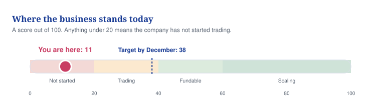
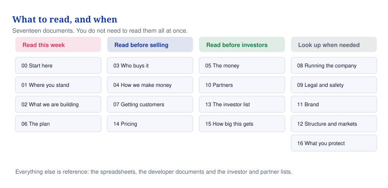

# 00 — Start here

**Read this one page first. It tells you what everything else is and what to do this week.**

## In one minute

- You have a good idea, a name, a logo, a prototype and one past government conversation. You do not yet have a company, a signed agreement over who owns MaternaLink, a customer, or any money coming in.
- The business scores **11 out of 100** today. That is normal for an idea that has not started trading. The plan takes it to about 38 by December.
- The biggest single risk is not competition. It is that nobody has written down who owns MaternaLink.
- The fastest money is advice and consulting, not the product. The product is the long-term value.
- Five things must be fixed before you speak to a single investor. They are listed below and they take about four weeks.

*Where you are now, and where the 90-day plan takes you.*

## What to do

| Action | Who | By when |
|---|---|---|
| Speak to David Agunede and write down who owns MaternaLink | You | Day 3 |
| Check the name is free, then register the company | You, then an accountant | Day 10 |
| Stop sending the 2025 AI slide deck; put the prototype behind a password | You | Day 3 |
| Get your first paying advisory client | You | Day 45 |
| Get one hospital to agree to a trial | You | Day 60 |

## The five blockers, in plain words

1. **No company.** You cannot open a bank account, sign a contract, apply for a grant or take investment without one.
2. **Nobody owns MaternaLink on paper.** David Agunede signs his emails as founder and chief executive of Maternal Link. Until there is a signed agreement, you cannot honestly tell anyone the company owns it.
3. **The old slide deck makes medical claims you cannot back up.** It says the software predicts pre-eclampsia, sepsis, bleeding and blood clots. There is no evidence for that, and software that predicts illness is legally a medical device. Withdraw the deck.
4. **No revenue.** No client has paid you anything.
5. **No hospital, no clinician.** Nobody in the health service has agreed to try it.

None of these is unusual at this stage. All five are fixable in about four weeks. Doing them in this order is what turns a plan into a company.

## What you should read, and when

*You do not need to read everything at once. Four documents this week is enough.*

| Read this week | Why |
|---|---|
| 00 Start here (this page) | What to do first |
| 01 Where you stand | The honest audit of what exists today |
| 02 What we are building | The product, and why the AI idea is parked |
| 06 The plan | Your first 90 days, day by day |

| Read before you sell | Read before you meet investors | Look up when you need it |
|---|---|---|
| 03 Who buys it | 05 The money and the raise | 08 Running the company |
| 04 How we make money | 10 Partners | 09 Legal, data and safety |
| 07 Getting customers | 13 How to use the investor list | 11 Brand and websites |
| | | 12 Structure and which countries |

Everything else is reference material: spreadsheets, the documents for your developer, and the investor and partner lists.

## What is in the pack

| Folder | What is in it |
|---|---|
| `docs/` | The fourteen documents above |
| `product/` | Four documents to hand to a software developer |
| `assets/` | Things you send to other people: company profile, service list, proposal template, one-pager, four slide decks |
| `finance/` | The three-year financial model |
| `investors/` | 316 investors, the top 25, call lists, scripts, and 74 partner organisations |
| `operations/` | Weekly numbers to track and pipeline trackers |
| `diagrams/` | The charts used in these documents |
| `exports/` | Everything again as PDF, Word, Excel and PowerPoint |
| `website/` and `maternalink-site/` | The two websites |

## The two websites are live

- Vytalix: https://elkelvinwilliams.github.io/Vitalyx/
- MaternaLink, with a working demonstration dashboard: https://elkelvinwilliams.github.io/Vitalyx/maternalink/

Both still contain placeholders for the company number, address and email. Fill those in once the company exists.

## One rule for everything here

Nothing in this pack claims a customer, a partner, an approval, a clinician or a pound of revenue that does not exist. Where something is a guess, it says so. Keep it that way. Every investor and every hospital will check, and being the founder who did not exaggerate is worth more than any slide.

## Words explained

| Word | What it means |
|---|---|
| Pre-seed | The first proper round of investment, usually £250,000 to £500,000, raised before a product is selling |
| Pilot | A short trial with one hospital or programme, usually 12 weeks, to see whether the thing works |
| Due diligence | The checking an investor does before giving you money. They will find anything you exaggerated |
| ESTIMATE | Our best guess, not a fact |
| TO VALIDATE | Something you must check before relying on it |
