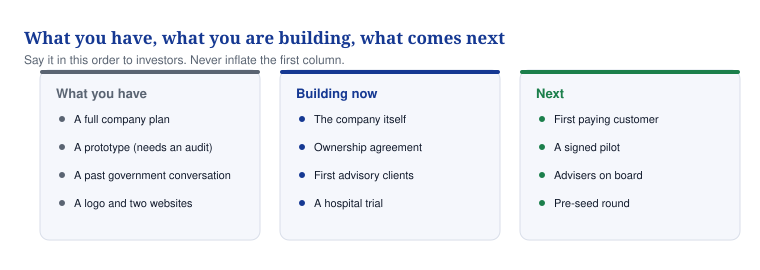

# 01 — Where you stand

**An honest look at what exists today, what is missing, and what to fix first.**

## In one minute

- Everything that exists today is an idea, a name, a logo, one prototype and one conversation that went nowhere. That is the true starting point.
- The business scores **11 out of 100**. Under 20 means a company that has not started trading.
- Ten problems are listed below. The first four block everything else and take about four weeks to clear.
- Ten opportunities are listed too. The best one is not the product. It is selling your own advice while the product is built.
- Nothing here is a criticism of the idea. The idea is sound. The company around it does not exist yet.

## What to do

| Action | Who | By when |
|---|---|---|
| Agree in writing who owns MaternaLink | You and David Agunede | Day 3 |
| Register the company after checking the name | You | Day 10 |
| Withdraw the 2025 AI deck and lock the prototype | You | Day 3 |
| Book a code and security check of the prototype | A developer you pay | Day 14 |
| Re-score this document | You | 14 October |

## What was actually reviewed

| What | Where it was | What it is | Verdict |
|---|---|---|---|
| The code repository | GitHub | One file with one line of text | Empty |
| Your written brief | This project | A clear, complete description of the company you want to build | The strongest thing you had |
| "Black Maternal health" deck, October 2025 | Google Drive | 13 slides proposing AI that predicts pre-eclampsia, sepsis, bleeding and blood clots | An idea only. No data, no model, no clinician, no permission to use patient data |
| Ekiti State proposal, March 2026 | Email | Sent by David Agunede as "Founder and CEO, Maternal Link". £4.5m for 15,000 women, rising to £36m | A proposal with no reply. The price is far above anything comparable |
| The prototype dashboard | maternal-health-psi.vercel.app | A working website with patients, alerts and a risk engine that suggests clinical actions | Real, but nobody has checked who owns the code or whether it is secure |
| Kemek Enterprise investor files | Google Drive | Your separate property business, with its own 128-name investor list | Not Vytalix. It shows you can run a disciplined process. It also splits your time |
| Public record for "Vytalix" | Web search | No company found. Similar names exist in the UK and the US | The name is at risk until checked properly |

Nothing else was found. No business plan, no financial model, no website, no brand, no contracts, no customers, no revenue, no grants, no partners, no clinicians, no policies, no insurance.

## The score, area by area

Scoring: 0 means nothing exists. 3 means an idea or a draft. 5 means a usable draft that nobody has tested. 7 means it works and there is proof. 10 means best in class.

| Area | Score | Why |
|---|---|---|
| Company and governance | 0 | No registered company, no board, no shareholder agreement |
| Name and brand | 1 | A logo exists. The name has not been checked and clashes with others |
| Business model and prices | 1 | One price existed and it was wrong |
| Advisory and consulting | 1 | An idea. No offers, no collateral, no clients. The fastest money in the company |
| MaternaLink | 2 | A prototype and a concept. No clinician, no evidence, no plan for regulation |
| Clinical safety | 0 | No safety officer, no hazard log, no statement of what the product is for |
| Data protection and regulation | 0 | Not registered with the ICO. No data protection assessment. No thinking about medical device rules |
| Who owns the intellectual property | 0 | Nothing written down with David Agunede or with whoever wrote the code |
| Technology | 1 | One prototype of unknown quality. No domain, no email, no cloud account |
| E-learning | 0 | Nothing exists |
| Proof that customers want it | 1 | One meeting in Nigeria. No UK conversations at all |
| Knowing the competition | 1 | The Ekiti proposal did not mention that the state already has a funded programme |
| Partners | 1 | One ministry meeting. No agreements |
| Sales system | 0 | No contact list, no scripts, no proposals |
| Marketing | 0 | No website, no company page, nothing published |
| Money and accounts | 0 | No model, no budget, no bank account, no accountant |
| Ready for investors | 1 | You have shown you can run a list. Vytalix has no deck, no data room, no tax clearance |
| Team | 1 | One founder and one informal collaborator with unclear roles |
| Routines and reporting | 0 | None |
| Credibility: advisers, evidence, press | 0 | None |
| **Total** | **11 / 100** | Pre-formation |

*Say it in this order to anyone who asks. Never inflate the first column.*

## What is strong and what is weak

**Strong.** A precise founder brief. A genuinely important problem with real political attention behind it in the UK. A live conversation in Nigeria and a working prototype, which most founders at this stage do not have. Proof that you can run an investor list properly.

**Weak.** No company, no ownership, no brand protection. Medical claims with nothing behind them. A price built on nothing. One founder doing everything, across two businesses. No web presence at all.

**The chances.** Selling your own advice pays within weeks. A re-scoped MaternaLink can be trialled without becoming a medical device. Grants suit this story. Women's health and impact investors are actively looking for something like it. Partnering with the Nigerian incumbent turns a threat into a route in.

**The threats.** A name clash with two US health-tech companies. Regulatory trouble if any prediction feature ships. A falling-out over who owns MaternaLink. Slow, political government sales in Nigeria. An investor finding all of this in ten minutes.

## The ten problems, worst first

| # | Problem | Why it matters | What fixes it | By |
|---|---|---|---|---|
| 1 | Nobody owns MaternaLink on paper | Blocks funding, contracts and trials. Risks a dispute | Meet this week, agree heads of terms, then a solicitor drafts a deed | Day 7 |
| 2 | No company | Cannot contract, bank, apply for grants or take investment | Check the name, then register | Day 10 |
| 3 | Medical claims with no evidence | Regulatory and reputational risk. Fails any investor check | Withdraw the deck. Re-scope the product. Rewrite what it does | Day 3 |
| 4 | The name may not be yours | Two US health-tech companies use near-identical names | Trademark searches, then file | Day 20 |
| 5 | No money coming in | Your time is the only funding | Launch three advisory offers, hold 40 conversations | Day 45 |
| 6 | The £300 per woman price | Anyone who knows the market will see it is wrong | Replace with the new price book | Day 21 |
| 7 | No clinician anywhere near this | You cannot build maternity software without midwives and doctors | Recruit four advisers | Day 60 |
| 8 | The prototype is unchecked | May contain insecure code, other people's work, or real patient data | Pay for a code and security audit | Day 14 |
| 9 | Nobody in the UK has been asked | Your home market is untested | 15 interviews with midwives and maternity leads | Day 60 |
| 10 | Two businesses, one of you | Everything waits for you | Write down your time split. Get help with admin | Day 14 |

## The ten opportunities, best first

| # | Opportunity | Why it is good | First step |
|---|---|---|---|
| 1 | Sell your own advice | Cash in weeks, references, credibility | Publish three offers, start 40 conversations |
| 2 | MaternaLink as a care-coordination service | The product story, without the medical device problem | Write what it is for, get one clinician to agree |
| 3 | Work with the Nigerian incumbent, not against | Keeps the government relationship alive | Reply to Ekiti offering to complement, not replace |
| 4 | Grants | £50,000 to £500,000 without giving away shares | Check the Innovate UK and SBRI Healthcare calendars |
| 5 | Women's health and impact investors | Better terms and aligned expectations | Work the A-list after the blockers are cleared |
| 6 | Publish one research report | Authority, press, inbound interest | Outline it in week five |
| 7 | Training for midwives and health workers | Repeat income, low regulatory risk | Two pilot modules with an NGO |
| 8 | Consulting for companies entering the NHS or Africa | High margin, repeatable | Package two fixed-price sprints |
| 9 | A university research partnership | Turns the 2025 AI idea into fundable research | Approach a maternal health research group |
| 10 | Telecoms and insurers in Nigeria | Reach without government budgets | Keep on the partner list for year two |

## What creates value, and what creates risk

| Brings money in now | Builds credibility | Makes investors comfortable | Creates real risk |
|---|---|---|---|
| Advisory days, consulting projects, grant-funded work | Advisers, a published report, a real trial, a professional website | A registered company, clean ownership, sensible prices, a named pipeline | Prediction claims, health data without safeguards, using the prototype with real patients, unclear purpose |

## Words explained

| Word | What it means |
|---|---|
| Heads of terms | A short written summary of what two people have agreed, before the lawyers write the full contract |
| ICO | The Information Commissioner's Office, the UK regulator you must register with to handle personal data |
| Data protection impact assessment | A written check of what could go wrong with people's data, required before you handle health information |
| Hazard log | A list a health software team keeps of everything that could harm a patient, and what stops it |
| Medical device | Anything, including software, whose purpose is to diagnose, predict or treat. Tightly regulated |
