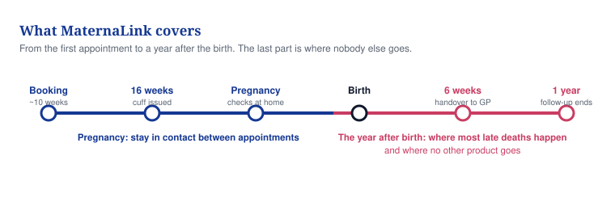
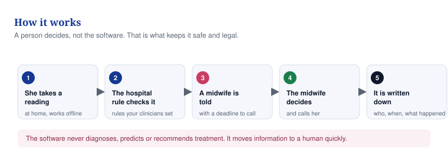
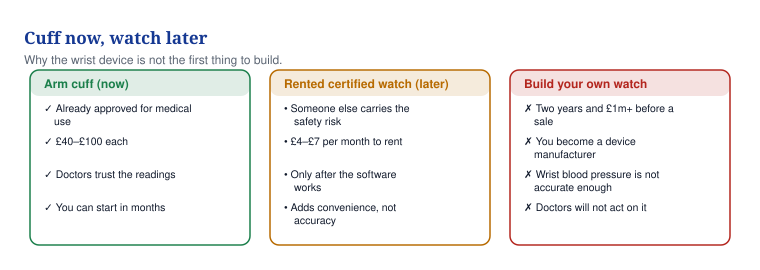

# 02 — What we are building

**This document says what MaternaLink is, what it is not, and what gets built first.**

## In one minute
- MaternaLink keeps a pregnant woman connected to a real midwife between appointments, and for a year after the birth.
- The old idea was an AI "risk score". It is parked. It is unproven and it would be a medical device.
- The first product is home blood-pressure monitoring for high-risk pregnancy, at one hospital.
- The software never diagnoses. It moves a reading to a named human, with a deadline to act.
- Everything here is PROPOSED (a plan, not a fact). MaternaLink is in development and is approved by nobody.

## What to do
| Action | Who | By when |
|---|---|---|
| Stop sending the 2025 AI deck to anyone; put the prototype behind a login | You | Day 3 |
| Write the one-page intended-use statement and get a clinician to sign it | You | Day 14 |
| Ask your regional Health Innovation Network (the NHS body that introduces new products to hospitals) which two hospitals want home blood-pressure monitoring | You | Week 2 |
| Interview 10 midwives and obstetricians about what happens when blood pressure rises between appointments | You | Week 4 |
| Get one hospital to sign a letter of intent for a 12-week evaluation | You | Month 2 |

## The problem, in plain words

A pregnancy lasts about 280 days. A woman spends perhaps 10 to 15 hours of that in front of a clinician. Almost all of pregnancy happens where no clinician can see.

That is where women get into trouble. Blood pressure rises. Symptoms start. Nobody notices in time. The national reviews keep finding the same thing: women are not listened to, and escalation fails when it matters. Ockenden (2022) reviewed around 1,500 families' cases. Kirkup (2022) reviewed 202 cases in East Kent.

Black and Asian women are failed most. MBRRACE-UK is the UK national report into why mothers die. It is run by Oxford's National Perinatal Epidemiology Unit. It reports Black women at roughly 2.8 times the risk of White women. It reports Asian women at roughly 1.7 times. **Verify the current figure and report year before using it.** Never say "3x" without a source.

Care also stops too early. Midwives hand over at 10 to 28 days. Most late maternal deaths happen after that, in the year following birth, and mental-health causes lead them.

## Why the old AI idea does not work yet

The 2025 deck proposed one AI score, the "Maternal Instability Score", predicting pre-eclampsia, sepsis, haemorrhage and blood clots. Six honest reasons it fails today.

| # | Reason | What it means for you |
|---|---|---|
| 1 | The NHS already has an official early warning score | NHS England published a national Maternity Early Warning Score with the RCOG and RCM in 2023 to 2024. Midwives are told to use it. A rival score is a liability, not an advance. |
| 2 | No evidence that voice predicts these conditions | Voice has some published evidence in mental-health screening. It has none for predicting these physical obstetric emergencies. |
| 3 | One score for four conditions makes no clinical sense | Pre-eclampsia, haemorrhage, sepsis and clots differ in cause, timing and treatment. Clinicians will reject a single number that mixes them. |
| 4 | Rare events need tens of thousands of pregnancies | Each of these events is rare per pregnancy. A small pilot cohort cannot train or check such a model. |
| 5 | Ethnicity as a prediction input is being removed from medical tools | It has already been taken out of other calculators. Ethnicity belongs in checking who you are failing, not in the prediction itself. |
| 6 | It would be a medical device | Software that flags risk to inform care is regulated in the UK. ESTIMATE (our best guess, not a fact): 2 to 3 years and over £1m before a single sale. |

**And the finding that changes the design.** The Oxford BUMP trials were published in JAMA in 2022. They found that home blood-pressure monitoring on its own did **not** speed up detection of high blood pressure. It did not improve control either, against usual care. The lesson is not that home monitoring fails. The lesson is that the reading is worth nothing on its own. The value sits in what happens after it: who is told, how fast, and what they do.

So the AI score is not deleted. It moves to the back of the plan, behind a research group of consented women, ethics approval and validation. It is the last thing built, not the first.

## What we build instead

We build the in-between service: the part of care that happens when no clinician is in the room. Seven things.

| # | The thing | What it means |
|---|---|---|
| 1 | A record she keeps | It follows her between hospitals, community, private care, and between countries. Consent is set by her, in tiers. |
| 2 | Contact that never goes silent | Check-ins by app, SMS or voice note. It works offline, on any phone, in her language. |
| 3 | Home readings when her risk warrants it | A validated arm cuff, a urine dipstick read by a phone camera, plus symptoms and medicines. |
| 4 | Rules the hospital owns | Thresholds set by the hospital's own clinicians, lined up with the national MEWS and NICE NG133. We ship the rule editor, not the rules. |
| 5 | A queue with a deadline | A named midwife is told, with a response time. Every reading, contact and outcome is logged. |
| 6 | The year after birth | Follow-up to 12 months: mood, blood pressure, bleeding, infection, feeding, and a proper handover to the GP. |
| 7 | Who care is failing | Anonymous reporting of who is reached, escalated, seen and missed, by ethnicity, deprivation and area. |

*Caption: We cover the whole of her care, including the year after birth where no other product goes.*

*Caption: A person decides, never the software. That is what keeps it safe and legal.*

## The watch

You asked about a maternity watch, issued at week 16 and returned after discharge. Here is the order to do it in.

*Caption: Start with the cuff someone else already got certified.*

- **Arm cuff, now.** It is already approved for medical use. It costs about £40 to £100. Clinicians trust the readings and will act on them. You can start in months.
- **Rented certified watch, later.** Rent a device someone else has certified, so they carry the safety risk. ESTIMATE: £4 to £7 per month. Only after the software works. It adds convenience, not accuracy.
- **Never build your own.** You would become a device manufacturer. That is two years and over £1m before a sale. Wrist blood pressure is not accurate enough, and doctors will not act on it.

This is a fixed decision in `FACTS_BASE.md` (A11): a certified third-party wearable only, never a Vytalix-made device, and only after the v1 software is live.

## What it is and is not

| It is | It is not |
|---|---|
| A way to stay in contact between appointments | An app that tells a woman what is wrong with her |
| A place to put home readings so a human sees them | A machine that scores, predicts or interprets them |
| Rules written and owned by the hospital's clinicians | Our rules shipped into someone else's ward |
| A record that follows the woman | The hospital's legal maternity record |
| A service with a response time and an audit trail | A dashboard with suggested treatments |
| In development, pre-seed, no customers yet | Approved, validated or assessed by anyone |

## The five best ideas

| Idea | What it does | Why nobody owns it | When |
|---|---|---|---|
| **A. Maternity virtual ward, high blood pressure first** | Home cuff, phone dipstick, symptom check-ins, hospital-set thresholds, an escalation queue with a response time | General virtual-ward suppliers have no maternity workflow. Maternity record suppliers have no home monitoring. Babyscripts is US-focused. | First. This is the MVP |
| **B. The 365-day companion after birth** | Check-ins on mood, blood pressure, bleeding, infection, pain, feeding and contraception, with a handover to the GP | The money sits in three separate budgets: maternity, GP and mental health. So no single team buys it. | v2 |
| **C. Woman-held record with graduated consent** | A portable record she controls, readable anywhere with her permission, standing alone where no system exists | Making systems talk to each other is slow standards work. Existing suppliers build for institutions, not for women. | v1 into v2 |
| **D. Equity reporting for commissioners and ministries** | Monthly anonymous figures on who care reaches and misses, instead of a report every few years | It needs continuous data across settings. Only a continuity layer holds that. | v2 |
| **E. A consented research group of women** | A long-term, diverse group of pregnancies, UK and Nigeria, that universities and industry pay to study under strict rules | It takes years and trust to build. It is not a feature anyone can ship. | v3. The AI score lives here |

## How it grows

| Version | What ships | What must be true before it starts |
|---|---|---|
| **v1** (now to about 12 months) | Enrolment and consent; check-ins; education signed off by clinicians; secure messaging; home blood-pressure entry; hospital-set thresholds; escalation queue with a response time; handover summary; audit log; equity report; English plus one local language | The MaternaLink ownership agreement with David Agunede is signed. The intended-use statement is signed by a clinician. A DPIA and hazard log exist. A clinical safety officer is appointed. One hospital has signed a letter of intent. |
| **v2** (about months 7 to 15) | The postpartum year; links to hospital systems (BadgerNet, K2, DHIS2); WhatsApp and USSD; partner access with safeguarding controls; blood-glucose diary; triage intake; mental-health questionnaires | A written MHRA classification opinion covers triage, glucose thresholds and questionnaire scoring. v1 has been evaluated at the first site with results written up. |
| **v3** (month 15 and beyond) | The consented research group, and only then a regulated prediction model | Ethics approval, a data-sharing agreement with a hospital or university, retrospective then prospective validation, and an ISO 13485 quality system. ESTIMATE: 2 to 3 years and over £1m. |

## Words explained

| Word | What it means |
|---|---|
| MEWS (Maternity Early Warning Score) | The official NHS chart that flags a pregnant woman whose vital signs are getting worse. Midwives are already required to use it. |
| Medical device | Anything, including software, whose purpose is to diagnose, predict or guide treatment. It is regulated by law and cannot be sold without approval. |
| MHRA | The UK government body that regulates medicines and medical devices. |
| Virtual ward | Patients looked after at home with monitoring, instead of in a hospital bed. The NHS funds this as a service. |
| MBRRACE-UK | The UK's national investigation into why mothers and babies die, run from Oxford. |
| NICE NG133 | The national guideline on high blood pressure in pregnancy. Our thresholds must line up with it. |
| DTAC | The NHS checklist a digital product must pass before a hospital can buy it. |
| DPIA | A written check of the privacy risks in what you are building. It is required by law before you handle health data. |
| Hazard log | A list of every way the software could harm someone, and what you did about each one. |
| Clinical safety officer | A registered clinician who signs off that the software is safe to use. You must appoint one. |
| Letter of intent (LOI) | A signed letter saying a hospital intends to work with you. It is not yet a contract. |
| Pre-eclampsia | A pregnancy condition involving high blood pressure. It can become dangerous quickly. |
| PROPOSED / ESTIMATE / TO VALIDATE | A plan, not a fact / our best guess, not a fact / must be checked before you use it anywhere. |
