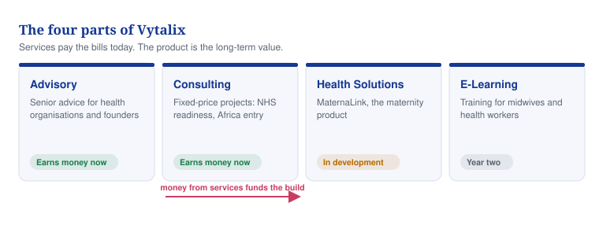
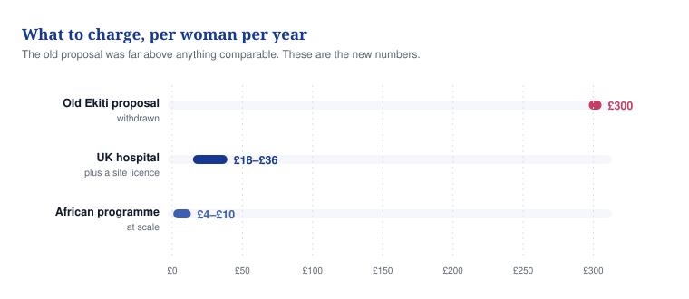
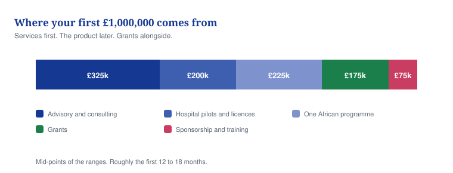

# 04 — How we make money

**What Vytalix sells, what it charges, and where the first £1,000,000 comes from.**

## In one minute

- Advice and consulting bring in cash now. They pay the bills while the product is built.
- MaternaLink is in development. It is not for sale and earns nothing yet.
- Every price here is an ESTIMATE (our best guess, not a fact). None has ever been charged.
- The old £300 per woman per year figure is withdrawn. The new UK price is £18–£36.
- Five sources add up to the first £1,000,000, and services are the biggest of them.

## What to do

| Action | Who | By when |
|---|---|---|
| Put the "from" prices on the website and into the proposal template | Founder | Day 21 |
| Stop using the £300 per woman figure anywhere, in writing or in person | Founder | Now |
| Test three price points across the first six proposals and log every objection | Founder | Day 45 |
| Ask three UK maternity digital leads what they think of £18–£36 per woman | Founder | Day 31–60 |
| Get a written regulatory opinion before quoting Triage, Glucose or the Watch | Founder | Before any proposal |

## The four parts of the business

*Caption: Advisory and Consulting earn money today; the maternity product is the long-term value.*

## The ways money comes in

Fifteen ways, in the order they can start. "Margin" is what is left after the direct cost of doing the work.

| What we sell | Who buys it | What we charge | Margin | When it starts | Label |
|---|---|---|---|---|---|
| Consulting projects | NHS trusts, private providers, health-tech firms, NGOs | £8k–£45k a sprint; founder day £1,200–£1,800 | 55–70% | Now | ESTIMATE |
| Advisory retainers | Health-tech founders, small providers, NGOs | £2,500–£6,000 a month | 70–85% | Now | ESTIMATE |
| Grants | Innovate UK, NIHR, SBRI Healthcare, foundations | £25k to £500k–£1m; year-one target £50k–£150k | Cost recovery only | Prepare now, first award at 6 months | ESTIMATE |
| E-learning courses | Midwives, nurses, doctors, students | £49–£299 in the UK; £10–£40 regional | 85–90% | 6 months | ESTIMATE |
| Corporate training | Trusts, providers, NGOs, scale-ups | £2,500–£6,000 a workshop; £15k–£40k a cohort | 60–75% | 6 months | ESTIMATE |
| Shared-revenue partnerships | Health Innovation Networks, consultancies, NGOs | 10–30% share, or sub-contract days; £10k–£100k a programme | 40–60% | 6 months | ESTIMATE |
| UK public contracts | NHS England bodies, ICBs, councils | £25k–£150k a contract | 45–60% | 12 months | ESTIMATE |
| Enterprise contracts | Private hospital groups, pharma teams, insurers | £50k–£300k a year | 50–65% | 12 months | ESTIMATE |
| Learning subscriptions | Individual professionals, small clinics | £12–£29 a month; £490–£990 a year for five seats | 80–90% | 12 months | ESTIMATE |
| African government work | State ministries, federal agencies, donors | Advice £15k–£80k; programme £100k–£1m+ a year | 30–50% | Advice 12 months, programme 24 months | TO VALIDATE |
| MaternaLink set-up fees | Pilot sites | £15k–£60k a UK site; £25k–£150k a state programme | 35–50% | 24 months | TO VALIDATE |
| MaternaLink subscription | Trusts, ICBs, private maternity, African states | UK £30k–£120k a site a year; Africa £5–£40 a woman a year | 65–80% once past five sites | 24 months | TO VALIDATE |
| Module licences to other firms | Health-tech vendors, maternity IT firms | £20k–£80k a year each | 80% or better | 24 months | TO VALIDATE |
| White-label versions | Insurers, telecoms, hospital groups | £25k–£75k set-up plus £2–£8 a user a year | 60–75% | 24 months | TO VALIDATE |
| Technology licensing | Universities, other vendors | Not priceable today | 90% or better | 24 months or later | TO VALIDATE |

## What to charge for advice and consulting

**Day rates (ESTIMATE).** No founder day is ever sold below £1,200.

| Role | Day rate | Half day |
|---|---|---|
| Founder advisory day | £1,200–£1,800 (list £1,500) | £900 |
| Founder delivery inside a package | £1,500 as the pricing basis | Not sold on its own |
| Associate consultant | £700–£1,000 (list £900) | £550 |
| Clinical adviser or Clinical Safety Officer | Cost passed on plus 15% | — |
| Workshop for a day | £4,000 all in (range £2,500–£6,000) | — |

**Fixed-price packages (ESTIMATE).** Price fixed, scope written down, changes agreed in writing. Do not quote C3, C5, C8, C9 or the safety part of C6 until the skill behind them exists and can be shown.

| Code | Package | How long | Price |
|---|---|---|---|
| C1 | Digital Health Discovery Sprint | 2 weeks | £14,000 |
| C2 | Business Case and Funding Sprint | 3 weeks | £18,000 |
| C3 | Digital Maternity Readiness Review | 4 weeks | £24,000 |
| C4 | UK Market-Entry Playbook | 4 weeks | £22,000 |
| C5 | Africa Market-Entry and Partner Scan | 4 weeks | £20,000 |
| C6 | DTAC and Evidence Readiness Sprint | 3 weeks | £15,000 |
| C7 | Grant and Investor Readiness Sprint | 2 weeks | £9,500 |
| C8 | Health Inequalities and Maternity Outcomes Review | 5 weeks | £28,000 |
| C9 | Programme Evaluation Lite | 6 weeks | £26,000 |
| C10 | Corporate workshop | 1 day | £4,000 |
| — | Cohort training programme | 4–8 weeks | £15,000–£40,000 |

**Monthly income (ESTIMATE).** Never more than five of these at once, because the founder runs out of days.

| Offer | Days a month | Monthly fee | Minimum term |
|---|---|---|---|
| Retainer — light | 1.5 | £2,500–£3,000 | 3 months |
| Retainer — standard | 2 | £4,000 | 3 months |
| Retainer — extended | 3–4 | £5,500–£6,000 | 3 months |
| Fractional Chief Digital or Strategy Officer | 4–6 | £5,500–£8,000 | 6 months |

## What to charge for MaternaLink

MaternaLink is in development. Nothing is sold until four things are done: ownership documented, the prototype audited, a Clinical Safety Officer and hazard log in place, and a data protection assessment written.

*Caption: The withdrawn figure was 8 to 30 times the new prices; the new ones can be defended.*

There are two price books because what a UK hospital can pay and what an African programme can pay are ten times apart. Software is priced separately from the watch, always.

**Price book A — United Kingdom (ESTIMATE)**

| What | How it is charged | Price |
|---|---|---|
| Core platform | Site licence plus a charge per woman enrolled | £12,000–£30,000 a year, plus £18–£36 a woman a year |
| Triage module | Per site a year | £15,000–£35,000 |
| Engagement module | Per woman a year | £8–£14 |
| Diabetes tracking | Per woman with the condition a year | £20–£30 |
| Voice diaries | Per woman a year | £3–£5 |
| The watch | Lease a month, or buy | £4–£7 a month, or £120–£220 plus £30 a year |
| Record integration | One-off, then yearly | £15,000–£40,000, then £4,000–£8,000 |
| Programme analytics | Per site a year | £6,000–£12,000 |
| Training | Per group of up to 25 | £2,500–£4,500 |
| Setting it up | One-off per site | £25,000–£75,000 |
| Pilot: 12 weeks, one site, up to 300 women | Fixed | £40,000–£90,000 |
| Yearly service plan | Share of the licence value | 18–22% Standard, 25–28% Enhanced, 30–35% Premium |

**Price book B — African and donor programmes (ESTIMATE)**

| What | How it is charged | Price |
|---|---|---|
| Core platform | Per woman a year, cheaper in bulk | £10 up to 5,000; £7 to 25,000; £5 to 100,000; £4 above |
| Engagement by SMS or WhatsApp | Per woman a year | £3–£5 |
| Triage module | Per facility a year | £1,500–£4,000 |
| Diabetes tracking | Per woman with the condition | £6–£10 |
| Voice diaries | Per woman | £1–£2 |
| The watch | Lease a month, or buy | £2–£4 a month, or £90–£160 plus £15 a year |
| Health-system integration | One-off, then yearly | £8,000–£25,000, then £3,000 |
| Training | Per group of 30 | £1,200–£2,500 |
| Setting it up | One-off per state or programme | £40,000–£120,000 |
| Yearly service plan | Share of the software value | 20% Standard, 28% Enhanced, 35% Premium, minimum £12,000 |

**Worked example: a UK trust with 5,000 births a year**

| Line | Amount |
|---|---|
| Core licence £20,000 plus 5,000 women at £22 | £130,000 |
| Engagement, 5,000 women at £10 | £50,000 |
| Triage | £25,000 |
| Analytics | £8,000 |
| Enhanced service, 26% of £213k | £55,400 |
| Setting it up, one-off in year one | £45,000 |
| **Year-one total** | **£313,400** |
| Year-two run-rate | £268,400 |

**Worked example: a state programme covering 15,000 women**

| Line | Amount |
|---|---|
| Core, 15,000 women at £7 | £105,000 |
| Engagement, 15,000 women at £4 | £60,000 |
| Triage, 20 facilities at £2,500 | £50,000 |
| Setting it up, one-off | £80,000 |
| Training, 10 groups | £18,000 |
| Enhanced service, 28% of £215k software | £60,200 |
| **Year-one total** | **£373,200, about £25 a woman** |
| Year-two run-rate | About £275,000, about £18 a woman |

The withdrawn proposal asked £4.5m for that same group of women. This asks £373,200.

## Rules you do not break

- **Pilot first, always.** Sell a fixed-price pilot with a written evaluation. Credit half the pilot fee against year one.
- **Minimum contract size.** £40,000 in the UK, £25,000 for a programme. Below that, walk away.
- **Never discount below the floor.** The floor is £14 a woman in the UK and £4 in a programme, because that is what it costs to serve her. No founder day below £1,200. Bulk discounts only through the published tiers.
- **Hardware is always a separate line.** Never fold the cost of a watch into the per-woman software price.
- Three years buys 5% off, and yearly price rises are capped at inflation plus 2%. Never trade a discount for a testimonial or a logo, and never offer a free MaternaLink pilot outside the agreed design-partner model.

## The first £1,000,000

*Caption: Services come first, pilots second, one programme third, grants alongside.*

| Where it comes from | Range | Mid-point |
|---|---|---|
| Advisory and consulting | £250k–£400k | £325k |
| Hospital pilots and first licences | £150k–£250k | £200k |
| One African programme or NGO contract | £150k–£300k | £225k |
| Grants | £100k–£250k | £175k |
| Sponsorship and training | £50k–£100k | £75k |
| **Total at the mid-points** | | **£1,000,000** |

Roughly the first 12 to 18 months. All ESTIMATE. The order matters more than the total: sell services first.

## Words explained

| Word | What it means |
|---|---|
| ESTIMATE | Our best guess, not a fact |
| TO VALIDATE | We do not know yet and must go and check |
| Retainer | A client pays the same fee every month for an agreed number of days |
| Site licence | A yearly fee a hospital pays for the software, before any per-woman charge |
| Run-rate | What a year costs once the one-off set-up is behind you |
| DTAC | The NHS checklist a digital product must pass before a hospital can buy it |
