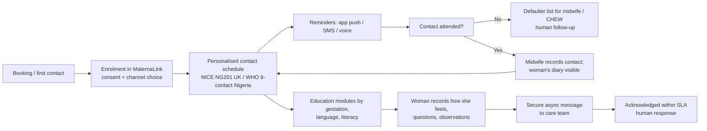
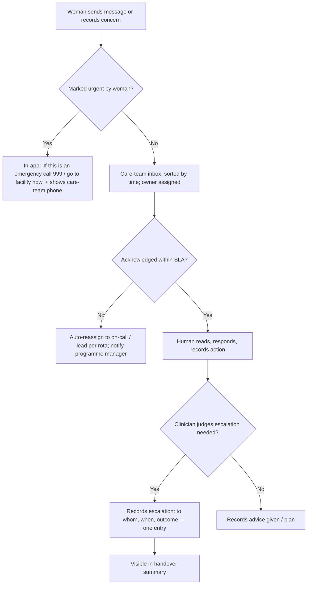

# 04 — MaternaLink (in development): Product Strategy

**Owner:** Chief Product Officer / CTO, Vytalix · **Status:** PROPOSED v0.1 · **Date:** 7 September 2026 · **Governing file:** `/FACTS_BASE.md` (every statement here is consistent with it; labels KNOWN / VERIFIED / ASSUMPTION / ESTIMATE / PROPOSED / TO VALIDATE apply throughout).

> **Source-verification note.** External web access was unavailable while this document was written (egress blocked; search budget exhausted). Every regulatory, clinical and epidemiological citation below is given from established prior knowledge with its canonical URL and is marked **TO VALIDATE (not fetched this session)**. Before any external use, each figure must be checked against the live source and the date of checking recorded.

## Executive view (5 lines)

1. MaternaLink (in development) is re-based from an unvalidated "AI Maternal Instability Score" concept into a **non-diagnostic maternal care-coordination, communication, education and monitoring-support platform** (v1), with the AI risk-score retained as a v3 research track gated by clinical validation and a UK MDR / MHRA SaMD pathway (FACTS_BASE decision A4).
2. The problem is real and documented on both sides: in the UK, persistent ethnic and deprivation-linked mortality disparities (MBRRACE-UK) and repeated communication/escalation/listening failures (Ockenden 2022, Kirkup 2022); in Nigeria, the world's largest absolute maternal-death burden (WHO/UNICEF 2023 estimates).
3. The MVP (12–16 weeks) is deliberately narrow: enrolment, personalised contact schedule, signed-off education, secure asynchronous messaging, self-recorded observations displayed (not interpreted), a care-team console with structured handover summaries, an operational dashboard, and an SMS channel for Nigeria — with no automated clinical interpretation, so that the product can credibly sit outside medical-device classification while the intended-use statement is confirmed with regulatory counsel (TO VALIDATE).
4. Commercially, UK B2B (NHS trusts, private maternity, employers) is the credibility market and Africa (state governments, NGOs, insurers) is the volume market; the Ekiti £300/woman/year figure is **UNVALIDATED** and the re-based indicative range is £6–£40/woman/year for the platform layer (ESTIMATE), excluding service delivery, devices and training which should be priced separately or by partners.
5. Nothing can be sold or claimed until four gates close: (i) IP/ownership of MaternaLink documented, (ii) the Vercel prototype audited for code ownership, security and data, (iii) a Clinical Safety Officer appointed and DCB0129 hazard log opened, (iv) DPIA and lawful-basis analysis completed under UK GDPR and the Nigeria Data Protection Act 2023.

---

## 1. Product vision

**Vision (PROPOSED):** Every woman, wherever she gives birth, has a care team that knows her, hears her, and acts on what she tells them — and every care team has the information it needs at the moment of handover.

**Mission for v1 (PROPOSED):** MaternaLink (in development) is intended to support maternity care teams and the women they care for by making communication, education, appointment adherence and information handover easier and more reliable. It is designed to support — not replace — clinical judgement. It does not diagnose, predict or triage.

**Positioning sentence (PROPOSED, for external use once the four gates in the Executive view are closed):**
"MaternaLink (in development) is a care-coordination and communication platform for maternity services, designed to help women stay connected to their care team and help care teams hand over safely — built for both NHS and low-connectivity settings."

**What we are deliberately not saying:** NHS-approved, clinically validated, CE/UKCA-marked, MHRA-registered, government partner, reduces maternal mortality (FACTS_BASE §4).

### 1.1 Why re-base (from the 2025 deck to v1)

| Dimension | 2025 "Maternal Instability Score" concept (VERIFIED as concept only) | Re-based v1 (PROPOSED) |
|---|---|---|
| Core claim | Multimodal AI "predicts pre-eclampsia, sepsis, haemorrhage, thromboembolism" | Supports coordination, communication, education and handover; no prediction |
| Evidence needed before sale | Retrospective + prospective clinical validation, ethics approvals, bias audit, SaMD conformity | Usability, safety case (DCB0129), DPIA, service evaluation |
| Regulatory status | Almost certainly a medical device (prediction/prognosis intended purpose); classification under UK MDR 2002 TO VALIDATE, likely Class IIa or above under any Rule-11-style approach | Designed to sit outside device classification via intended-use statement (TO VALIDATE with regulatory counsel) |
| Data required | Labelled clinical outcomes, voice recordings, socio-demographic data at scale — none held (VERIFIED absence) | Enrolment, schedule, self-reported diary, messages, content engagement |
| Time to first deployable version | 24–36 months + data partnerships (ESTIMATE) | 12–16 weeks to MVP (ESTIMATE) |
| Investor story | High-risk, high-reward deep-tech with no evidence today | Credible platform with a defined research option (v3) |

The 2025 concept is not discarded; it becomes the v3 research track with explicit prerequisites (§9).

---

## 2. The problem

### 2.1 United Kingdom

| Evidence | What it says (as recalled; TO VALIDATE against live source) | Source (canonical URL, not fetched this session) | Product implication |
|---|---|---|---|
| MBRRACE-UK, *Saving Lives, Improving Mothers' Care* (annual; 2024 edition covering deaths 2020–22) | Maternal mortality around 13 per 100,000 maternities; Black women roughly three times (approx. 2.9x) and Asian women roughly 1.7x more likely to die than White women; women in the most deprived areas about twice as likely as those in the least deprived. Mental-health causes are the leading cause of death between six weeks and one year. Repeated findings of "missed opportunities" and poor communication between services. A 2025 edition (deaths 2021–23) may supersede these figures. | https://www.npeu.ox.ac.uk/mbrrace-uk/reports | Disparities and communication gaps are the target; language, trust, reachability and continuity are product levers; perinatal mental-health signposting and safeguarding are essential content |
| Ockenden Review, final report (March 2022, Shrewsbury and Telford) | Reviewed ~1,500 families' cases; themes include failure to listen to women and families, failures of escalation, informed-consent gaps, and poor communication between teams; 15 "immediate and essential actions" for all trusts | https://www.gov.uk/government/publications/final-report-of-the-ockenden-review | Listening (structured two-way channel), documented escalation, and consent-supporting information are v1 features |
| Kirkup, *Reading the Signals* (East Kent, October 2022) | Of 202 cases reviewed, the outcome could have been different in a large proportion (recalled: 97 cases, including 45 of 65 baby deaths); themes of poor teamwork, failure to listen to families, lack of compassion, and failure to "read the signals" across a service | https://www.gov.uk/government/publications/maternity-and-neonatal-services-in-east-kent-reading-the-signals-report | Team-level visibility of each woman's concerns and a reliable handover summary are core |
| Continuity of carer | NHS England's Midwifery Continuity of Carer model was intended to give women a known midwife team; in September 2022 NHS England removed the national target date in favour of local, safely-staffed plans (recalled; TO VALIDATE). The *Three year delivery plan for maternity and neonatal services* (March 2023) sets the current framework. | https://www.england.nhs.uk/publication/three-year-delivery-plan-for-maternity-and-neonatal-services/ | Where a known team cannot be guaranteed, software must carry the continuity: who she is, what she has said, what is planned |
| Maternity incentive scheme (NHS Resolution CNST) | Ten safety actions incentivise trusts financially, including MSDS data quality, Saving Babies' Lives care bundle, and listening to women (recalled; TO VALIDATE current year's actions) | https://resolution.nhs.uk/services/claims-management/clinical-schemes/maternity-incentive-scheme/ | Trust buyers will map any tool to these actions; v1 must show how it helps evidence them |
| Nottingham University Hospitals independent review (Ockenden, ongoing) | Largest maternity review in NHS history; reporting expected 2026 (TO VALIDATE) | https://www.ockendenmaternityreview.org.uk/ | Expect renewed national focus on listening, escalation and handover in 2026–27 |

**The UK problem statement (PROPOSED):** Women — disproportionately Black, Asian and economically deprived women — are not reliably heard, not reliably followed up, and their information is not reliably handed over between the people caring for them. Existing maternity EPRs (e.g., BadgerNet, Euroking, K2 — TO VALIDATE current market shares) are record systems, not relationship systems. The gap is the communication and coordination layer between the woman and a changing set of professionals.

### 2.2 Nigeria

| Evidence | What it says (as recalled; TO VALIDATE) | Source (canonical URL, not fetched) |
|---|---|---|
| WHO/UNICEF/UNFPA/World Bank/UNDESA, *Trends in maternal mortality 2000–2023* (published 2025) | About 260,000 maternal deaths globally in 2023 (global MMR ~197 per 100,000 live births); sub-Saharan Africa about 70% of deaths; **Nigeria the single largest contributor, roughly a quarter or more of all global maternal deaths (recalled: ~75,000 deaths, ~29%)**, with a modelled MMR near 1,000 per 100,000 | https://www.who.int/publications/i/item/9789240108462 and https://www.who.int/news-room/fact-sheets/detail/maternal-mortality |
| Nigeria Demographic and Health Survey 2018 | Survey-based MMR of 512 per 100,000 (2011–2018 reference period); ANC4+ coverage ~57%; skilled birth attendance ~43% (recalled; TO VALIDATE; NDHS 2023–24 may supersede) | https://dhsprogram.com/publications/publication-fr359-dhs-final-reports.cfm |
| UNICEF Nigeria maternal health | Leading causes: haemorrhage, hypertensive disorders, sepsis, unsafe abortion, obstructed labour; strong rural/urban and North/South gradients | https://www.unicef.org/nigeria/maternal-and-newborn-health |
| Ekiti State context | Ekiti already runs the mDoc "Digital Mom" programme (MSD for Mothers-funded; ~24,000 women onboarded, 500+ providers trained as of Jan 2026) — VERIFIED via public reporting per FACTS_BASE §1 | Nigeria Health Watch (2026); Vanguard (Nov 2023); mDoc blog |

**The Nigeria problem statement (PROPOSED):** The dominant failure modes are the "three delays" — delay in deciding to seek care, delay in reaching care, delay in receiving adequate care. A phone-based (SMS/USSD/WhatsApp) programme can address the first (education, danger-sign awareness, reminders) and part of the second and third (knowing where to go, referral coordination, facility readiness) — but only alongside facilities, transport and skilled staff. Software alone does not "reduce maternal mortality", and MaternaLink will never claim it does without evidence from a formal evaluation.

### 2.3 What is common to both markets

- A woman's own account of how she feels is the most under-used data source in maternity care.
- Handover between professionals (community to hospital, shift to shift, antenatal to intrapartum to postnatal) is where information is lost.
- Education is delivered inconsistently and often in the wrong language or literacy level.
- Programmes cannot see, in near-real time, who has fallen out of contact.

---

## 3. Target users and personas

### 3.1 User groups

| Group | UK | Nigeria | v1 role in product |
|---|---|---|---|
| Women (and, with consent, a partner/birth companion) | Smartphone, NHS App user, English plus 300+ community languages | Feature-phone majority outside cities; smartphone growing; low data; Yoruba/Hausa/Igbo/Pidgin/English | `mother` (partner/companion access is v2) |
| Community midwives / community health workers | Registered midwives (NMC) | Midwives, CHEWs, CHIPS agents, TBAs in some communities (roles vary by state) | `midwife` (with `care_worker` variant for non-registered staff — permissions reduced) |
| Hospital clinicians (obstetricians, maternity triage, anaesthetists) | Consultant/registrar; maternity triage; maternal medicine networks | Facility doctors and nurse-midwives in PHCs, general hospitals, teaching hospitals | `clinician` |
| Programme / service managers | Head of midwifery, digital midwife, quality & safety leads, LMNS/ICB maternity leads | State Ministry of Health maternal-health desk, State Primary Health Care Development Agency, LGA health authority | `programme_manager` |
| NGO / donor programme officers | Charities, VCSE partners in Maternity and Neonatal Voices Partnerships | Implementing NGOs, donor M&E officers | `programme_manager` (scoped) |
| Operators / admins | Trust IT, information governance | State IT, implementing partner | `operator_admin` |
| Vytalix support | Support engineers, clinical safety, data protection | — | `vytalix_support` (break-glass, fully audited) |

### 3.2 Six personas (illustrative — ASSUMPTION; validate in discovery with at least 20 women and 10 professionals per market)

**P1 — Amara, 31, expectant mother, Lewisham (UK).** Second pregnancy; first was traumatic with an emergency caesarean. Works shifts in retail; smartphone always on; uses the NHS App and WhatsApp. Feels she was "not listened to" last time. Wants: to know who her midwife is this week, to write down what she is feeling and be sure someone reads it, to understand her options for birth after caesarean in plain language, and to know exactly when to call. Fears: being labelled "anxious" and dismissed. *Success for Amara:* her messages are acknowledged within a stated time; her birth preferences travel with her into the labour ward.

**P2 — Bolanle, 24, expectant mother, Ikere-Ekiti (Nigeria).** First pregnancy; farms and trades; shares a basic feature phone with her husband; ~₦500/week for airtime; Yoruba first language, some English. Nearest PHC is 40 minutes by motorcycle taxi. Wants: to know when to go for antenatal care and what will happen, to recognise danger signs, to have a plan and money set aside for delivery, and to be reminded without her husband having to read for her. Constraints: no data plan; phone off at night to save battery; may not control the phone. *Success for Bolanle:* Yoruba voice/SMS reminders at times she chooses; a facility that expects her; a referral that is known to the receiving facility before she arrives.

**P3 — Sarah, 44, community midwife, NHS trust (UK).** Caseload of ~30–40 women; visits, clinics, phone calls; documents in BadgerNet (ASSUMPTION about the local EPR). Spends an hour a day chasing messages via the trust switchboard and personal-phone workarounds. Wants: one inbox with her caseload's messages, to see what a woman has recorded before a visit, to hand over cleanly when she is off, and to record an escalation once — not three times. Fears: another system to double-enter into; being blamed for a message missed while off duty. *Success for Sarah:* a caseload view she trusts, on-call cover rules that are explicit, and a summary she can paste into the EPR until integration exists.

**P4 — Mr Okafor, 52, consultant obstetrician and maternity clinical lead (UK).** Accountable for clinical governance; sits on the trust's Maternity Safety Champions group; scarred by a recent serious-incident review where "she told the midwife three times". Wants: nothing that creates a new unmanaged risk (a message that nobody read); evidence a tool supports the Ockenden actions and CNST safety actions; a clinical safety case he can sign off with the trust's Clinical Safety Officer under DCB0160. Will veto anything that looks like an unvalidated risk score. *Success for Mr Okafor:* a DCB0129 safety case from Vytalix, clear "not a triage tool" language in the app, and audit logs.

**P5 — Dr Adeyemi, 47, Director of Family Health, State Ministry of Health (Nigeria).** Runs maternal, newborn and child health across the state with donor programmes, a state health insurance scheme, and a PHC development agency. Already has mDoc's Digital Mom in the state. Under pressure to show results to the Governor and to donors; suspicious of vendors who arrive with a £36m proposal. Wants: interoperability with the state's data (DHIS2 reporting), no vendor lock-in, local capacity, and a pilot that costs little and proves something within a year. *Success for Dr Adeyemi:* a defined pilot in specific LGAs that complements the incumbent, with data he owns and a clear exit.

**P6 — Grace, 35, NGO programme officer (implementing partner, Nigeria).** Manages a maternal-health grant across three LGAs, with 60 CHEWs and quarterly donor reporting. Uses DHIS2, KoboToolbox, WhatsApp groups and Excel. Wants: enrolment and follow-up tracking for her cohort, SMS at scale without her team typing messages, defaulter tracing lists for CHEWs, and exportable indicators for the donor logframe. Constraints: the grant ends in 18 months; price must fit the budget line. *Success for Grace:* a dashboard that answers "who has missed a contact and who is chasing them", and a data export she can trust.

---

## 4. User journeys

### 4.1 Antenatal (enrolment to 36 weeks)



Key design rules: the woman chooses channel and language; reminders are content-neutral on shared phones (no diagnosis or pregnancy status revealed in SMS unless opted in — safeguarding); every message has a human owner and an acknowledgement SLA; emergency guidance ("call 999 / go to your nearest facility now") is a permanent banner, not a computed output.

### 4.2 Intrapartum handover

```mermaid
sequenceDiagram
  participant W as Woman
  participant CM as Community midwife
  participant ML as MaternaLink (in development)
  participant LW as Labour ward / facility
  W->>ML: Reports labour signs via message/call (non-emergency) or follows emergency banner
  CM->>ML: Opens structured handover summary (auto-populated from recorded data, editable, no interpretation)
  ML-->>LW: Summary available to receiving team (v1: printable/pasteable; v2: FHIR/EPR)
  LW->>ML: Acknowledges receipt; records arrival
  Note over ML: Audit trail: who created, edited, viewed, acknowledged
```

The handover summary is structured (identifiers, gestation, known conditions as recorded by clinicians, birth preferences, allergies as recorded, language/interpreter need, safeguarding flag presence [not content], companion, recent messages flagged by the woman as "important"). It is a communication artefact, not a clinical assessment; the receiving clinician performs their own assessment.

### 4.3 Postnatal (birth to 6–8 weeks; extended to 12 months for mental-health signposting content)

- Automatic switch of schedule and content to postnatal (feeding, wound care, recognising sepsis/haemorrhage/pre-eclampsia warning signs postnatally, mental health, contraception, newborn danger signs).
- Postnatal contacts scheduled; missed-contact lists; self-recorded mood check-ins are **displayed** to the midwife, not scored (validated instruments such as EPDS/Whooley are v2 under clinical governance review — scoring may bring the feature into device territory TO VALIDATE).
- Discharge from the service closes the episode; data retention rules apply (§10).

### 4.4 Escalation (the safety-critical journey)



Non-negotiable: **the system escalates unread messages to humans; it never decides clinical urgency.** Automated urgency scoring of message content is explicitly out of scope for v1 (and would be assessed under §12 before any v2 consideration).

---

## 5. Core features (v1 platform)

| # | Feature | Woman | Care team | Programme | Rationale / safety note |
|---|---|---|---|---|---|
| F1 | Enrolment, consent, channel and language preferences | ✔ | ✔ | — | Consent is granular (messaging, SMS content, research contact). Under-18 and capacity rules apply (§11) |
| F2 | Pregnancy profile (EDD, parity, care team, facility, birth preferences, language/interpreter) | ✔ | ✔ | — | Clinical conditions entered only by clinicians; woman can add "things I want my team to know" |
| F3 | Personalised contact schedule and reminders | ✔ | ✔ | ✔ | Schedule templates are configurable per organisation and signed off clinically |
| F4 | Education library (text, audio, short video, low-data variants) by gestation, language and literacy | ✔ | ✔ | ✔ | All content clinically signed off; version-controlled; sources cited (NICE, RCOG, WHO, FMOH) |
| F5 | Secure asynchronous messaging with ownership, SLA and on-call escalation | ✔ | ✔ | ✔ | Non-emergency only; banner and phone numbers for emergencies |
| F6 | Self-recorded diary/observations (how I feel, BP if she has a cuff, weight, fetal movements, symptoms) — displayed, not interpreted | ✔ | ✔ | — | No thresholds, alerts or scores in v1; reference information is generic education, not personalised interpretation |
| F7 | Care-team console: caseload, timeline, inbox, contact log, care notes | — | ✔ | — | Notes are communication notes, not the legal record (the EPR remains the record) until integration |
| F8 | Structured handover summary (antenatal → intrapartum → postnatal; shift/on-call) | ✔ (view) | ✔ | — | Printable/pasteable v1; FHIR export v2 |
| F9 | Escalation log (human-to-human, single entry) | — | ✔ | ✔ (aggregate) | Supports Ockenden escalation actions; audit-ready |
| F10 | Defaulter / missed-contact tracing lists | — | ✔ | ✔ | Operational; assigned to a human |
| F11 | Programme dashboard: enrolment, contact completion, engagement, response times, content reach; exports (CSV; DHIS2-compatible aggregates v1.1) | — | — | ✔ | Operational analytics only; no clinical outcomes claims |
| F12 | Admin: organisations, sites, users, roles, rotas, content management, consent texts, audit log viewer | — | — | ✔ | RBAC; every access audited |
| F13 | Channels: web PWA (offline-capable), SMS (two-way, keyword), voice reminders (Nigeria, optional), WhatsApp (v1.1/v2) | ✔ | — | ✔ | Provider options in PRD |
| F14 | Safeguarding support: private "safe messaging" mode, discreet content on shared phones, staff prompts to record concerns and route to safeguarding lead | ✔ | ✔ | — | Follows local safeguarding policy; system never decides |

---

## 6. MVP (12–16 weeks) — scope

**MVP name (internal):** MaternaLink Connect 1.0. **Goal:** a deployable, safety-cased, DTAC-ready (design target) care-coordination product usable in one UK service evaluation site and one Nigeria SMS pilot cohort.

| IN (must ship) | OUT (explicitly not in MVP) |
|---|---|
| F1–F3, F5, F7–F10, F12 fully; F4 with an initial signed-off library (~40 items UK English; ~20 items Nigeria English with Yoruba subset if Ekiti/other Yoruba-speaking state pilot proceeds) | Any risk score, automated alert on clinical values, message urgency classification, symptom checker, chatbot advice |
| F6 diary with display only | EPR/FHIR integration (v2); NHS login / NHS App integration (v2, TO VALIDATE access) |
| F11 dashboard with core operational metrics and CSV export | Wearables/device pairing; video consultations; payments |
| F13: PWA + SMS (Nigeria, via one gateway); email/SMS reminders UK | WhatsApp channel (v1.1), USSD (v1.1/v2), voice IVR (v1.1) |
| F14 baseline safeguarding behaviours | Validated mental-health questionnaires with scoring (v2 under governance review) |
| English UI; i18n framework in place; Yoruba content subset | Hausa, Igbo, Pidgin (roadmap) |
| Offline-capable PWA for content, schedule, queued diary entries and messages; midwife console offline read of last-synced caseload | Full offline clinical documentation |
| DCB0129 hazard log, clinical safety case v1, DPIA, penetration test, audit logging, encryption, backups | Formal DTAC submission (requires a buyer; readiness pack instead) |
| Multi-tenant (organisation-scoped) with UK-region hosting; Nigeria deployment cell option designed | Multi-region active-active |

**MVP acceptance in one sentence (PROPOSED):** A community midwife and a woman can complete an antenatal episode end-to-end — enrolment, reminders, education, two-way messaging with acknowledgement, diary, contact log, a handover summary and an escalation record — with every action audited, under a signed clinical safety case, in the UK region; and a programme officer in Nigeria can enrol a cohort and run scheduled two-way SMS with a defaulter list.

---

## 7. Version 2 (months 7–15, PROPOSED)

| Theme | Items | Regulatory note |
|---|---|---|
| Integration | FHIR UK Core read/write facade; PDS demographics lookup; NHS login (TO VALIDATE onboarding); export to BadgerNet/other maternity EPR via supported interfaces (TO VALIDATE availability); DHIS2 aggregate push (Nigeria) | Interoperability section of DTAC |
| Channels | WhatsApp Business Platform; USSD menus (Nigeria); voice IVR reminders in Yoruba/Hausa/Igbo/Pidgin | NCC sender-ID/DND rules TO VALIDATE |
| Family | Partner/birth-companion access with the woman's consent and safeguarding controls | Safeguarding review |
| Monitoring support | Rule-based flagging of self-recorded observations against clinician-set, per-woman parameters (e.g., "tell me if BP recorded above X") | **Likely crosses into medical-device territory (monitoring intended purpose).** Requires a documented qualification decision and, if a device, UKCA Class I (or higher under any Rule-11-style approach) route before release — see §12 |
| Mental health | Validated screening instruments (EPDS, Whooley, GAD-2) administered digitally with scoring displayed to clinicians | Qualification decision needed; likely device if scoring drives care |
| Content | Localised libraries (Hausa, Igbo, Pidgin); audio-first content; literacy-level variants | Content governance |
| Programme | Referral coordination between facilities; transport/emergency fund tracking (Nigeria); CHEW performance views | Operational |

## 8. Version 3 — AI research track (month 15+, PROPOSED; not a product commitment)

Retains the 2025 concept (multimodal data → maternal instability signal) **as research**, with the following prerequisites, in order:

1. **Data partnership** with at least one NHS trust or academic maternity unit (and, for Nigeria, a teaching hospital) under a data-sharing agreement; HRA/REC approval (UK) and NHREC/state ethics approval (Nigeria; TO VALIDATE).
2. **Retrospective model development** on curated, consented or appropriately approved data; pre-registered protocol; TRIPOD+AI-style reporting; algorithmic-fairness analysis by ethnicity and deprivation (Fairlearn-style analysis from the original deck is appropriate here).
3. **Qualification and classification** with MHRA: prediction/prognosis is a medical-device intended purpose; expect Class IIa or higher (TO VALIDATE under UK MDR 2002 and MHRA's forthcoming framework); ISO 13485 QMS, IEC 62304 software lifecycle, ISO 14971 risk management, clinical evaluation.
4. **Prospective validation** (silent mode alongside care, then clinician-facing under study conditions).
5. Only then: any clinical claim, always proportionate to evidence.

Vytalix should present v3 to investors as an option with a defined cost and timeline (ESTIMATE: 24–36 months and £1.5m–£4m including QMS, data partnerships, validation and regulatory submission), not as a product on the roadmap.

---

## 9. Revenue model

All figures ESTIMATE unless stated. No revenue exists (FACTS_BASE A3).

| Segment | Buyer | Model | Indicative price (ESTIMATE) | Evidence required to sell | Notes |
|---|---|---|---|---|---|
| UK NHS trusts / LMNS / ICBs | Head of midwifery, CNIO, digital, procurement | Annual SaaS licence per trust (banded by births/year), plus implementation fee | £40k–£120k/year per trust (roughly £8–£25 per birth at 5,000 births/year); implementation £15k–£40k | DTAC readiness, DCB0129 safety case, DSPT, Cyber Essentials Plus, service-evaluation evidence, a reference site | Procurement via G-Cloud (TO VALIDATE listing route) or direct under threshold; sales cycles 9–18 months |
| UK private maternity and independent midwives | Private hospitals (e.g., Portland, Kensington Wing, Lindo Wing — TO VALIDATE fit), independent midwife groups | Per-woman-per-episode licence | £30–£80 per woman per episode | Same safety artefacts; smaller IG burden | Fast-cycle credibility market |
| UK employers / benefits platforms | HR benefits, insurers' wellbeing arms | Per-employee-per-month or per-pregnancy | £2–£6 PEPM bundled via benefits platforms, or £150–£300 per supported pregnancy | Non-clinical positioning; DPIA | Competes with established fertility/family benefits vendors (e.g., Peppy — TO VALIDATE) |
| Africa — state governments | State MoH / SPHCDA, often via donor funds | Per-woman-per-year platform licence + implementation + SMS pass-through | **£6–£40 per woman per year for the platform layer** (ESTIMATE); SMS/voice costs at pass-through; training and devices priced separately | Pilot evidence, local hosting option, NDPA compliance, DHIS2 export, local partner | **The £300/woman/year figure in the Ekiti proposal is UNVALIDATED (FACTS_BASE A5) and appears to bundle service delivery; it should not be quoted as a platform price** |
| Africa — NGOs / donors | Implementing NGOs, foundations | Programme licence per cohort + M&E reporting | £8k–£60k per programme per year depending on cohort size | Logframe-ready indicators; data ownership | Shorter cycles; grants end |
| Africa — insurers / HMOs | State health insurance agencies, private HMOs (e.g., AXA Mansard, Reliance HMO, Hygeia — TO VALIDATE interest) | Per-enrolled-pregnancy engagement fee | £3–£12 per enrolled pregnancy per year | Engagement and adherence evidence | Value: ANC adherence and facility delivery uptake |
| Data/insights (later) | Public health, research | Aggregated, anonymised insights only with approvals | Not modelled | Ethics, DPIA, consent | Never patient-level data sales |

**Re-basing the Ekiti numbers (illustrative, ESTIMATE):** 15,000 women × £20/woman/year platform = £300k/year, plus SMS pass-through (~₦4–₦6 per SMS; at ~60 SMS/woman/year ≈ £0.50–£1.00 per woman — TO VALIDATE current rates), plus implementation/training £50k–£150k. A credible Phase 1 is therefore roughly **£0.4m–£0.6m/year**, not £4.5m. This is the range a state or donor can plausibly fund and the range a reviewer will not laugh at.

## 10. Partnership model

| Partner type | Role | Examples to approach (public organisations; no relationship exists — TO VALIDATE) |
|---|---|---|
| Clinical academic partner (UK) | Service evaluation, feasibility study, later formal evaluation and v3 data partnership | University maternity research units (e.g., NPEU Oxford, King's, Manchester — as institutions, not commitments) |
| NHS pilot site | First deployment under DCB0160; reference customer | A trust with an active maternity improvement programme and a digital midwife role |
| Content partners | Signed-off educational content and translations | Royal College of Midwives, RCOG patient information (licensing TO VALIDATE), Tommy's, NCT, Five X More (community trust), Nigerian FMOH/NPHCDA materials |
| Implementing partner (Nigeria) | Local delivery, training, CHEW supervision, state relationships | Established NGOs (e.g., Society for Family Health, Wellbeing Foundation Africa, Nigeria Health Watch as convenor — TO VALIDATE fit) |
| Technology partners | Messaging gateway, hosting, EPR vendors | Africa's Talking / Termii; AWS; maternity EPR vendors for integration |
| Incumbent in Ekiti | Complement, not compete | mDoc (see §12) |
| Standards bodies | Alignment | PRSB (digital maternity record standard), HL7 UK, Nigeria's digital health governance bodies (TO VALIDATE current names) |

## 11. Hospital strategy (UK-first, applies to Nigeria teaching hospitals)

1. **Sell to the problem the trust already owns**: Ockenden actions, CNST safety actions, CQC maternity inspection findings, complaints about communication. Map each v1 feature to those.
2. **Land as a service evaluation**, not a procurement: a 3–6-month evaluation with a digital midwife and a Clinical Safety Officer on the trust side, under DCB0160, with a defined cohort (one community team). No fee or nominal fee; Vytalix provides safety case, DPIA template and support.
3. **Do not touch the EPR in v1.** Provide pasteable summaries. Integration is a v2 promise once the trust asks.
4. **Bring the artefacts** in the first meeting: DTAC readiness pack, DCB0129 hazard log, DPIA, penetration-test summary, Cyber Essentials Plus certificate, DSPT status, intended-use statement. Trusts have been burnt by unvalidated maternity apps; artefacts are the differentiator.
5. **Expand** to intrapartum handover and postnatal in the same trust before adding trusts.

## 12. Government strategy — approaching a state ministry credibly

### 12.1 General principles (Nigeria and any African state)

- Lead with a **pilot in named LGAs**, a fixed budget under £0.5m/year (ESTIMATE), a 12-month evaluation, and a defined exit; never open with a full-state £36m proposal.
- Bring a **local implementing partner** and evidence of **local hosting options** and NDPA compliance.
- Offer **data ownership to the state** with DHIS2 exports; avoid lock-in.
- Ask for a **letter of intent / MoU first**, then a pilot agreement, then a contract — and never describe an MoU as a "government partnership" in investor material (FACTS_BASE §4).
- Align with the national digital-health governance framework and the Federal Ministry of Health's Nigeria Digital Health strategy (TO VALIDATE current documents) and with the state health insurance scheme.

### 12.2 The Ekiti question: partner, differentiate, or move state

| Option | What it means | Pros | Cons | Recommendation |
|---|---|---|---|---|
| **Partner** with mDoc | Position MaternaLink as the care-coordination/handover and CHEW-workflow layer complementing Digital Mom's coaching/navigation | Uses the incumbent's relationships and funding; fastest credible route; reduces state confusion | Dependent on a competitor's goodwill; margin shared; unclear whether mDoc wants a partner | **Explore first** (one exploratory conversation; low cost) |
| **Differentiate** in Ekiti | Target LGAs/segments Digital Mom does not cover (e.g., specific rural LGAs, facility-side handover, referral coordination) | Keeps Ekiti conversation alive (David Agunede's relationship, if it is real and assignable) | The state has an incumbent with ~24,000 women onboarded and donor funding; a second vendor is a hard sell without a distinct use case; risk of appearing to duplicate | Only if the ministry itself identifies a gap |
| **Move state** | Take the same offer to a state without an incumbent (candidates to score: Ondo, Osun, Oyo, Kwara for Yoruba content reuse; Kaduna/Kano/Jigawa for burden but require Hausa content and different partners) | Clear field; higher burden states offer greater impact and donor interest | New relationships from zero; northern states need Hausa-first content and security considerations | **Score in parallel** with a simple rubric (burden, digital readiness, incumbent presence, partner availability, budget line, safety of operations) |

**Working recommendation (PROPOSED):** Do not spend further on the Ekiti proposal as written. Hold one conversation with the Ekiti ministry to learn the status of the March 2026 proposal (FACTS_BASE §2: unknown), one with mDoc about complementarity, and score two alternative states. Decision within one quarter.

## 13. NGO strategy

- NGOs are the fastest route to a Nigeria cohort: they have enrolled women, CHEWs and donor reporting obligations.
- Offer a **programme licence** priced to a grant budget line, DHIS2/logframe exports, and CHEW defaulter-tracing as the killer feature.
- Co-author the evaluation protocol with the NGO's M&E lead; share authorship of any publication.
- Grant channels to pursue with partners (eligibility TO VALIDATE): Grand Challenges (Gates), MSD for Mothers (note: funds mDoc), UNFPA innovation calls, UK FCDO-funded programmes, Innovate UK / NIHR global health research where a UK institution leads.

## 14. Insurance strategy

- UK: private medical insurers rarely cover maternity broadly (TO VALIDATE current products); the employer-benefits route is stronger.
- Nigeria: state health insurance agencies and private HMOs have a direct financial interest in ANC adherence and facility delivery; pitch engagement-fee pricing and provide adherence dashboards. Requires NDPA-compliant data-sharing and clarity that MaternaLink does not perform underwriting or risk scoring.
- Never share individual-level clinical data with insurers; aggregate adherence metrics only, with the woman's consent to the insurer relationship.

## 15. Data strategy

| Principle | Implementation |
|---|---|
| Data minimisation | Collect only what a feature needs; pregnancy profile fields are per-role; no free-text clinical history from women in v1 beyond "things I want my team to know" |
| Lawful basis (UK GDPR) | Controller/processor roles determined per deployment: in NHS deployments the trust is controller, Vytalix processor under a Data Processing Agreement; lawful basis Article 6(1)(e) public task for the trust and Article 9(2)(h) health/social care (with DPA 2018 Schedule 1 Part 1 para 2 conditions) — TO VALIDATE with counsel; for direct-to-woman/employer deployments Vytalix may be controller with Article 6(1)(a)/(b) and Article 9(2)(a) explicit consent. Sources: https://ico.org.uk/for-organisations/uk-gdpr-guidance-and-resources/lawful-basis/special-category-data/ (not fetched this session) |
| Consent | Layered, plain-language, per-channel consent; separate research-contact consent; withdrawal via the app and via SMS keyword |
| DPIA | Mandatory before any live data (Article 35: large-scale special-category processing); template maintained; reviewed per deployment; Nigeria DPIA under NDPA 2023 and NDPC directives (TO VALIDATE thresholds) |
| Data residency | UK: AWS eu-west-2 (London). Nigeria: deployable "cell" in either a Nigerian data centre (e.g., Galaxy Backbone for government workloads, Rack Centre, MainOne/Equinix — TO VALIDATE) or a nearby cloud region (AWS af-south-1 Cape Town) with NDPA cross-border transfer safeguards; the choice is a per-contract configuration, not a rebuild |
| Nigeria Data Protection Act 2023 | Health data is sensitive personal data; registration as a data controller/processor "of major importance" with the NDPC may be required above thresholds (TO VALIDATE); DPO appointment; DPIA; cross-border transfer conditions. Source: https://ndpc.gov.ng/ (not fetched) |
| No training on patient data | No patient data is used to train or fine-tune any model, internal or third-party, without ethics approval, DPIA, and (where applicable) explicit consent; enforced by policy, contract (no-training clauses with any LLM vendor), and architecture (no patient-data egress to model endpoints in v1) |
| Retention | Episode data retained per controller instruction; default proposal: maternity records retention follows the NHS Records Management Code (25 years for maternity records — TO VALIDATE) only when Vytalix holds the record of care; in v1 the EPR remains the record and MaternaLink communication data is retained per the DPA (proposal: 8 years, TO VALIDATE) |
| Rights | Subject access, rectification, deletion (subject to record-keeping duties) supported by tooling |
| Anonymisation | Aggregated dashboards use k-anonymity thresholds (no cells below 5); ICO anonymisation guidance followed |

## 16. AI opportunities — non-clinical first

| Tier | Use case | Data touched | Guardrails |
|---|---|---|---|
| Now (v1.1–v2), non-clinical | Message inbox **triage of operational type** (appointment change vs. question vs. concern) for routing — not urgency; translation drafts for staff-authored messages (human-reviewed); content personalisation by gestation/language/literacy (rules first, LLM for variants with sign-off); operations analytics summaries for programme managers | Message text (patient data) only under a DPIA, with a UK/EU-region model endpoint, contractual no-training, and human-in-the-loop; otherwise content and aggregate data only | Any LLM output shown to a woman must be pre-approved content, never generated on the fly in v1/v2 |
| Later (v2+), clinical-adjacent | Summarisation of contact notes for handover (clinician-reviewed) | Clinical notes | Qualification decision; may be a device if it influences care |
| v3 research | Maternal instability signal (multimodal) | Clinical, voice, social | Full SaMD pathway (§8) |

Vytalix LLM policy (group-wide) is in `/docs/07_TECHNOLOGY_ARCHITECTURE.md` §AI.

## 17. Security

- Threat model: shared phones, coercive partners, staff account misuse, message interception, tenant isolation failure, supply-chain compromise, gateway spoofing.
- Controls (detailed in the MVP spec): SSO/MFA for staff, passcode/biometric and "quick hide" for women, per-tenant isolation, encryption in transit (TLS 1.2+) and at rest (AES-256, KMS), field-level encryption for identifiers, audit logging of every access to personal data, least privilege, secrets management, dependency scanning, annual penetration test (before go-live and after major change), incident response plan with 72-hour ICO / NDPC breach-notification readiness, Cyber Essentials Plus, DSPT "Standards Met" (design targets, not claims).

## 18. UK GDPR (summary; see §15)

Register with the ICO (fee tier per turnover/headcount — ESTIMATE £52–£78 for a small company; TO VALIDATE current fees at https://ico.org.uk); appoint a DPO (fractional acceptable) given large-scale special-category processing; maintain Records of Processing Activities; DPAs with all processors; international-transfer assessments for any non-UK sub-processor; privacy notices in plain language and in the woman's language; children's data (under-18 mothers) handled per the ICO Age-Appropriate Design Code where the service is "likely to be accessed by children" (TO VALIDATE applicability).

## 19. Safeguarding

| Area | Product behaviour | Policy anchor (UK; Nigeria equivalents TO VALIDATE) |
|---|---|---|
| Vulnerable adults / capacity | Enrolment supports advocate/interpreter presence; capacity concerns recorded by staff and routed to the safeguarding lead; the system never assesses capacity | Care Act 2014; Mental Capacity Act 2005 |
| Domestic abuse | Discreet mode (neutral app name/icon option, no sensitive content in SMS previews, quick-exit); staff prompt for routine enquiry at contacts per local policy; a woman-initiated "safe word" message type routes to a named human; no partner access in v1 | Domestic Abuse Act 2021; NICE PH50; routine enquiry practice in maternity |
| Under-18s | Age captured at enrolment; under-16s require local policy on consent/Gillick competence; safeguarding-lead notification workflow is configurable; content adapted | Children Act 1989/2004; Working Together to Safeguard Children 2023; Nigeria Child Rights Act 2003 (state adoption TO VALIDATE) |
| Perinatal mental health and suicide risk | Content and signposting to crisis lines; any message the woman flags as "I am not safe" surfaces the emergency banner and routes to on-call human; no automated risk scoring | NICE CG192; MBRRACE findings on mental-health deaths |
| Escalation to humans | Every safeguarding-relevant flag has a human owner and SLA; unresolved items escalate up the rota; audit trail | Local safeguarding procedures; DCB0129 hazard log entries |
| Staff | Safeguarding training evidence required for staff accounts (attestation field); DBS/equivalent is the employer's responsibility | Employer policy |

## 20. Clinical governance

- **Clinical Safety Officer (CSO):** a registered clinician (midwife or obstetrician) trained in clinical risk management, contracted from day one (ESTIMATE 0.2 FTE). Owns the Clinical Risk Management System, hazard log and Clinical Safety Case Report under **DCB0129** (manufacturer). Deploying NHS organisations complete **DCB0160**. Standard source: https://digital.nhs.uk/data-and-information/information-standards/information-standards-and-data-collections-including-extractions/publications-and-notifications/standards-and-collections/dcb0129-clinical-risk-management-its-application-in-the-manufacture-of-health-it-systems (not fetched this session).
- **Hazard log (opened before build):** initial hazards include unread urgent message; wrong woman in handover summary; stale schedule after EDD change; content error; SMS to wrong number/shared phone; offline sync conflict overwriting a note; misinterpreting diary values as clinical assessment; language/translation error; system outage during escalation.
- **Clinical Advisory Group:** 3–5 members (consultant obstetrician, senior midwife, GP or public-health physician, Nigerian obstetrician/midwife, lived-experience representative); meets monthly during build, quarterly after; minutes kept.
- **Content sign-off:** two-person rule (clinical author + CSO or advisory reviewer); sources cited; version and review date on every item; changes logged; a "content incident" route.
- **Incident management:** clinical-safety incidents reported to the CSO within 24h; serious incidents to the deploying organisation and, where relevant, MHRA Yellow Card (if ever a device) and the NHS patient-safety incident framework.

## 21. Regulatory considerations

### 21.1 Intended-use statement (PROPOSED; TO VALIDATE with regulatory counsel and against MHRA guidance)

> "MaternaLink (in development) is a software platform intended to support communication, education, appointment scheduling and information handover between women receiving maternity care and their care teams, and to support programme administration. It is not intended to diagnose, prevent, monitor, predict, prognose, treat or alleviate any disease, injury or physiological condition, nor to provide clinical decision support. Information recorded by users is displayed without automated interpretation for review by qualified professionals who remain responsible for all clinical decisions."

Reference guidance (not fetched this session): MHRA, *Medical devices: software applications (apps)* — https://www.gov.uk/government/publications/medical-devices-software-applications-apps; MHRA, *Crafting an intended purpose in the context of software as a medical device* — https://www.gov.uk/government/publications/crafting-an-intended-purpose-in-the-context-of-software-as-a-medical-device-samd; UK MDR 2002 (SI 2002/618) — https://www.legislation.gov.uk/uksi/2002/618.

### 21.2 Line-crossing features and the pathway

```mermaid
flowchart TD
  F[Proposed feature] --> Q1{Does it interpret data about an individual\nfor a medical purpose: diagnose, monitor,\npredict, prognose, treat?}
  Q1 -- No --> NOT[Not a medical device: document the\nqualification decision; keep in hazard log]
  Q1 -- Yes --> Q2{Classification under UK MDR 2002\n(and any Rule-11-style approach)}
  Q2 --> C1[Class I: UKCA self-declaration,\nMHRA registration, technical file,\nPMS per 2025 regulations]
  Q2 --> C2[Class IIa+: UK Approved Body\nconformity assessment; ISO 13485,\nIEC 62304, ISO 14971, clinical evaluation]
  C1 --> R[Release with claims limited to evidence]
  C2 --> R
```

Known line-crossers: threshold alerts on observations (v2), scored questionnaires (v2), message urgency AI, any risk score (v3). Also note: the Medical Devices (Post-market Surveillance Requirements) (Amendment) (Great Britain) Regulations 2024 apply from June 2025 to any device (TO VALIDATE); CE-marked devices are accepted in Great Britain until 30 June 2030 for some classes (TO VALIDATE).

### 21.3 NHS assurance

- **DTAC** (Digital Technology Assessment Criteria): clinical safety (DCB0129/CSO), data protection (DSPT, DPIA, ICO registration), technical security (Cyber Essentials, penetration testing), interoperability (open APIs, FHIR), usability and accessibility (WCAG 2.1/2.2 AA; NHS service standard). Source: https://transform.england.nhs.uk/key-tools-and-info/digital-technology-assessment-criteria-dtac/ (not fetched).
- **NICE Evidence Standards Framework for digital health technologies**: v1 maps to Tier B (communication/simple monitoring) — TO VALIDATE mapping; v2 flagging and v3 to Tier C with correspondingly higher evidence.
- **DSPT**: annual submission; suppliers with access to NHS patient data are expected to reach "Standards Met" (source: https://www.dsptoolkit.nhs.uk/ — not fetched).

### 21.4 Nigeria (all TO VALIDATE)

- **NAFDAC** regulates medical devices; the treatment of standalone software as a device and any registration route are TO VALIDATE. v1 non-diagnostic positioning is intended to avoid device status there as well.
- **NHREC** (National Health Research Ethics Committee) and state/institutional ethics committees govern research; any evaluation involving human participants needs approval; the *National Code of Health Research Ethics* applies.
- **NDPA 2023 / NDPC**: see §15. **NCC** rules on SMS sender IDs, DND and bulk messaging: TO VALIDATE with the chosen gateway.
- **Federal Ministry of Health / NPHCDA / NHIA** digital-health and PHC frameworks: align content with national ANC guidelines (8-contact model).

## 22. Product roadmap (quarterly, 24 months; detail in `/product/MATERNALINK_ROADMAP.md`)

| Quarter | Product | Evidence | Regulatory / assurance |
|---|---|---|---|
| Q4 2026 | Discovery, PRD sign-off, design system, architecture; build weeks 1–6 | 20 women + 10 professional interviews per market | IP resolution; prototype audit; CSO appointed; hazard log opened; DPIA started; ICO registration |
| Q1 2027 | MVP complete (weeks 7–16); internal alpha; SMS channel | Service-evaluation protocol agreed with a UK site | Pen test; safety case v1; DTAC readiness pack; Cyber Essentials |
| Q2 2027 | v1.0 live in UK service evaluation; v1.1: WhatsApp, Yoruba library, voice reminders | UK service evaluation (n≈50–150); Nigeria pilot design with NGO/state | DSPT submission; NDPA registration (if required) |
| Q3 2027 | v1.2: USSD, DHIS2 export, partner access design | Nigeria pilot start (1–2 LGAs, 500–2,000 women); UK feasibility study protocol | Cyber Essentials Plus; Nigeria ethics approval for pilot evaluation |
| Q4 2027 | v2.0: FHIR read facade, PDS lookup (TO VALIDATE), rule-based flagging qualification decision | UK feasibility study begins (2 sites) | Device qualification decision documented; if device: Class I route begins |
| Q1 2028 | v2.1: partner access, mental-health instruments (if cleared), Hausa/Igbo/Pidgin | Nigeria pilot interim results; UK formal-evaluation protocol | UKCA Class I registration if applicable |
| Q2 2028 | v2.2: EPR export interfaces; v3 research design | UK formal evaluation starts (multi-site); Nigeria scale-up 5k–10k women | Data-sharing agreements; HRA/REC; NHREC |
| Q3 2028 | v2.3 hardening; v3 retrospective modelling under approvals | Interim evaluation reports | ISO 13485 QMS decision for v3 |

## 23. Commercial roadmap

| Quarter | Milestone (PROPOSED) |
|---|---|
| Q4 2026 | Advisory/consulting revenue funds runway (FACTS_BASE A6); 1 UK service-evaluation LOI; Ekiti status call; mDoc conversation; 2 alternative states scored |
| Q1 2027 | Grant applications submitted (Innovate UK, SBRI Healthcare where a call fits; TO VALIDATE); 1 NGO programme LOI in Nigeria |
| Q2 2027 | First paid pilot (private maternity or NGO programme licence, £10k–£40k ESTIMATE) |
| Q3 2027 | Nigeria pilot funded (donor or state, £0.1m–£0.3m ESTIMATE); 1 employer-benefits partnership conversation |
| Q4 2027 | First NHS trust paid contract discussion post-evaluation; G-Cloud listing (TO VALIDATE) |
| Q1–Q2 2028 | 2–3 UK sites; 1 state-scale agreement in Nigeria (10k+ women); seed round on evidence |
| Q3 2028 | ARR target £0.4m–£0.9m ESTIMATE (scenario, not forecast) |

## 24. Success metrics

| Layer | Metric | MVP target (design target, ESTIMATE) |
|---|---|---|
| Safety | Messages acknowledged within SLA; unresolved escalations; content incidents; hazard-log actions closed | ≥95% within SLA; zero unresolved >24h; all hazards mitigated before go-live |
| Engagement (women) | Enrolment completion; weekly active; reminder response; content completion; retention to postnatal | ≥70% enrolment completion; ≥50% weekly active (UK app); ≥80% SMS reach (Nigeria) |
| Care team | Time to acknowledge; caseload coverage; handover summaries used per birth; NPS | Median acknowledge <4 working hours; ≥60% of births with a summary |
| Programme | Contact completion vs schedule; defaulters traced within 7 days; DHIS2 export accuracy | +10 percentage points contact completion vs baseline (pilot hypothesis, not a claim) |
| Quality | Uptime (design target 99.5%), sync conflict rate, accessibility audit pass, translation QA | Reported honestly per period |
| Commercial | LOIs, pilots, paid contracts, ARR, CAC payback | Per §23 |

**Never reported as product outcomes without a formal evaluation:** maternal deaths, severe morbidity, "lives saved".

## 25. Prototype audit — what the Vercel dashboard must pass before reuse

| Area | Questions | Pass condition |
|---|---|---|
| Code ownership and licensing | Who wrote it; under what agreement; repository ownership; third-party licences; any copied code | Written IP assignment to the Vytalix legal entity from every contributor (including David Agunede and any developers he engaged); licence inventory clean |
| Data | Has any real personal or patient data been entered; where is the database; which region; who has credentials; any exports | If any real data: confirm lawful basis or securely delete with a record; rotate all credentials |
| Security | Auth implementation ("operator access" registration flow), session handling, secrets in repo, dependency vulnerabilities, hosting config, logging | Static analysis, secret scan, dependency audit and a short penetration test; findings triaged |
| Architecture fit | Stack, data model, test coverage, documentation | Decide reuse vs. rebuild against the MVP spec; assume rebuild of the data layer unless the audit is clean |
| Content | Any clinical content, claims, "AI" labels or risk scores visible | Remove or re-label; nothing unsupported remains visible |
| Brand/IP | "Maternal Link" name usage, domain, trademark searches (note VITALIX/VYTALYX conflicts in FACTS_BASE) | Naming decision and clearance before public use |

Until this audit and an IP assignment are complete, the prototype is a **demo asset, not a product asset**, and must not process real data.

---

## Priorities / Risks / Next actions

### Priorities (next 90 days)
1. Resolve MaternaLink IP and the David Agunede relationship in writing (assignment, licence, or co-founder agreement) — nothing else is truthful to investors without it.
2. Audit the prototype (§25) and decide reuse vs. rebuild.
3. Appoint a Clinical Safety Officer, open the DCB0129 hazard log, start the DPIA, register with the ICO once incorporated.
4. Run discovery interviews (20 women + 10 professionals per market) and sign off the PRD.
5. Secure one UK service-evaluation site and one Nigeria NGO/state pilot partner; make the Ekiti decision (§12.2).

### Risks
| Risk | Likelihood | Impact | Mitigation |
|---|---|---|---|
| IP dispute over MaternaLink brand/code | Medium | Critical | Written agreement before any external use; be prepared to rename |
| Prototype has processed real data unlawfully | Unknown | High | Audit and remediate immediately |
| A v1 feature is judged a medical device | Medium | High | Intended-use statement, qualification decisions documented, counsel review |
| Ekiti proposal expectations (£300/woman) contaminate credibility | Medium | High | Re-based pricing; retire the proposal figures |
| No clinical partner willing to evaluate | Medium | High | Lead with artefacts; target trusts with digital midwives; offer no-fee evaluation |
| Unread urgent message causes harm | Low | Critical | SLA escalation, emergency banner, rota cover, hazard-log controls |
| Safeguarding failure on shared phones | Medium | High | Discreet mode, consent per channel, content neutrality |
| Funding runway | High | High | Services revenue and grants first (A6/A7) |

### Next actions (owners PROPOSED)
- Founder: IP agreement; incorporation; ICO registration; Ekiti status call.
- CPO/CTO: prototype audit; PRD/spec finalisation; hire/contract CSO and designer; open hazard log.
- Clinical advisor (to recruit): advisory group formation; content sign-off process.
- Commercial: LOIs (UK site, Nigeria NGO); state scoring; grant calendar.
