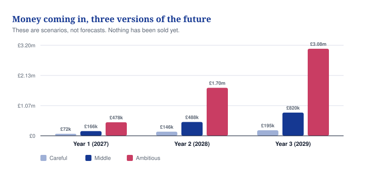
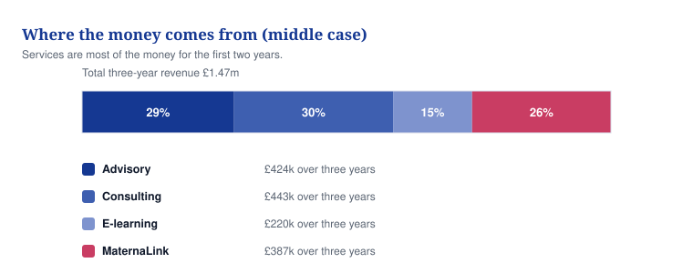
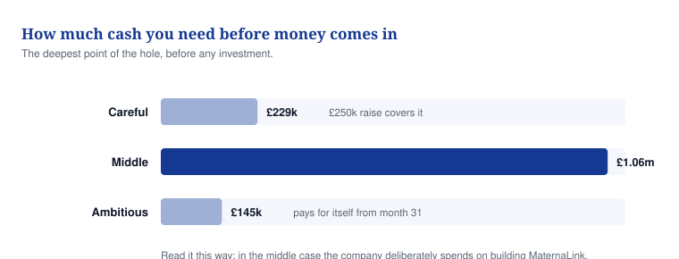
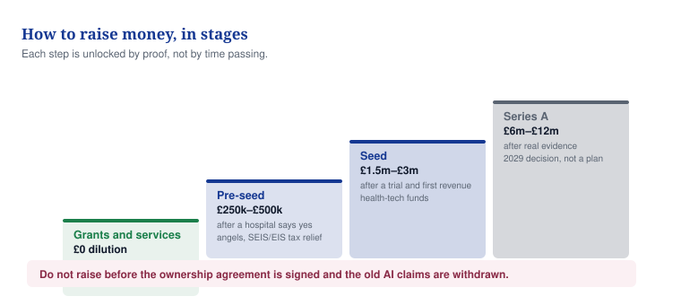
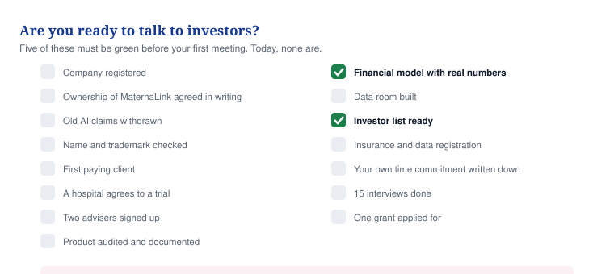

# 05 — The money: what it costs, what you raise

**What the three-year plan says, how much cash it needs, and how you raise it without being caught out.**

## In one minute

- Three versions of the next three years exist. None has happened. Nothing has been sold.
- The careful version loses money slowly. The middle version spends about £1m building the product.
- Retainers are the best money in the company. Your day rate barely changes anything.
- You raise in four steps. Each step needs proof, not time passing.
- You are not ready to meet an investor today. Fifteen things must be fixed first.

## What to do

| Action | Who | By when |
|---|---|---|
| Take the 2025 predictive claims off every public page and date-stamp the removal | Founder | Day 3 |
| Clear the name, incorporate, open the bank account, appoint the accountant | Founder | Day 12 |
| Sign the MaternaLink ownership deed with David Agunede | Founder and solicitor | Day 30 (hard stop Day 60) |
| Apply for SEIS/EIS advance assurance | Accountant | Month 1–2 |
| Take no investor meeting until items 1 to 4 below are done and two of 5 to 7 | Founder | Day 61 |

## Three versions of the future

*Caption: These are scenarios, not forecasts; the gap between them is mostly the product, not the services.*

EBITDA below means profit before interest, tax and the cost of equipment. It is the plain measure of whether the trading is paying for itself.

| | Careful | Middle | Ambitious |
|---|---|---|---|
| Three-year revenue | £412,514 | £1,474,289 | £5,249,714 |
| Three-year EBITDA | −£239,543 | −£1,032,201 | £113,985 |
| Peak cash needed before any funding | £228,872 | £1,058,035 | £144,705 |
| Break-even that lasts | Not reached in 36 months | Not reached in 36 months | Month 31 |
| Equity raised in the model | £250,000 | £2,400,000 | £3,500,000 |
| People employed at month 36 | 2 | 8 | 10 |

The middle version loses £1m on purpose. That money buys a product, evidence and a team of eight.

## Where the money comes from

*Caption: Services are most of the money for the first two years; the product only matters in year three.*

| Source | Three-year revenue | Share |
|---|---|---|
| Advisory | £423,748 | 29% |
| Consulting | £443,333 | 30% |
| E-learning | £220,208 | 15% |
| MaternaLink | £387,000 | 26% |
| **Total** | **£1,474,289** | |

MaternaLink earns nothing in year one. In year three it is £282,000, and still only 34% of that year.

## How much cash you need

*Caption: The deepest point of the hole, counted with no investment and no grants at all.*

| | Careful | Middle | Ambitious |
|---|---|---|---|
| Cash needed by month 12 | About £4k | About £36k | About £5k |
| Cash needed by month 24 | About £86k | About £253k | About £64k |
| Cash needed by month 36 | £228,872 | £1,058,035 | £144,705 (peak at month 31) |
| Lowest the bank balance ever gets | £4,726 in month 5 | £6,099 in month 3 | £12,750 in month 2 |

The first 90 days are the tightest point in all three. The rule that follows: never hire the product lead before the money lands.

## What actually moves the numbers

| What you change | From, to | Three-year revenue | Three-year EBITDA |
|---|---|---|---|
| Retainers held in years two and three | 1 to 3 | −£94k / +£96k | −£91k / +£93k |
| Average size of a consulting project | £15k to £30k | −£111k / +£222k | −£72k / +£144k |
| MaternaLink pilot value a year | £40k to £150k | −£105k / +£225k | −£58k / +£124k |
| African price per woman per year | £3 to £12 | −£61k / +£122k | −£61k / +£122k |
| Founder day rate | £1,200 to £1,800 | −£5k / +£5k | −£5k / +£5k |

Three things to take from that table.

- **One retainer held for two years is worth about £91,000.** That is more than any single MaternaLink assumption inside three years. Sell retainers first.
- **Bigger projects beat more projects.** Your billable days are already spoken for, so the day rate is almost irrelevant. Capacity is the lever, not price.
- **When MaternaLink goes live matters more the faster you grow.** A 12-month slip costs the middle case £132k of revenue, but it costs the ambitious case £775k of EBITDA and £642k of cash. So do not build the MaternaLink cost base until go-live has a contract date.

## Raising money in stages

*Caption: Each step is opened by proof, not by time passing.*

| Step | Amount | Who puts it in | What must be true first |
|---|---|---|---|
| Grants and services | No shares given up | Innovate UK, SBRI Healthcare, first paying clients | A registered company and a clinical partner letter |
| Pre-seed | £250k–£500k | SEIS/EIS angels, angel syndicates | Company incorporated; ownership deed executed; 2025 claims retired; advance assurance submitted; one signed services engagement; two named advisers |
| Seed | £1.5m–£3m | Health-tech and impact funds | Product built, security-tested and in a registered evaluation; one paid pilot signed; safety pack complete; team of three; services at £15k a month with two retainers; clean share register |
| Series A | £6m–£12m | Growth and impact funds, a strategic as a minority | Recurring MaternaLink revenue of £0.4m–£0.9m, or three UK sites plus one state programme; multi-site evaluation results; team of about ten |

Do not open any raise before the ownership agreement is signed and the old AI claims are withdrawn.

**SEIS and EIS in plain words.** SEIS is a tax scheme that gives people money back when they invest in a small British company. An investor gets 50% of what they put in taken off their income tax. EIS is the same idea for a slightly bigger company, at 30%. This is why UK angels will not invest without it. Never say "SEIS-approved"; say "advance assurance applied for" once that is true.

| Limit | Commonly cited figure | Label |
|---|---|---|
| SEIS, per company, for its lifetime | £250,000 | TO VALIDATE |
| SEIS, per investor, per tax year | £200,000 | TO VALIDATE |
| SEIS company conditions | Trading under 3 years; assets under £350,000; fewer than 25 full-time staff | TO VALIDATE |
| EIS, per 12 months | £5,000,000 | TO VALIDATE |
| EIS, lifetime | £12,000,000 | TO VALIDATE |

TO VALIDATE means we do not know yet. Check every line with an accountant and against gov.uk before saying it to an investor. A £400k pre-seed cannot be all SEIS: it splits into £250k SEIS then £150k EIS.

## Are you ready?

*Caption: The first four items gate everything else, and none of them is done today.*

| Done | What must be true | Owner | By when |
|---|---|---|---|
| [ ] | Company registered, bank account open, accountant appointed | Founder | Day 10 |
| [ ] | MaternaLink owned or licensed in writing | Founder and solicitor | Day 30 |
| [ ] | No unproven medical claims anywhere public | Founder | Day 3–14 |
| [ ] | Name and trademark checked and filed | Founder and trademark attorney | Day 5, filed Day 20 |
| [ ] | First revenue: one signed piece of work | Founder | Day 45 |
| [ ] | One hospital or NGO agrees in writing to a trial | Founder | Day 60 |
| [ ] | Two advisers confirmed, one clinical | Founder | Day 60 |
| [ ] | Prototype audited, written up, with an intended-use statement | Fractional product lead | Day 30 |
| [ ] | Financial model updated with real costs, round size chosen | Finance role | Day 60 |
| [ ] | Data room built | Founder | Day 45 |
| [ ] | Investor list verified and outreach ready | Founder | Day 55 |
| [ ] | Data registration, security certification booked, insurance quoted | Founder | Day 30 |
| [ ] | Your own time commitment written down, the other venture ring-fenced | Founder | Day 7 |
| [ ] | Fifteen discovery interviews written up, three quotes with consent | Founder | Day 60 |
| [ ] | One grant application submitted | Founder | Day 75 |

**The rule.** Take no first investor meeting until the first four are done and at least two of items 5, 6 and 7. A meeting taken too early costs you that fund for twelve months.

## What investors will ask, and the honest answer today

| Question | The answer now | The answer at day 90 |
|---|---|---|
| Do you own MaternaLink? | Not yet in writing | Yes, the deed is signed |
| Is it a medical device? | Not as re-scoped, but the prototype needs changes | Intended use adopted, prototype changed, a regulatory opinion scoped |
| Any revenue? | None | The first advisory engagements |
| Any customer or pilot? | An earlier ministry conversation that went nowhere | One written pilot agreement, fifteen interviews documented |
| Who is on the team? | A solo founder and one collaborator | Founder, two advisers, a part-time technical lead and a safety officer identified |
| Why you? | The founder story, still to be written | The founder story plus evidence that you deliver |
| How much and what for? | £250k–£500k pre-seed | The same, with milestones tied to the model |

## What kills a raise

| What kills it | How an investor finds it | Fixed by |
|---|---|---|
| Ownership of MaternaLink not written down | One question: who owns the code. Then the email signature on the old proposal | Day 30, hard stop Day 60 |
| Medical claims nobody has proved | Any copy of the 2025 deck, a web search, or the prototype's own words | Day 3 |
| No company registered | A Companies House search returns nothing | Day 12 |
| The old £300 per woman pricing | The proposal circulates; anyone with African health-tech experience knows the going rate | Day 21 to re-base, Day 60 for the decision |

Any one of these ends the conversation on the spot, and some investors will not come back.

## Words explained

| Word | What it means |
|---|---|
| EBITDA | Profit before interest, tax and the cost of equipment |
| Peak cash need | The deepest the bank balance would go with no investment and no grants at all |
| Pre-seed | The first outside money, usually from individuals rather than funds |
| Seed | The round that pays for the product and the first proper team |
| Series A | The round that pays for scaling something already working |
| SEIS and EIS | Tax schemes that give people money back when they invest in a small British company |
| Advance assurance | HMRC saying in advance that your company looks eligible for those schemes |
| Data room | One organised folder holding everything an investor will ask to see |
| TO VALIDATE | We do not know yet and must go and check |
