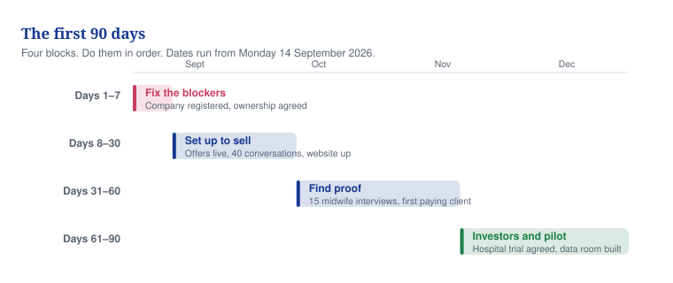

# 06 — The plan: your first 90 days

**What you do each week from Monday 14 September to Saturday 12 December 2026, and the four decisions that control it.**

## In one minute
- Ninety days to turn an idea into a real company that trades and tells the truth.
- Four blocks: fix the basics, build the sales engine, meet investors, launch.
- Four decisions control everything: the company, the ownership, MaternaLink, Ekiti.
- Money comes first. One paying client by 13 October, three by 12 December.
- You speak to no investor until the first three decisions are closed.

## What to do
| Action | Who | By when |
|---|---|---|
| Open the four blockers: name check, company decision, ownership talk, old claims withdrawn | You | Mon 14 Sept 2026 |
| Get the standstill letter signed and send the first 40 sales messages | You | Fri 18 Sept 2026 |
| Register the company | You and the accountant | Fri 25 Sept 2026 |
| First signed client, and the ownership deed signed | You and the solicitor | Tue 13 Oct 2026 |
| Decide Ekiti, then decide whether to build MaternaLink | You, with the board | Thu 12 Nov and Tue 8 Dec 2026 |

## The ninety days at a glance

*Caption: Fix the basics first; everything else waits behind those seven days.*

## Week one, day by day
Day one is Monday 14 September 2026.

| Day | What you do | Why | What you end up with |
|---|---|---|---|
| Mon 14 Sept | Set your weekly rhythm and your two trackers. Run the name and trademark checks on "Vytalix" and "MaternaLink" at Companies House, UK IPO, EUIPO and USPTO. Decide to register one English company. Send David Agunede a meeting request with your written questions and the ownership questionnaire. Write down that the 2025 AI deck and the £36m Ekiti headline are withdrawn from all outside use. | Every later step needs a name, a company and a clear owner. Nothing you say in public is safe until the old claims are gone. | Two decisions logged, search results saved with dates, a meeting booked for Wednesday, the old deck withdrawn |
| Tue 15 Sept | Set up the free CRM (the software that holds your contacts and deals). Build the first 50 of a 150-name list. Rewrite your LinkedIn profile so it says "pre-seed" and "in development". Publish your first post. Ask three solicitors and three accountants to quote. | You cannot sell without a list, and you cannot sign anything without a solicitor. | CRM live, 50 named contacts with sources, an honest profile, six quotes coming |
| Wed 16 Sept | Hold the ownership conversation with David Agunede, one hour, notes written the same day. Establish who wrote the code and the decks, who pays for the prototype, whether real patient data was ever entered, and what happened after the 18 March 2026 Ekiti email. Hand him the 60-day standstill letter. Adopt the new MaternaLink description: it helps midwives coordinate care, it does not diagnose. Take the old claims out of every file. | Undocumented ownership and over-claiming are the two things that end an investor call in minutes. | A written note of the facts, the letter with him for signature, the new product wording adopted, zero old claims left |
| Thu 17 Sept | Take the trademark attorney's opinion call on "Vytalix". Choose the solicitor and send the instruction. Send the standstill letter for signature. Send the first 20 sales messages. Publish your third post. | Tomorrow's name decision needs a professional opinion, not your guess. The first client is due on day 30, so selling starts now. | Attorney memo requested, solicitor engaged, 20 messages logged |
| Fri 18 Sept | Decide the name. If the checks are clean, use it; if not, use the reserve name rather than wait. Buy the domain and set up email. Sign both engagement letters. Get the standstill signed. Send messages 21 to 40. Log how much cash you have. Hold your first Friday review. | A cleared name and a professional bench are what week two is built on. | Name decision, domain and email, two engagement letters, a signed standstill, 40 messages sent, a 13-week cash plan |

Weekend: read the draft ownership terms on Saturday, send them to David Agunede on Sunday 20 September.

## Weeks two to four

| Week | What you do | What you end up with |
|---|---|---|
| Week 2, 21 to 27 Sept | File the incorporation (target Wed 23, hard deadline Fri 25). Sign your own IP assignment the same day. Send contract templates to the solicitor. Get insurance quotes. Apply for the bank account. Hold your first two discovery calls and send proposal one. Start the prototype audit. | A registered company, a bank application in, first buyer feedback |
| Week 3, 28 Sept to 4 Oct | Full sales quota begins: 40 contacts, 20 conversations, 5 discovery calls, 2 proposals each week. Register with the ICO. Bind the insurance. Open the bank account. Start the SEIS and EIS paperwork. Draft the grant calendar and the data room list. Build the 30-name list for UK interviews. | Insured, registered, banked, and selling at full rate |
| Week 4, 5 to 11 Oct | Adopt the new pricing memo, so the £300 per woman per year figure is gone from every document. Ask for the Ekiti status call and hold it. Approach the first three advisers. Publish the website. Send newsletter one. Negotiate the first engagement. | Website live, honest pricing, Ekiti facts known, data room version one |
| Days 29 to 30, 12 to 13 Oct | Sign the first client and raise the invoice. Execute the ownership deed. Receive the prototype audit report. Submit the SEIS and EIS application. Hold the first board meeting. | Revenue exists, ownership is documented, phase two is closed |

## Days 31 to 60

| Fortnight | What you do | What you end up with |
|---|---|---|
| Days 31 to 45, 14 to 28 Oct | Check that the company, the ownership and the claims are all closed; only then start investor outreach. Contact the top 25 investors, phone first. Decide whether to bid for a grant (by Fri 23 Oct). File the trademark (Wed 28 Oct). Identify a Clinical Safety Officer. Keep the sales quota. Run UK interviews. | 25 investors contacted, trademark filed, first meetings booked |
| Days 46 to 60, 29 Oct to 12 Nov | Contact the next 50 investors. Hold the mDoc conversation and score two other Nigerian states. Decide Ekiti (Thu 12 Nov). Sign two advisers and engage the Clinical Safety Officer. Complete 15 UK interviews and draft the research report. Sign the second client. | 75 investors contacted, 4 meetings, Ekiti decided, second client signed |

## Days 61 to 90

| Fortnight | What you do | What you end up with |
|---|---|---|
| Days 61 to 75, 13 to 27 Nov | Publish the research report (Fri 20 Nov) and run the webinar (Tue 17 Nov). Start on the next 75 investors. Act on the Ekiti decision by Fri 27 Nov. Keep second meetings moving with 48-hour answers. | Report published, webinar delivered, Nigeria path chosen |
| Days 76 to 90, 28 Nov to 12 Dec | Sign the third client. Make the MaternaLink build decision (Tue 8 Dec): build, build small, or wait. Get Cyber Essentials certified. Hold the fourth adviser meeting and the third board meeting. Write the plan for the next quarter (Sat 12 Dec). | Three clients, £15k to £30k contracted (ESTIMATE, our best guess), a minuted product decision, a Q1 plan |

## Four decisions you must make

| Decision | Decide by | If yes | If no |
|---|---|---|---|
| Register the company | Decide Mon 14 Sept; filed by Fri 25 Sept | You can invoice, insure, bank, and apply for tax relief and grants | Every later item slips day for day; delay past 25 September is not acceptable |
| Settle the ownership with David Agunede | Terms sent Sun 20 Sept; deed signed Tue 13 Oct; hard stop Thu 12 Nov | You can say Vytalix owns MaternaLink and name it to investors | Until it is signed, call it "a concept Vytalix is developing with a collaborator". If nothing is signed by 12 November, rebuild version one from scratch and drop his materials and the "Maternal Link" name |
| Re-scope MaternaLink | Wed 16 Sept | Version one coordinates care and does not diagnose; the AI risk score moves to a research track for later | Keeping the prediction claims needs a medical device route, data and ethics you do not have and cannot fund |
| Decide on Ekiti | Thu 12 Nov, after the status call, the mDoc conversation and a two-state scorecard | Offer a small, re-priced, partner-aware pilot, and only with board approval | Move to a better-scoring state with an NGO, or stop Nigerian government work for six months. The £4.5m and £300 per woman proposal is not restated under any option |

## How to decide anything else
Score any idea out of 100. Ten points, each marked 1 to 10.

| Point | A high score means |
|---|---|
| 1 Strategic fit | It matches the plan: services pay the bills, MaternaLink is the long story, UK first |
| 2 Money | Real cash within 12 to 24 months, and a large repeat stream later |
| 3 Demand | A named buyer has said they want it and can pay |
| 4 Speed | First paying customer in weeks, not years |
| 5 Cost | Cheap to reach the first result, under £2,000 |
| 6 Growth | It grows without more of your hours |
| 7 Advantage | A real difference from named competitors that you can build in a year |
| 8 Rules risk | Little exposure to medical device, data or clinical safety rules |
| 9 Simplicity | One owner, known steps, no outside dependency |
| 10 You can do it | You can deliver it alone, with the time and skills you have now |

Points 5, 8 and 9 are scored backwards on purpose. Cheap, low risk and simple all score high, so a bigger total is always better.

| Total | Verdict | What it means |
|---|---|---|
| 70 or more | BUILD | Commit your time and money now; it goes in the plan with dates |
| 50 to 69 | TEST | Promising but unproven; run one bounded experiment with a budget cap and a decision date |
| 35 to 49 | WAIT | Not now; write down the trigger that brings it back |
| Under 35 | STOP | Not pursued as stated; the idea underneath may return in a different form |

Four rules beat the total. If strategic fit is 3 or less, it is STOP. If rules risk is 2 or less, WAIT is the best it can be. If you cannot do it alone and cannot pay a team, WAIT. If nobody has said they want it, it can never be BUILD.

Scores for the eight live ideas, made 8 September 2026. All are ESTIMATES (our best guess, not facts).

| Idea | Score | Verdict |
|---|---|---|
| A. Advisory work you deliver yourself | 76 | BUILD |
| B. A research report used to attract clients | 65 | TEST |
| C. MaternaLink version one, care coordination only | 59 | TEST |
| D. Chasing an NHS pilot, starting as a design partner | 54 | TEST |
| E. Launching e-learning in year one | 49 | WAIT |
| F. White-label MaternaLink for NGOs | 45 | WAIT |
| G. The MaternaLink AI risk score as a product now | 33 | STOP for now (rules risk) |
| H. The Ekiti proposal at £300 per woman per year as written | 33 | STOP as written (no proven buyer) |

Re-score every quarter, first in the week of Monday 14 December 2026. Any score that moves by three points or more must name the new evidence.

## What not to waste time on
- Any investor conversation before the company, the ownership and the claims are settled. It is the fastest way to lose a good investor.
- Building the MaternaLink app before the decision on Tuesday 8 December. You do not yet know what to build or who pays.
- The AI risk score as a product. It needs a medical device route, a data partner and an ethics review you cannot fund this year.
- Repeating the £300 per woman per year figure or the £36m Ekiti number. Both are withdrawn.
- E-learning courses and white-label versions. Both are WAIT; a waiting list page is all they get.
- Paid logos, printed brand work or a fancy website before the name is cleared on Friday 18 September.
- Hiring anyone. A virtual assistant only if admin passes eight hours a week for two weeks running.

## Words explained
| Word | What it means |
|---|---|
| Standstill letter | A short signed promise that neither side sells, licenses or shows MaternaLink to anyone else for 60 days while you agree terms |
| Heads of terms | A one or two page summary of a deal, agreed before the solicitors write the full contract |
| Discovery call | A first 30 to 45 minute call with a possible client, to find out what they need |
| SEIS and EIS | Tax schemes that give people money back when they invest in a small British company |
| ICO | The UK office you must register with, and pay £52 a year, if you hold people's personal data |
| Data room | One tidy folder of documents an investor reads before deciding |
| Cyber Essentials | A basic UK government security certificate that buyers ask for |
