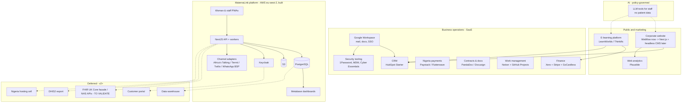

# 07 — Vytalix Group Technology Architecture

**Owner:** CTO, Vytalix · **Status:** PROPOSED v0.1 · **Date:** 7 September 2026 · **Governing file:** `/FACTS_BASE.md`. Related: `/docs/01_BUSINESS_MODEL.md` (revenue streams that each component serves), `/docs/03_BRAND_SYSTEM.md` (web and content standards), `/docs/04_MATERNALINK_PRODUCT_STRATEGY.md`, `/product/MATERNALINK_MVP_SPEC.md` (MaternaLink detail — not repeated here).

> **Starting point (VERIFIED):** Vytalix has no domain, website, e-mail domain, CRM, LMS, cloud account, security tooling or company registration; the founder uses a personal Gmail; a MaternaLink prototype of unknown provenance runs on Vercel (FACTS_BASE §1). An investor CRM exists only as CSVs and a Python build script in this repository (`/investors/`). Everything below is a recommendation. All prices are ESTIMATE in GBP at September 2026 from public list prices as recalled — TO VALIDATE before purchase; vendor plan names change often.

## Executive view (5 lines)

1. Vytalix needs two very different technology estates: a **lean, mostly bought, business stack** for the services and learning businesses that must cost under ~£300/month before MaternaLink build starts, and a **built, assured, in-region product platform** for MaternaLink (in development) that costs £350–£700/month to run at MVP plus the build itself.
2. **Buy, don't build**, for everything that is not the product: website (Webflow now, Next.js later), CRM (HubSpot Starter), LMS (LearnWorlds or Thinkific; Moodle only if a university/NHS buyer demands SCORM/LTI at scale), payments (Stripe + GoCardless; Paystack/Flutterwave for Nigeria), finance (Xero), workspace (Google Workspace).
3. **One product platform, not several:** MaternaLink's identity, audit, encryption, analytics and channel abstraction become the group's reusable core; the customer portal and admin dashboard are thin layers on it and are not built in year 1.
4. **AI is used for internal productivity and content drafting under a written policy**: no patient data to any third-party model without a DPIA, contractual no-training terms and an in-region endpoint; nothing generated reaches a woman without clinical sign-off.
5. **Assurance before scale:** Cyber Essentials (then Plus), DSPT, ICO registration, a fractional DPO and a Clinical Safety Officer are the year-1 governance spend; ISO 27001, FHIR/NHS API integration, native apps, a data warehouse and in-country Nigeria hosting are deliberately deferred.

---

## 1. Architecture diagram (group)

---

## 2. Component-by-component recommendations

Scoring: **Complexity** (L/M/H to set up and run), **Scalability** (L/M/H headroom without re-platforming).

### 2.1 Corporate website

| Item | Recommendation |
|---|---|
| Technology | **Year 1: Webflow** (CMS plan) on `vytalix.com` or the cleared domain (name clearance TO VALIDATE — FACTS_BASE §1 conflicts). **When engineers exist (2027+): Next.js static site + headless CMS (Sanity or Payload)** deployed on Vercel or Cloudflare Pages |
| Why | No engineering time exists in year 1; the brand system (`/docs/03_BRAND_SYSTEM.md`) needs editable pages, a blog, case-study templates and forms; Webflow supports design fidelity and non-developer editing. Moving to Next.js later unifies the stack with the product |
| Cost (ESTIMATE) | Webflow CMS £18–£25/month; domain £10–£15/year; Next.js route £0–£20/month hosting + CMS £0–£80/month |
| Complexity / Scalability | L / M (Webflow); M / H (Next.js) |
| Alternatives | Framer (similar; cheaper design-led); WordPress (cheap, plugin/security burden); Squarespace (limited) |
| Requirements | WCAG 2.2 AA; cookie-less analytics; privacy notice; no claims beyond FACTS_BASE §4; HSTS; forms post to CRM |

### 2.2 CMS

| Item | Recommendation |
|---|---|
| Technology | Webflow CMS (year 1); **Sanity** (hosted, generous free tier, structured content) or **Payload** (open source, self-hostable in AWS) when the site moves to Next.js. MaternaLink's clinical content library is **not** a marketing CMS — it lives in the product with its own two-person approval workflow (PRD §9) |
| Why | Separate marketing content from clinical content; clinical content needs versioning, sign-off and audit |
| Cost (ESTIMATE) | Included in Webflow; Sanity £0–£80/month; Payload compute £20–£40/month |
| Complexity / Scalability | L / M; M / H |
| Alternatives | Contentful (pricier); Strapi (self-host) |

### 2.3 CRM

| Item | Recommendation |
|---|---|
| Technology | **HubSpot** (free CRM → Starter Customer Platform) for sales pipeline, contacts, sequences and marketing e-mail; the investor CRM in `/investors/` imports as a separate pipeline; **Kemek Enterprise data stays out** (FACTS_BASE §1) |
| Why | Fastest setup; free tier adequate for month 1–6; good Gmail integration; forms from Webflow; reporting for the sales engine in `/docs/13_SALES_ENGINE.md` |
| Cost (ESTIMATE) | £0 (free) → £15–£20/seat/month Starter; Professional £700+/month is not needed in years 1–2 |
| Complexity / Scalability | L / H |
| Alternatives | Pipedrive (£12–£14/seat; sales-only, simpler); Attio (modern, £25+/seat); Folk (light); Salesforce (no) |
| Data rules | Only business contact data; investor data per FACTS_BASE §4 (public sources only); UK GDPR legitimate-interest assessment for outreach; suppression list |

### 2.4 Customer portal

| Item | Recommendation |
|---|---|
| Technology | **Do not build in year 1.** Serve consulting clients with shared Google Drive/Notion spaces and PandaDoc; serve e-learning customers inside the LMS; serve MaternaLink organisations inside the product's admin surface. **Year 2–3:** a Next.js portal on the MaternaLink identity (Keycloak) exposing invoices, documents, support tickets and product admin |
| Why | A portal without customers is cost; the product platform will supply identity and audit when needed |
| Cost (ESTIMATE) | £0 now; £30k–£60k build later |
| Complexity / Scalability | — / H (on the product platform) |
| Alternatives | HubSpot customer portal (ticketing); SuiteDash-style SaaS portals (weak security posture — TO VALIDATE) |

### 2.5 E-learning platform

Serves revenue streams #9–#11 in `/docs/01_BUSINESS_MODEL.md` (courses £49–£299; subscriptions £19/month; corporate licences). Requirements: self-paced video/text courses, quizzes, certificates (no accreditation claims until CPD approval — TO VALIDATE), coupons and regional pricing (Nigeria/Kenya/Ghana), bundles/subscriptions, corporate seat licences, SCORM export/import if NHS/universities require, GDPR-compliant learner data, UK VAT handling.

| Option | Fit | Cost (ESTIMATE, monthly) | Complexity | Scalability | Notes |
|---|---|---|---|---|---|
| **LearnWorlds** (recommended for B2B + B2C) | Strong: interactive video, assessments, certificates, SCORM, white-label, corporate/team plans, mobile app add-on | £25–£250 (Starter to Learning Center); transaction fee on the lowest tier | L–M | H | Best match for corporate licences and NHS-style buyers; TO VALIDATE current plan names and fees |
| **Thinkific** (alternative, cheapest credible start) | Good: simple authoring, communities, no transaction fees on paid plans (TO VALIDATE), B2B "groups" | £30–£150 | L | H | Choose if year-1 focus is B2C courses only |
| Teachable | Good for B2C creators; payment handling included; less B2B | £30–£120 + fees on lower tiers | L | M | Weaker corporate/SCORM story |
| Moodle (self-hosted or MoodleCloud) | Full LMS, SCORM/LTI, accreditation-friendly, open source | MoodleCloud £80–£150; self-host £30–£100 compute + admin time | M–H | H | Choose only when a university/NHS licence demands LTI/SCORM at scale or data must be self-hosted; admin burden for a one-person company |
| Custom (Next.js + Stripe + video CDN) | Full control | £40k–£80k build + £100+/month | H | H | Not before year 3; no justification at current volumes |

**Recommendation:** start on **Thinkific** if the first courses are founder-authored B2C (months 6–9), or **LearnWorlds** if a corporate/NHS cohort licence is signed first; migrate to Moodle only on a buyer requirement. Video hosting via the LMS (or Vimeo/Bunny) and course content drafted with AI assistance under §2.13.

### 2.6 MaternaLink application

See `/product/MATERNALINK_MVP_SPEC.md` for the full stack. Summary for the group view: TypeScript monorepo; Next.js PWAs; NestJS API; PostgreSQL (RLS) on RDS; Redis/BullMQ; S3; Keycloak; AWS eu-west-2; Terraform; GitHub Actions; channel adapters (Africa's Talking/Termii/Twilio; WhatsApp BSP v1.1). Run cost £350–£700/month at MVP; build £140k–£320k (ESTIMATE). Complexity H; Scalability H (designed to 20k women / 2m SMS per year before change).

### 2.7 Admin dashboard

| Item | Recommendation |
|---|---|
| Technology | **Product admin** inside the MaternaLink staff app (organisations, users, content workflow, audit viewer, feature flags) — part of the MVP; **business dashboards** on **Metabase** (self-hosted on ECS) reading a read replica; **group KPI dashboard** (services revenue, pipeline, learners) initially a Google Sheet/Looker Studio fed by HubSpot, Xero and LMS exports |
| Why | Avoids a separate internal-tools platform; Metabase is open source and embeds for `programme_manager` views |
| Cost (ESTIMATE) | Metabase compute £30–£50/month; Looker Studio £0 |
| Complexity / Scalability | M / H |
| Alternatives | Retool (fast internal tools; £10+/user; data leaves region unless self-hosted); Grafana for ops; Power BI if the buyer base is Microsoft-heavy |

### 2.8 Analytics

| Layer | Recommendation | Cost (ESTIMATE) | Alternatives |
|---|---|---|---|
| Web analytics | **Plausible** (EU-hosted, cookie-less) on website and LMS | £9–£15/month | Fathom; GA4 (free; consent banner and data-transfer questions) |
| Product analytics (MaternaLink) | In-house events table (no PII) → Metabase; PostHog EU self-hosted considered in year 2 | Included in cloud | Amplitude/Mixpanel (data leaves region — excluded for patient-adjacent data) |
| Business KPIs | Looker Studio / Sheets over HubSpot, Xero, LMS | £0 | Metabase over exported CSVs |
| Warehouse | **Not in year 1**; Parquet on S3 + Athena when volumes justify; BigQuery/Snowflake later | £0 → £50–£200/month later | — |

### 2.9 Authentication and identity

| Item | Recommendation |
|---|---|
| Staff/business tools | **Google Workspace** as the identity provider (SSO to HubSpot, Notion, GitHub, LMS admin); mandatory 2-step verification with security keys/passkeys for admins; a company domain replaces personal Gmail on day one of incorporation |
| MaternaLink staff users | **Keycloak** (self-hosted, eu-west-2) — OIDC for our apps, SAML/OIDC federation with NHS trust or state identity providers; MFA enforced |
| MaternaLink women | Phone OTP + device PIN/biometric (MVP spec §2) |
| Customer portal (later) | Keycloak realm per customer type |
| Cost (ESTIMATE) | Workspace £5–£11/user/month; Keycloak £40–£70/month compute |
| Alternatives | Auth0 (managed; per-MAU; UK residency tier TO VALIDATE); Clerk (developer-friendly; residency TO VALIDATE); Cognito (cheap; weaker federation UX); Microsoft Entra ID if the company standardises on Microsoft 365 (NHS buyers are Microsoft-heavy — a legitimate reason to choose Microsoft 365 over Google Workspace; decision TO VALIDATE with the founder's preference) |

### 2.10 Payments and billing

| Need | Recommendation | Fees (ESTIMATE, TO VALIDATE) | Alternatives |
|---|---|---|---|
| Course and subscription payments (UK/global cards) | **Stripe** (Checkout, Billing, Tax for VAT on digital services) — usually via the LMS's built-in Stripe integration | ~1.5% + 20p UK cards; ~2.5%+ international; Stripe Tax extra | Paddle (merchant of record — handles global VAT; higher %); Lemon Squeezy |
| Retainers and invoices (UK B2B) | **Xero** invoicing + **GoCardless** direct debit for retainers; Stripe for card-paid invoices | GoCardless ~1% + 20p capped per transaction (TO VALIDATE); Xero £15–£40/month | QuickBooks; FreeAgent |
| Nigeria (courses, programme fees, pilots) | **Paystack** (Stripe-owned) or **Flutterwave** for NGN cards, bank transfer, USSD and mobile money; requires a Nigerian entity/bank account or a partner (TO VALIDATE) | ~1.5% local + ₦100 on transactions over ₦2,500 (Paystack, as recalled — TO VALIDATE); Flutterwave similar; international cards ~3.9% | Interswitch; Monnify; bank transfer with manual reconciliation |
| Government/donor contracts | Invoice + bank transfer; no card rails; consider escrow/milestone payments and FX policy | Bank fees | — |
| Rules | No card data touches Vytalix systems (PCI SAQ-A via hosted checkout); refunds per Consumer Rights Act 2015; SMS pass-through billed monthly from `delivery_attempt` cost records |

### 2.11 APIs and integration layer

| Item | Recommendation |
|---|---|
| Product APIs | OpenAPI 3.1 REST (MVP spec §4); versioned; per-organisation API keys for programme partners (v1.2) with scopes; webhooks for events (v2) |
| Health interoperability | **FHIR UK Core** facade (read first) in v2; PRSB digital maternity record standard alignment for the handover summary (TO VALIDATE current version); HL7 UK membership when integration starts |
| NHS APIs (all TO VALIDATE for access, onboarding and fit) | PDS FHIR API (demographics), NHS login (citizen identity), MESH (secure messaging), GP Connect (not maternity), NHS App integration (in-app messaging/notifications), Maternity Services Data Set (MSDS) alignment for indicators — each requires onboarding through the NHS England API platform with a clinical safety and IG case |
| Nigeria | DHIS2 aggregate export (v1.2) mapped to the state's data elements; NHIA/state insurance interfaces TO VALIDATE |
| EPR vendors | Vendor-supported export/import interfaces (BadgerNet, Euroking, K2 — availability TO VALIDATE) in v2.2 |
| iPaaS | Not needed; point integrations via the API and workers; Zapier/Make only for business tools (HubSpot ↔ Xero ↔ LMS), never for patient data |
| Cost (ESTIMATE) | NHS API onboarding is mostly effort (£20k–£40k engineering and assurance per integration); FHIR facade £30k–£50k build |

### 2.12 Cloud, databases and hosting

| Item | Recommendation |
|---|---|
| Primary cloud | **AWS eu-west-2 (London)** with separate accounts for prod, non-prod, backup vault and security tooling under AWS Organizations; SSO via Workspace/IAM Identity Center |
| Alternative | **Azure UK South** — equivalent services; choose if the first NHS customer or the founder's team is Microsoft-centred. Do not run both |
| Nigeria | Cell options A–D in MVP spec §2.1; default: UK region with NDPA transfer safeguards until a contract requires in-country hosting |
| Databases | PostgreSQL everywhere (RDS); no MongoDB/Firebase for personal data (weaker relational integrity and audit); Redis for queues/cache only |
| Object storage | S3 (SSE-KMS, versioning, Object Lock for audit) |
| Edge | CloudFront + WAF; Cloudflare as DNS/registrar alternative |
| Cost (ESTIMATE) | £350–£700/month at MVP; £1,000–£2,500/month at 5 organisations and 20k women (ESTIMATE); Nigeria cell +£350–£1,500/month |
| Complexity / Scalability | H / H |
| Alternatives | GCP europe-west2 (fewer NHS references — ASSUMPTION); Hetzner/OVH (cheap, weak compliance story for NHS/DSPT); Vercel/Supabase (excellent DX; sub-processor and residency questions for patient data — acceptable for non-clinical apps such as the corporate site) |

### 2.13 AI and LLM usage policy (group-wide, PROPOSED)

| Rule | Detail |
|---|---|
| Permitted now | Drafting marketing and course content, code assistance, meeting summaries of **internal** meetings, research synthesis, translation **drafts** for internal review — using enterprise/business tiers with no-training terms (e.g., business tiers of major LLM vendors; TO VALIDATE terms and regions) |
| Prohibited | Entering any patient/woman data, identifiable client data, unpublished clinical content without review, or confidential contract terms into any third-party model without a DPIA and a contract covering the processing; generating clinical advice shown to women; using LLM output as a clinical or regulatory decision |
| MaternaLink product use | v1: none on patient data. v1.1–v2: operational message-type routing (not urgency), staff-authored translation drafts, content variants — all human-reviewed, in a UK/EU-region endpoint under DPIA and no-training contract (strategy §16). v3: research only under ethics approvals |
| Governance | AI use register; model/vendor list approved by the CTO; prompts and outputs for regulated content stored with the content version; bias and safety review for any woman-facing content pipeline; annual policy review |
| Tooling cost (ESTIMATE) | £20–£60/user/month for assistant tools; coding assistants £10–£40/user/month |

### 2.14 Cybersecurity (group)

| Control | Recommendation | Cost (ESTIMATE) |
|---|---|---|
| Identity | Workspace SSO, passkeys/security keys for admins, no shared accounts | Included |
| Devices | MDM (Google endpoint management for basics; Kandji/Jamf for Mac or Intune for Windows when >5 devices); disk encryption; auto-updates; EDR (e.g., CrowdStrike/Defender for Business) once staff >5 | £0–£8/device/month |
| Passwords/secrets | 1Password Business (or Bitwarden) for the team; AWS Secrets Manager for systems | £6–£8/user/month |
| E-mail security | SPF/DKIM/DMARC (p=reject), phishing-resistant MFA, security awareness training | £0–£5/user/month |
| Certification | Cyber Essentials (basic £300–£600 + VAT by size band; Plus £1,500–£3,000 + VAT — sources: https://www.isms.online/cyber-essentials/cost/ ; https://www.figgroup.co.uk/blog/cyber-essentials-vs-cyber-essentials-plus-cost ); DSPT as a Category 3 supplier (v8 CAF-aligned: 35 assertions, 42 evidence items — https://www.dsptoolkit.nhs.uk/News/161 ); ISO 27001 deferred to year 2–3 (£15k–£40k) | £2k–£4k/year |
| Product security | See MVP spec §12 (WAF, scanning, pen test, audit, encryption) | £6k–£12k/year pen test |
| Insurance | Cyber and professional indemnity once trading (TO VALIDATE quotes) | £1k–£3k/year |
| Incident response | Written plan; 72-hour ICO/NDPC notification readiness; tabletop exercise twice a year | Effort |

### 2.15 Data governance

| Element | Recommendation |
|---|---|
| Registrations | ICO registration on incorporation (fee tier ESTIMATE £52–£78 — TO VALIDATE); NDPC registration when Nigeria thresholds apply (health sector; reportedly >200 data subjects in 6 months — TO VALIDATE against https://ndpc.gov.ng/wp-content/uploads/2025/07/NDP-ACT-GAID-2025-MARCH-20TH.pdf ) |
| Roles | Fractional DPO (£500–£1,500/month ESTIMATE); SIRO (founder); Caldicott-style guardian from the clinical advisory group; CSO (DCB0129) |
| Artefacts | RoPA; data classification (public / internal / confidential / special category); retention schedule; DPIA templates (product, marketing, LMS); sub-processor register; DPAs; international transfer assessments; privacy notices per audience and language |
| Data classes and where they live | Marketing/CRM (HubSpot, EU/US hosting TO VALIDATE → transfer assessment); learners (LMS); finance (Xero/Stripe); patient-adjacent (MaternaLink only, in-region) — **never in Drive/Notion/CRM** |
| Access | Least privilege; quarterly access reviews; joiner/leaver checklist |
| Anonymisation | Aggregate dashboards with small-cell suppression; ICO anonymisation guidance |

### 2.16 Backups and continuity

| Layer | Recommendation | Cost (ESTIMATE) |
|---|---|---|
| Product | MVP spec §9: PITR, 35-day snapshots, cross-account UK copy, RPO 15 min / RTO 4 h, quarterly restore drills | Included in cloud |
| Business SaaS | Google Workspace backup (e.g., Spanning/Backupify-class) once >3 users; HubSpot/Xero exports monthly to an encrypted S3 bucket; LMS content master copies in Drive + S3 | £3–£6/user/month |
| Code | GitHub organisation with branch protection; nightly mirror to S3 | £0–£10/month |
| Continuity | Static status/emergency page; documented manual fallback for MaternaLink sites (phone lists) | Effort |

---

## 3. Lean year-1 stack and monthly total (ESTIMATE)

Two phases: **Phase A** (months 1–3, services only) and **Phase B** (months 4–12, MaternaLink build and alpha). ASSUMPTION: 2 paid seats in Phase A, 4–5 in Phase B.

| Component | Phase A (£/month) | Phase B (£/month) | Notes |
|---|---|---|---|
| Domain, DNS, e-mail security | 2 | 2 | Cloudflare registrar; DMARC tooling free tier |
| Google Workspace (Business Starter/Standard) | 10–22 | 25–55 | Replaces personal Gmail |
| Website (Webflow CMS) | 18–25 | 18–25 | |
| Web analytics (Plausible) | 9 | 9 | |
| CRM (HubSpot free → Starter) | 0–20 | 20–40 | |
| Finance (Xero) + GoCardless/Stripe | 15–30 | 15–30 | Transaction fees excluded |
| Work management (Notion/GitHub Projects) | 0–16 | 16–40 | |
| Contracts (PandaDoc/Docusign) | 0–25 | 25–40 | |
| Password manager (1Password) | 12–16 | 30–40 | |
| Scheduling (Calendly) | 0–10 | 0–10 | |
| AI assistants (business tier) | 20–60 | 80–200 | Per policy §2.13 |
| LMS (Thinkific/LearnWorlds) | 0 | 30–120 | From month ~6 |
| GitHub Team | 0 | 12–20 | |
| AWS (dev/staging/prod as they come online) | 0 | 150–700 | Ramps across the build |
| Observability (Sentry, Grafana Cloud, uptime) | 0 | 20–80 | |
| Messaging gateways (sandbox → pilot) | 0 | 10–150 | Pass-through in pilots |
| Fractional DPO | 0–500 | 500–1,500 | Governance, not tooling; shown for completeness |
| **Tooling total (excluding DPO)** | **£90–£250** | **£460–£1,560** | |
| **Total including DPO** | **£90–£750** | **£960–£3,060** | |

Annual items (ESTIMATE): Cyber Essentials £300–£600; Plus £1,500–£3,000; pen test £6k–£12k; accessibility audit £3k–£6k; ICO fee £52–£78; insurance £1k–£3k.

---

## 4. What not to build (yet)

| Item | Why not now | Revisit when |
|---|---|---|
| Custom website/CMS | No engineers; Webflow suffices | Engineering team in place and brand assets stable |
| Custom LMS | Off-the-shelf covers years 1–2 | >£150k/year learning revenue or a buyer demands self-hosting |
| Customer portal | No customers to serve | 5+ paying organisations |
| Data warehouse / BI platform | Volumes tiny; Metabase and Sheets suffice | >5 organisations or research data needs |
| Native mobile apps | PWA meets MVP needs; app-store overhead and clinical-safety re-testing per release | Evaluation shows PWA limits (push on iOS, background sync) |
| FHIR / NHS API integrations | No NHS customer; onboarding is effort-heavy | A trust asks for it (v2) |
| Nigeria in-country hosting | No contract requiring it | A signed contract with a residency clause |
| Multi-region active-active | Cost and complexity | >99.9% requirement in a contract |
| AI features on patient data | No DPIA, no in-region endpoint, no clinical review process | v1.1+ under strategy §16 with the policy in §2.13 |
| ISO 27001 | Cyber Essentials Plus + DSPT are what NHS buyers ask first | A buyer requires it or year 3 |
| Kubernetes | ECS Fargate is enough | Multi-service scale or team preference with ops capacity |
| Microservices | Modular monolith (NestJS modules) is faster and safer | Team >10 engineers |
| Separate identity SaaS for women | OTP+PIN suffices | Unification with Keycloak justified |
| Blockchain, tokenisation, wearables | No user need; distracts from the credibility strategy | Never, absent evidence |

---

## 5. Integration and data-flow principles

1. Patient-adjacent data lives only in the MaternaLink platform, in-region, behind RLS, audit and encryption; business SaaS never receives it.
2. Every external service is a sub-processor with a DPA and an entry in the register; every new one requires a DPIA delta.
3. Integrations are adapters behind interfaces (channel providers, identity providers, EPR exports, DHIS2) so that a customer choice is configuration.
4. Exports for customers are documented formats (CSV, FHIR bundles v2, DHIS2 aggregates) to avoid lock-in.
5. Observability, backups and IaC are non-negotiable from the first environment — they are the cheapest DSPT evidence.

---

## Priorities / Risks / Next actions

**Priorities**
1. On incorporation: domain and Google Workspace (or Microsoft 365 — decide once), DMARC, 1Password, HubSpot free, Xero, Webflow site, Plausible, ICO registration — one week of setup, under £300/month.
2. Stand up the AWS organisation, Terraform baseline and GitHub before the MaternaLink build starts; adopt the LLM policy (§2.13) in writing.
3. Choose the LMS at the point the first course is scheduled (month 6), not before.
4. Book Cyber Essentials for the quarter in which MaternaLink staging exists; plan DSPT for the cycle in which real patient data first flows.
5. Keep the deferred list (§4) as a standing agenda item so that build pressure does not reintroduce it early.

**Risks**
| Risk | Mitigation |
|---|---|
| Founder time consumed by tool sprawl | Single-week setup checklist; SaaS with SSO only; quarterly tool review |
| Personal Gmail and Drive continue to hold company data | Migrate on day one of the domain; Drive ownership transfer; Kemek separation |
| Vendor data residency assumptions wrong (HubSpot, Clerk, LMS) | Transfer assessments; keep patient data out of SaaS entirely |
| Cloud costs creep during build | Budgets and alerts; Fargate Spot in non-prod; monthly review |
| Choosing Google Workspace when NHS buyers live in Microsoft | Decide once with the founder; either works — federation is what matters |
| Prototype on Vercel becomes a shadow production system | Audit and freeze it (strategy §25); no real data |

**Next actions**
- CTO: setup checklist and IaC baseline; sub-processor register v0.1; AI policy v0.1 for founder sign-off.
- Founder: domain and name clearance; workspace decision (Google vs Microsoft); ICO registration on incorporation; Vercel prototype access and audit authorisation.
- Finance/ops (founder or bookkeeper): Xero, Stripe, GoCardless accounts; Paystack/Flutterwave entity question for Nigeria (TO VALIDATE).
- DPO (fractional, to contract): RoPA, DPIA templates, retention schedule.
