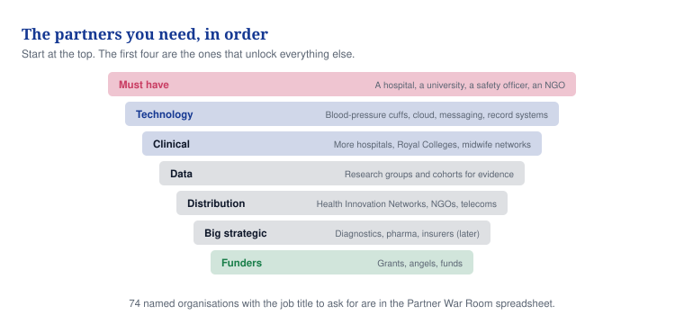

# 10 — The partners you need

**This document tells you which seven kinds of partner matter, which four to get first, and exactly what to say to them.**

Labels used below: **KNOWN** (checked and true today), **ESTIMATE** (our best guess, not a fact), **TO VALIDATE** (must be tested before you say it out loud).

Vytalix has no partners today. No agreement, no letter of intent, no grant, no membership and no introduction exists with any organisation named here (KNOWN). Every name below is a public institution and a target. Nothing here may be shown to anyone as a relationship.

## In one minute

- You cannot buy NHS access, clinical credibility, an African cohort or evidence. Partners are the only route.
- Four partners come before all the others: one hospital, one university, one safety officer, one African NGO.
- You pay community and charity partners. You never ask them for a free endorsement or a logo.
- Equity goes to people who put in cash or who join as a founding executive. Never to an institution.
- Nothing is a partnership until it is signed. Until then it is a target, or a conversation.

## What to do

| Action | Who | By when |
|---|---|---|
| Apply to one regional Health Innovation Network and to DigitalHealth.London | Founder | Month 3 |
| Send paid co-design proposals to two community organisations | Founder | Month 3 |
| Open the clinical safety officer search through midwifery and obstetric networks | Founder | Month 3 |
| Ask one university perinatal research group to design the evaluation | Founder | Month 6 |
| Get one Nigerian implementing NGO to sign a letter of intent for a cohort | Founder | Month 6 |

*Caption: work from the top band down. The four in the first band are the ones the rest depend on.*

## The seven kinds of partner

| Kind | Why you need them | What you ask for | What you give | When to approach |
|---|---|---|---|---|
| **1. Must have** — one NHS maternity service, one African NGO, a clinical safety officer, a university research group | Without a clinical home there is no product, no evidence and no credibility | A named clinical lead, a cohort of women, ownership of the hazard log, an evaluation design | No licence fee during the evaluation, all safety paperwork done, co-authorship, a fractional retainer for the safety officer | Now |
| **2. Technology** — blood-pressure cuff makers, cloud providers, messaging gateways, record-system vendors, home urine testing | Readings must come from validated devices, and data must reach the hospital's real record | Access to their software, device pricing, loan stock, start-up credits, interface specifications | A new channel into maternity, a reference customer, joint case studies | Month 1–6 |
| **3. Clinical** — more hospitals, private maternity units, Nigerian teaching hospitals, the Royal Colleges, digital-midwife networks | Scale, variety of settings, and permission to be taken seriously | Sites, clinicians, data, a review of your process, conference slots | Service evaluations, fair pricing, training content that matches their standards | Month 3–6 |
| **4. Data** — perinatal research units, birth cohorts, health data bodies, Nigerian DHIS2 programmes | You need real comparison data to show anything is working | Access under proper governance, and advice on method | New data flowing in, joint publications, acknowledgement | Month 6–12 |
| **5. Distribution** — Health Innovation Networks, accelerators, NGO implementers, telecoms, buying frameworks | They reach buyers a solo founder cannot reach | Introductions, a programme place, a listing, bundling | Evidence, a compliant product, a referral or reseller margin of 10–25% | Month 2 onwards |
| **6. Big strategic** — diagnostics firms, pharma with maternal programmes, insurers, device companies | Money, reach and credibility, but only once you have evidence | Programme funding, co-development, pilots | Access to a consented group of women under governance, joint pathways | Month 9 and later |
| **7. Funders** — angels, women's-health and impact funds, Innovate UK, SBRI Healthcare, NIHR, Wellcome, Grand Challenges, Gates, MSD for Mothers | Money staged against evidence, most of it without giving up shares | Pre-seed money, then grants, then seed | A credible plan and an honest data room | Month 3 onwards |

## The first four to get

Send short messages. Never open by asking for a logo or an endorsement. Say your stage honestly every time.

### 1. One NHS trust maternity service

Route in: a Health Innovation Network introduction to the obstetric lead for high blood pressure in pregnancy, not a cold email to the trust.

> "I am building a non-diagnostic tool that helps a maternity team keep track of women between appointments and hand over safely. It is in development, it has no users and it is not approved by anyone. I want to design it around a real high-blood-pressure pathway rather than guess. Would 20 minutes be useful? What I would bring is the safety paperwork done properly and a written evaluation you co-author. What I would need is a named clinical lead, a midwifery lead and 100 to 300 women over three to six months. There is no licence fee for the first site."

### 2. One university perinatal research group

Route in: email the professor who runs the maternal-health digital or blood-pressure research directly, citing their published work.

> "Your team produced the evidence on self-monitoring blood pressure in pregnancy. My question is what should happen after the reading is taken. I am pre-seed, the product is in development, and I do not have an evaluation design I trust. Would you be willing to shape one with me, as co-investigator, with a view to a joint grant bid? You would own the design and the authorship."

### 3. A clinical safety officer

Route in: midwifery and obstetric professional networks, and Health Innovation Networks.

> "I need someone to own the hazard log, the intended-use statement and the safety classification before anything is built. This is a fractional paid role, not free advice. It comes with a founding-team role and a share option grant if we work well together. Are you taking work of this kind?"

### 4. One African implementing NGO

Route in: the country director or programme manager, through public routes only. Never arrive with a state-wide proposal.

> "You already run a maternal programme with an enrolled group of women. I am not trying to replace it. I am building the facility-side part that messaging programmes do not cover: follow-up tracking, defaulter lists for community health workers, referral tracking and exports that fit your reporting. Pre-seed, in development, no deployments. Would you scope a cohort of 500 to 2,000 women with me, with your name on the evaluation and the data owned by you?"

Rule for incumbents such as mDoc, Jacaranda Health and Helium Health: talk about what they do not do. Never talk about price, never say "better", and never mention the March 2026 Ekiti proposal.

## The five partnerships that would change everything

These are unlikely. They are listed so you recognise the opening if it appears. None has been approached (KNOWN).

| # | The partnership | Why it would change everything |
|---|---|---|
| 1 | **NHS England maternity programme with a national perinatal research unit** | Removes the "this duplicates the national early-warning score" objection and turns policy into pull instead of resistance |
| 2 | **A diagnostics company with a pre-eclampsia blood test** | Home readings decide who gets tested, and the result flows back. A guideline-backed test attached to your pathway, with their access to every trust |
| 3 | **A large foundation or MSD for Mothers, funding a Nigerian state programme with mDoc as the incumbent partner** | Pays for validation at scale and places you underneath existing programmes rather than against them |
| 4 | **A large cloud or technology company with a university partner** | Gives you speech in African and South Asian languages, and shared learning across sites, without building the infrastructure |
| 5 | **A private insurer with an international network** | Makes the postpartum year a covered benefit. A paying customer at scale, and a bridge to insurers in other countries |

Runner-up: a telecom with African operations, so that messages to enrolled women cost the woman nothing.

## What you give away and what you never give away

"Founding partner" is a title and a thank-you. It is not exclusivity and it is not shares.

| Package | What they put in | What they get | Shares? |
|---|---|---|---|
| **Founding clinical partner** (1–3 UK sites, 1–2 African) | A clinical lead, midwives, women, governance sign-off | Named as a founding partner, co-authorship, a seat on the steering group, no licence fee during the evaluation, then 40% off for three years | No. Individual clinicians may join the advisory board with a small option grant |
| **Founding technology partner** (devices, cloud, messaging) | Software access, devices, credits, engineering help | Reference partner, joint case studies, a say in the roadmap, preferred-supplier status at fair prices | No |
| **Founding research partner** (1–2 universities) | Evaluation design, ethics, analysis, grant bids | Co-authorship, data access under governance, a seat on cohort governance | No. Joint ownership of research outputs is written into the agreement |
| **Founding data partner** (cohorts, research bodies, trusts) | Governed datasets and methods | Acknowledgement and joint publications | No. You pay them data-access fees, not the other way round |
| **Founding distribution partner** (NGOs, networks, insurers, telecoms) | Introductions, bundling, a channel | Revenue share, joint marketing, a partner portal | No. Margin is 10–25% |
| **Founding strategic partner** (diagnostics, pharma, corporates) | Programme funding, market access | Joint pathways, a board observer seat only if they invest | Only for cash at market terms in a proper round. Never for "help" |

**The rule that never changes.** Shares are exchanged for three things only: cash at market terms, a founding executive's time, or a small advisory grant of 0.1% to 0.5% that vests. No institution ever receives shares. Exclusivity is sold, never given, and is always narrow and time-limited.

**The other rule.** Charities and community organisations are paid £2,000 to £10,000 per piece of co-design work (ESTIMATE). You never ask them for free support, a logo, or advocacy.

## How to ask

Keep both under 120 words. One offer, one question, one 20-minute ask. Follow up twice at most, then leave it for 90 days.

**Email**

> Subject: 20 minutes on [their specific programme or paper]
>
> Dear [name],
>
> I read [the specific report, paper or programme page] this week. [One sentence on the one thing in it that matters to what you are building.]
>
> I am pre-seed and UK-based. MaternaLink is in development. It has no users, no approvals and no deployments. I am not asking you to endorse anything.
>
> What I can offer is [the one thing that costs them nothing: a draft, a data point, an introduction, or a paid brief].
>
> One question: [the single question only they can answer].
>
> Would 20 minutes in the next fortnight be useful?
>
> [Name]

**LinkedIn**

> Hello [name] — I saw [the specific thing they published or launched]. I am building a non-diagnostic maternity coordination tool, pre-seed, in development, nothing deployed. I am not selling anything and not asking for an endorsement. I have one question about [the specific gap], and I would value 20 minutes. Happy to send a one-page note first if that is easier.

## Where the names are

The 74 named organisations, with the country, the tier, what to ask for, what to offer, the job title to contact, the opening approach and a priority score out of 10, are in:

`/investors/partners/PARTNER_TARGET_LIST.csv`

The same list with tracking columns is in `PARTNER_CRM_TEMPLATE.csv` and `PARTNER_WAR_ROOM.xlsx` in that folder. Update the tracker within 24 hours of any contact. Review it once a month. Never enter an invented email address or phone number.

## Words explained

| Word | What it means |
|---|---|
| Health Innovation Network | One of 15 publicly funded English bodies that help new health products reach the NHS, and introduce you to hospitals |
| Clinical safety officer | The named clinician who signs off that a digital health product is safe to use, and owns the list of things that could go wrong |
| Hazard log | The written list of everything that could go wrong with the product, and what you have done about each one |
| Letter of intent (LOI) | A one-page, non-binding note saying two organisations intend to work together |
| MoU | A memorandum of understanding: a non-binding document setting out scope and principles. It is not a contract and never a "government partnership" |
| Service evaluation | A study of how a service works in practice. It is not a clinical trial and does not need the same approvals |
| DHIS2 | The health reporting system most African health ministries use. Your data must be able to export into it |
| Cohort | A defined group of women enrolled in a programme and followed over time |
| Vesting | Shares or options earned gradually over time, so someone who leaves early keeps only part |
