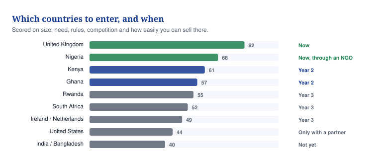

# 12 — Company structure and which countries

**How to set the company up, who owns what, who advises you, and which countries to sell in and when.**

## In one minute
- Set up one UK company now. Do not build a group of companies yet.
- Vytalix cannot say it owns MaternaLink until the agreement with David Agunede is signed.
- You start with 100% of the shares. Plan the giving away, do not improvise it.
- The UK is the home market. Nigeria is second, Kenya third. Everywhere else waits.
- Nothing here is legal advice. A solicitor and an accountant must check it before you sign.

## What to do

| Action | Who | By when |
|---|---|---|
| Instruct a solicitor for the IP and share paperwork | You | Within 14 days |
| Sign a 60-day standstill letter with David Agunede | You and him | This week |
| Register one company in England and Wales | You | Within 30 days |
| Approach the first two advisers, an obstetrician and a senior midwife | You | Months 1 to 2 |
| Find a Nigerian delivery partner in a state without a rival programme | You | Months 6 to 18 |

## How to set the company up

Register one private limited company in England and Wales. Suggested name: Vytalix Group Ltd. Reserve name: Vytalix Health Technologies Ltd. Both depend on the name clearance in document 11.

The four parts of the business — Advisory, Consulting, Health Solutions, E-Learning — are departments inside that one company. They are not separate companies. Each gets its own budget line, not its own bank account.

Why one company. It costs about £50 to register and roughly £1,500 to £3,000 a year in accounts (ESTIMATE, our best guess). One bank account, one tax registration, one list of shareholders. Grant bodies such as Innovate UK want one registered UK applicant. Investors want one share register.

Sign a founder IP assignment on day one. That is a short document where you give the company everything you have already made for it. Founders forget this and it costs them later.

**When to split MaternaLink into its own company.** Do it when any two of these happen, and always before real patient data goes in.

| Trigger | Why it forces a split |
|---|---|
| The first real deployment holding identifiable patient data | Keeps clinical and data risk away from the consulting income |
| An investor who wants to back the product only, not the consulting | The two are valued in completely different ways |
| A grant or government contract that demands a dedicated company | Some funders will not pay anyone else |
| Any regulated status, such as being a medical-device manufacturer | The regulator expects the company itself to be the manufacturer |

Cost of splitting later: £3,000 to £6,000 in legal fees and about £2,000 a year more in accounts (ESTIMATE).

**Nigeria and Kenya.** Do not register a company there until you have a signed pilot or funded programme. Work through a local delivery partner until then.

## Who owns what

David Agunede signs himself "Founder and CEO, Maternal Link". He sent the Ekiti proposal and the prototype. Nothing is written down. That is a VERIFIED gap: we checked, and no agreement exists.

Until it is fixed, you cannot tell an investor that Vytalix owns MaternaLink. Do not say it.

First, do an IP audit. That means asking, in writing, who wrote the code, what other people's code is in it, whether an employer or university has a claim, and whether any real patient data was ever entered. Do this before you offer anything.

| Option | How it works | Good points | Bad points | Recommendation |
|---|---|---|---|---|
| 1. He gives you the rights, you give him shares | He signs over the code, brand, decks, proposals and domain to your company. He receives shares that vest over four years, and possibly a job title. | The company owns what it sells. Investors expect exactly this. Fastest and cheapest: 3 to 6 weeks, £2,500 to £6,000 (ESTIMATE). | You give away real ownership. If he leaves early, vesting must claw the shares back. | **Preferred.** |
| 2. He keeps the rights and licenses them to you | He stays the owner. He grants Vytalix an exclusive worldwide licence with the right to buy the rights later. He gets a small stake or a share of MaternaLink income. | Easier for him to accept. Keeps talks moving. | Investors will pay you less for the company, and may demand you convert it to option 1 anyway. He could dispute the scope. 3 to 6 weeks, £3,000 to £7,000 (ESTIMATE). | Fallback only. Insist on a right to buy the rights within 36 months. |
| 3. A new joint company | A new company, say 60/40 or 51/49 between Vytalix and him. He puts in the rights. You put in cash, work and the brand. | He keeps visible ownership of what he built. | Two share registers, deadlock risk, and most UK angel investors will refuse. Slowest: 8 to 16 weeks, £8,000 to £20,000 (ESTIMATE). | **Not recommended.** |

Under option 1, a PROPOSED (suggested, not agreed) starting figure is 8% to 12% of shares, vesting over four years with a one-year cliff. A cliff means he gets nothing if he leaves in the first year. Ask for a warranty that he wrote it, and that no real patient data was ever processed.

**A solicitor must draft this. Do not write it yourself and do not promise anything verbally.** Budget £4,000 to £9,000 for the whole package (ESTIMATE). This week, at almost no cost, get both of you to sign a standstill letter: neither party shows MaternaLink to anyone else for 60 days while you agree terms.

## The share plan

Everything in this table is an ILLUSTRATION. It is a worked example to show the shape, not a plan you have agreed with anybody. Every figure is PROPOSED or ESTIMATE.

| Stage | You | MaternaLink rights settlement | Staff option pool | Investors |
|---|---|---|---|---|
| Day one | 100% | — | — | — |
| After the rights deal, months 2 to 4 | 88–92% | 8–12% | — | — |
| After the option pool, months 4 to 6 | 76–82% | 7–11% | 12% | — |
| After a £250,000 pre-seed round, months 9 to 15 | 68–73% | 6–10% | 10.7% | 11.1% |

Rules that keep this safe. Everyone who gets shares without paying cash vests them over four years with a one-year cliff. Advisers get options, roughly 0.25% to 0.5% each, over two years. Nobody is called a co-founder or shareholder until a term sheet is signed. Options for staff go through an EMI scheme, which is a tax-friendly UK share scheme, once the company qualifies.

## Who sits around the table

**The board.** For the first six months: you as director, plus one independent non-executive director. Ideally a former NHS or health-technology executive. Pay is nothing, or £3,000 to £6,000 a year (ESTIMATE). Meet monthly for an hour.

The board, not you alone, must approve: issuing shares, borrowing over £25,000, any contract over £50,000, any clinical or regulatory claim you publish, any government proposal, and any hire above £60,000.

**Four advisers to recruit.** None is appointed today. That is KNOWN. Describe them by role, never name anyone until they have agreed in writing.

| Adviser | What they bring | Where to look | When |
|---|---|---|---|
| A consultant obstetrician who has led maternity improvement work | Clinical credibility, and sign-off on what the product claims to do | Royal College of Obstetricians networks, academic obstetrics departments | Months 1 to 2 |
| A senior midwife: head of midwifery or a digital midwifery lead | The buyer's own view, and how the work really flows on a ward | Digital midwife networks, maternity voices partnerships | Months 1 to 2 |
| A clinical safety officer who knows UK medical-device rules | Keeps version 1 out of medical-device territory, and keeps grant panels happy | Independent safety officers, digital health consultancies | Months 2 to 3 |
| An NHS digital or commissioning leader | How the NHS actually buys, and introductions to the people who buy | Health Innovation Network alumni, former NHS England staff | Months 2 to 4 |

Two more later, once you can afford them: a Nigerian health-system leader for African entry, and a health-technology founder who has raised a Series A.

Advisers give 90 minutes a quarter plus occasional calls. They do not make decisions. Never describe an adviser as a partner or as endorsing the product.

## The vision and the five ways to say the mission

**Vision.** Technology for Life. A world where every person, starting with every mother, is connected to care that knows them, hears them and acts in time.

| Version | Use it for | The words |
|---|---|---|
| One sentence | Anywhere | Vytalix builds and advises on technology that keeps people connected to the care they need, starting with mothers in the UK and Africa. |
| Twenty-five words | Bios, forms, introductions | Vytalix is a UK health-technology group. We help health organisations, founders and governments make technology work in real care, beginning with maternal care coordination. |
| Website | The home page | Care fails most often between people. Between a woman and a changing set of professionals. Between one shift and the next. Vytalix exists to close those gaps. We advise and deliver for health organisations, founders and public bodies. We are building MaternaLink, a coordination platform for maternity services, in development for the NHS and for places with poor connectivity. |
| Investor | Pitch decks and first meetings | Maternal care is a coordination problem before it is a clinical one. UK inquiries keep finding failures to listen, escalate and hand over. Vytalix has two layers. Advisory, consulting and courses bring cash in from month two. MaternaLink, in development, is the equity story: coordination for NHS trusts and for African programmes. We are pre-seed and pre-formation, and we say so. |
| Formal | Proposals to health organisations | Vytalix works with maternity services, providers and commissioners to make digital tools usable on the ward and in the community. We bring strategy, delivery, product and training under one roof. MaternaLink, in development, is intended to support clinical judgement, not replace it. We are explicit about what is evidenced and what is not. |

## Which countries and when

*Caption: the UK is where you start, Nigeria and Kenya come next, and everything else waits for evidence and money.*

Every country was scored on eleven things: size, need, regulation, competition, digital coverage, health system, government opportunity, funding available, partners available, ease of winning a customer, and money you could earn. The second score is the first one cut down to what a solo founder with a small pre-seed can actually reach by 2028. All scores are desk ESTIMATES.

| Country | Score /100 | Score after a reality check | Do not enter yet | When and how |
|---|---|---|---|---|
| United Kingdom | 67.9 | 67.9 | No — start here | Now. Consulting and advisory first. One unpaid design partner trust in months 6 to 12. Paid pilots months 12 to 24. |
| Nigeria | 61.3 | 55.2 | No — second | Months 6 to 18, through a charity or donor-funded group. Ekiti already has a funded rival programme, mDoc. Either work alongside it or pick another state. |
| Kenya | 58.9 | 47.1 | No — third | Months 18 to 36, with a county or a charity. Do not compete with Jacaranda Health on text messaging. Sell coordination between facilities instead. |
| Ghana | 54.6 | 38.2 | Yes, for now | Prepare in 2027, enter 2028 through a regional partner. One national buyer makes it simpler than Nigeria. |
| Rwanda | 54.5 | 32.7 | Yes, for now | 2028, and only if the government invites you. A good place to be evaluated, not a place to earn money. |
| South Africa | 50.9 | 25.5 | Yes | Revisit 2029. The government channel is taken by MomConnect. Private medical schemes need staff on the ground. |
| Europe | 53.3 | 26.7 | Yes | 2029 at the earliest, and Ireland first. Consulting can serve European companies entering the NHS from day one. |
| United States | 58.3 | 11.7 | Yes | Not before 2029, and not before the name clash with Vytalyx Inc. is settled. Use it as an investor market only. |
| India, Bangladesh, Pakistan, Indonesia, Ethiopia, Gulf states, Canada | 48 to 59 | 10 to 20 | Yes | No product entry without a licensing partner and separate money. Courses can be sold there from day one. |

**The order to follow.** UK services now. Then a UK design partner plus a Nigerian cohort, months 6 to 18. Then UK paid pilots plus Kenya, months 18 to 36. Then Ghana and Rwanda from 2028, through a partner. Everywhere else from 2029, and only through a partner.

**When to stop.** If no UK trust is interested after ten approaches, point the product at Africa and private maternity instead. If no Nigerian partner is signed within two quarters, pause Nigeria and move Kenya forward.

## Words explained

| Word | What it means |
|---|---|
| IP | Intellectual property: the code, the name, the designs, the documents. What you own that is not physical. |
| Assignment | A signed document that moves ownership of IP from one person to a company, for good |
| Licence | Permission to use something someone else still owns, on agreed terms |
| Vesting | Shares earned over time. Leave early and you keep only the part you have earned. |
| Cliff | The first period, usually a year, in which nothing is earned at all |
| Option pool | Shares set aside now so you can offer them to future staff |
| SEIS and EIS | UK tax schemes that give people money back when they invest in a small British company |
| EMI | A UK share-option scheme for employees with favourable tax treatment |
| Pre-money | What a company is agreed to be worth just before an investor puts money in |
| Non-executive director | A board member who is not an employee and is there for judgement and challenge |
| Design partner | An organisation that helps you build the product, usually for free, in exchange for shaping it |
