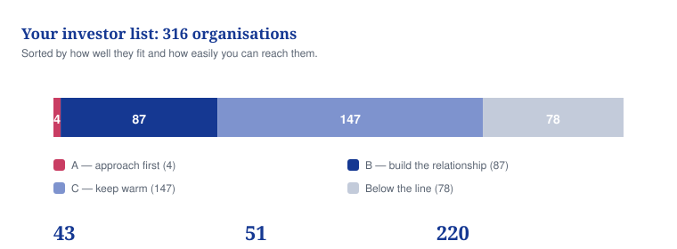

# 13 — How to use the investor list

**What is in the 316-name investor list, and exactly how to call, email and meet the people on it.**

## In one minute
- You have a researched list of 316 investors, scored and ranked, with contact routes.
- Nobody has been contacted yet. Every activity number in the list is zero.
- Five things must be true before you call anyone. Until then, do not start.
- Only about a third of the records were checked this week. Re-check a record before you call it.
- Phone the four best-fit funds. Email or use LinkedIn for everyone else.

## What to do

| Action | Who | By when |
|---|---|---|
| Finish the five pre-conditions below | You | Before any contact |
| Get a solicitor to sign off the deck and its warnings | Solicitor | Before any contact |
| Re-check the 25 records you plan to contact first | You | The week you start |
| Work the weekly rhythm: 15 calls, 25 emails, 20 LinkedIn messages | You | Weeks 5 to 12 |
| Write up every call the same day, in the list itself | You | Same day, every time |

*Caption: only four names are top-tier, so the list is a research asset to work through patiently, not a pile of easy calls.*

## What is in the list

| What | Number | Honest note |
|---|---|---|
| Organisations | 316 | Real, publicly identifiable investors only. Nothing invented. |
| Top tier (fit 80 to 100) | 4 | These four get a personal phone call first |
| Second tier (65 to 79) | 87 | Build a relationship over months |
| Third tier (50 to 64) | 147 | Keep warm, watch for a change that makes them a fit |
| Below 50 | 78 | Not a priority. Leave them alone for now. |
| Phone numbers | 43 | Found in public sources, each with the web address it came from |
| Official emails | 51 | Published on the fund's own pages only |
| Named decision makers | 220 | Named in their public role only, from team pages |

Where a phone number or email was not published, the record says NOT PUBLICLY AVAILABLE. Nothing was guessed. Personal mobile numbers were never recorded and must never be called.

**The honesty warning.** About a third of the 316 records were checked on 7 September 2026. The rest are marked "Unverified (prior knowledge)". That means the information came from earlier reading, not from a check this week. Funds change their teams, their cheque sizes and what they invest in. Open the fund's own website and confirm the person and the route before you dial. A call to someone who left two years ago costs you the fund.

By type: 158 venture capital funds, 47 corporate investors, 41 angel networks, 38 impact and development funds, 23 family offices, 5 government funds, 4 university funds. By country: 139 in the UK, 64 in the United States, 17 in Nigeria, 8 in Kenya, 9 in South Africa, the rest across Europe and elsewhere.

## How the scores work

Every investor carries two numbers.

**Fit, out of 100.** How well they match Vytalix. It is built from eight parts: what sectors they back (20), what stage they back (15), whether their cheque size suits you (15), whether they invest where you are (10), what they bring beyond money (15), whether maternal health interests them (10), how easy they are to reach (5), and who they could introduce you to (10).

**Reachability, out of 10.** How easy it is to actually get through. A published phone number is worth 3. A direct route in is worth 2. The rest comes from having a named person, an official email, a LinkedIn profile, a possible warm introduction, and good information overall.

The two combine into an overall ranking. Fit decides who is worth your effort. Reachability decides the order you work in. A fund with a fit of 78 and a phone number beats a fund with a fit of 82 and a contact form. The list also shows a probability of High, Medium or Low: that is a rule of thumb, not a forecast, so do not repeat it to anyone.

## The rule before you call anyone

All five of these must be true. Not four.

1. Vytalix is registered at Companies House.
2. The MaternaLink rights agreement with David Agunede is signed, at least as heads of terms.
3. Every 2025 claim about predicting complications has been removed from every document.
4. The one-page summary and the data room are finished.
5. The SEIS/EIS application has been submitted. You may say "applied for". You may never say "approved".

One more, and it is a legal one. In the UK, asking people for investment is regulated. Only approach investors who fall inside the exemptions, such as certified high-net-worth or self-certified sophisticated investors, or go through an authorised platform. A solicitor must sign off your deck and its warnings first. Never write "guaranteed", "assured" or "low risk".

## How to call

Phone the top-tier funds where you have a verified number. Everyone else gets email or LinkedIn first. Call the switchboard or the published investment line. Never a personal mobile.

**The opening, about 25 seconds.**

"Good morning. This is Kelvin Williams, founder of Vytalix, a UK health-technology group. I am calling because you backed [portfolio company] and we are building something next door to it. MaternaLink is a maternal-health coordination platform, in development for the UK and Nigeria. I am not asking for a decision on this call. I would like 20 minutes with [partner] to test whether we fit your mandate. Is [partner] the right person, and what is the best way to get that slot?"

**If a gatekeeper answers.** "Could you tell me who leads health-technology investments, and the best route to reach them? An email or a pitch form is fine. I will keep it to one page."

**Voicemail, 15 seconds.** Your name, the company, the one-line reason, then: "I will send a one-page summary by email today. My number is [number]."

| Say this | Never say this |
|---|---|
| "We are pre-seed and founder-led. There is a prototype and a pilot in design." | Anything that implies the NHS, a government or a clinician has approved it |
| "You backed [named company] and here is why we are next door to it." | A message you have sent to twenty other funds |
| "What would stop you investing?" | "Is there any interest?" |
| "I am not asking for a decision today." | Anything about owning MaternaLink before that agreement is signed |

## The emails

Send the first email the same day you call. Keep every message under 150 words.

**First contact.** Subject: Maternal-health platform (UK and Nigeria), 20 minutes? Five short parts. One line on who you are. One line on why them specifically, naming a company they backed or a view they have published. Three bullets on what actually exists today, honestly. One line on what you are raising and what it pays for. Then the ask: 20 minutes, one-pager attached.

**Follow-up one, day 4.** Send the one-pager link again. Add one genuine question about how their process works or what they are looking for this year.

**Follow-up two, day 10.** Send one new piece of proof. An adviser confirmed, a grant submitted, a first paying client, a letter of intent. No new proof means no follow-up. Go and create one first.

**Follow-up three, day 21.** Close the loop politely. Ask them to point you at a fund that fits better. Then move them onto the quarterly update list.

Three messages with no reply means "not now", not "no". Move them to Not now and try again next quarter. On LinkedIn, send a connection note under 300 characters with the specific reason and no pitch beyond one sentence. Once they accept, send one message with the one-line pitch and the 20-minute ask.

## What happens in a meeting

Thirty minutes. Keep to it.

| Minutes | What you do |
|---|---|
| 0 to 3 | Thank them, confirm the time, agree the agenda, ask what they want to leave with |
| 3 to 8 | Ask about them: stage, cheque size, process, what health-technology they have turned down recently and why |
| 8 to 12 | The problem, and why now. UK maternal inequality, the Nigerian burden, the coordination failures named in national reviews. Cite the source of every figure. |
| 12 to 17 | What exists today. The prototype, the true status of the Nigerian conversation, real service revenue only, real advisers only. |
| 17 to 22 | The product and the evidence plan. Version 1 is non-diagnostic. The pilot design. What each stage of evidence lets you claim. |
| 22 to 26 | The money. Services fund the company. The platform is the equity story. Round size, what it pays for, the milestones. |
| 26 to 29 | Ask straight out: "What would stop you?" Answer it, or promise a written answer within 48 hours and send it. |
| 29 to 30 | Agree one concrete next step, with a date |

Common objections and the honest answer: "Too early" — agree, ask what milestone would change it, book a 90-day update. "Solo founder" — show the adviser plan and the hiring tied to the round. "mDoc is already in Nigeria" — correct, so you go to another state or work alongside them. "Is it a medical device?" — version 1 is built to stay non-diagnostic, with a written statement of intended use. "What do you own?" — if the rights agreement is not signed, do not be in the meeting.

## The stages

The list tracks 18 stages. In plain words:

| Plain words | The labels used in the file |
|---|---|
| Found them, and looked them up | Identified, Researched |
| They fit, and they go to the top | Qualified, Priority A |
| Ready to contact | Outreach Ready |
| Contacted, called or emailed | Contacted, Called, Email Sent |
| They replied | Responded |
| Meeting asked for, booked, then done | Meeting Requested, Booked, Completed |
| They are checking us out | Due Diligence |
| Talking about actual money | Investment Discussion |
| Offer in writing, then money in the bank | Term Sheet, Closed |
| No, and here is why | Passed |
| Not now, try next quarter | Future Opportunity |

Every record starts at "Looked them up". "They fit" needs proof from a public source, not a hunch. "Ready to contact" needs all five pre-conditions above. "No" must always carry a written reason.

## What to write down after every call

Do it the same day, in the record itself. Five things.

1. The date, and who you actually spoke to.
2. What they said about stage, cheque size and process, in their words.
3. The one objection they raised.
4. The next step you agreed, and the date it falls due.
5. The new stage, and anything that changes their fit score.

If you do not write it down the same day, it is gone. A list nobody updates is worse than no list, because you start trusting it.

## Where the files are

| File | What it is |
|---|---|
| `investors/VYTALIX_INVESTOR_CRM.xlsx` | The full list of 316, one row each. Open this one. The `.csv` next to it holds the same data as plain text. |
| `investors/TOP_25_INVESTORS.md` | The 25 to work first, with the reasoning |
| `investors/CALL_LISTS.md` | Sorted call sheets, best route first |
| `investors/OUTREACH_TOP25.md` | A written script for each of the top 25 |
| `investors/INVESTOR_DASHBOARD.md` | The counts and totals, regenerated from the list |
| `investors/NON_DILUTIVE_FUNDING_ROUTES.md` | Grants and prizes that do not cost you shares |

To change the data, edit the files in `investors/raw/` and run `python3 investors/build_crm.py`. That rebuilds the list, the top 25, the call sheets, the scripts and the dashboard together.

## Words explained

| Word | What it means |
|---|---|
| CRM | The file that holds every investor and every contact you have had with them |
| Mandate | The written rules a fund works to: what stage, sector and cheque size it can back |
| Due diligence | The checking an investor does on you before handing over money |
| Term sheet | A short written offer setting out the price and terms, before the full contracts |
| Data room | A private folder of documents you give a serious investor |
| Non-dilutive | Money, such as a grant, that does not cost you any shares |
