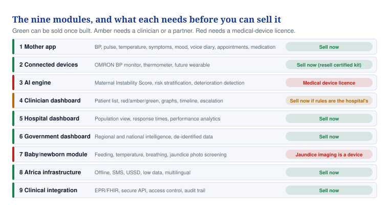
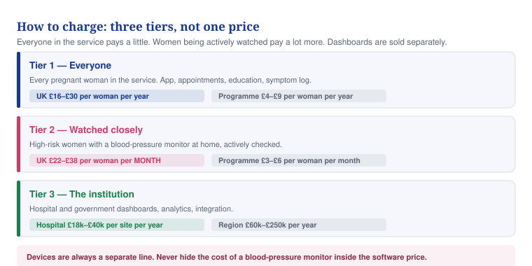

# 14 — Pricing the full product

**What to charge for each of the nine modules, and how the pieces add up to a real contract.**

## In one minute

- The nine-module ecosystem is a much bigger product than the one priced in document 04. It needs three prices, not one.
- Tier 1 is every pregnant woman, priced per year and cheap. Tier 2 is women actively watched on a device, priced per month and roughly ten times higher. Tier 3 is the dashboards, sold to the hospital and the government.
- Two of the nine modules cannot legally be sold yet. The AI engine and the jaundice photo screening are medical devices.
- A 5,000-birth UK hospital is worth £250,000 to £490,000 a year depending on how much they buy.
- A 100,000-woman African state programme is worth about £1.4m a year, which is £14 per woman.

## What to do

| Action | Who | By when |
|---|---|---|
| Split your price list into the three tiers below | You | This week |
| Take the AI engine out of anything you send a buyer until it is licensed | You | Now |
| Replace the OMRON M7 Intelli IT with the current model, it is discontinued | You | This week |
| Test the three package prices on three UK maternity leads | You | Day 60 |
| Get a cost-to-serve figure from your developer before quoting anything | Developer | Day 30 |

## The nine modules, and what blocks each

*Six of the nine can be sold as soon as they are built. Two need a licence that takes years.*

Two warnings before any of this reaches a buyer.

**The AI engine is a medical device.** "Maternal Instability Score", "risk stratification" and "deterioration detection" are the exact words that make software regulated. A UK Approved Body is likely to class this as Class IIa, the same class a clinical decision support tool reached in June 2026. That means a quality system, clinical evidence and certification before you take a penny for it. Sell the other seven modules first and treat the AI engine as the upgrade you sell in year three.

**The jaundice photo screening is also a device, and the field is crowded.** Picterus, BiliScreen and Bilicam already do this, and Picterus is patented out of a Norwegian university. Build it last, or licence theirs.

## The three tiers

*Everyone pays a little. Women on a monitor pay ten times more. Dashboards are sold separately.*

### Tier 1 — every pregnant woman

The mother app, appointments, medication reminders, education, symptom log, mood, fetal movement logging, and alerts that reach a human.

| Market | Price | Note |
|---|---|---|
| UK hospital | £16–£30 per woman per year | Plus a site licence of £12,000–£30,000 by birth numbers |
| African programme | £4–£9 per woman per year | Tiered down by volume, see document 04 |

### Tier 2 — women watched closely

A woman with high blood pressure or another risk, given a monitor to take home, whose readings are actively watched and escalated. This is the expensive part because it costs you the most to run.

| Market | Price | Typical length | Value per woman |
|---|---|---|---|
| UK | £22–£38 per woman per month | 16–22 weeks | £90–£190 |
| African programme | £3–£6 per woman per month | 12–20 weeks | £11–£30 |

Your cost to serve one UK monitored woman is roughly £6.50 a month: hosting and storage £0.30, messaging £0.40, device wear and replacement £3.00, support and safety work £2.00, logistics £0.80. That is an ESTIMATE (our best guess, not a fact) and your developer must confirm it. At £28 a month you keep about three quarters.

For comparison, American remote monitoring platforms charge $80 to $200 per patient per month for the software alone. You are pricing well below that, which is right for the NHS and gives you room later.

### Tier 3 — the institution

| What | Price | Sold to |
|---|---|---|
| Clinician dashboard | Included in tiers 1 and 2 | Nobody buys it separately |
| Hospital dashboard | £18,000–£40,000 per site per year | The trust, by birth numbers |
| Government or regional dashboard | £60,000–£250,000 per year | A state ministry or an ICB, by population covered |
| Integration to the hospital record | £15,000–£40,000 to set up, then £4,000–£8,000 a year | The trust |

## The add-on modules

| Module | UK price | Programme price | When you can sell it |
|---|---|---|---|
| Newborn module, without jaundice imaging | £8–£14 per birth | £1.50–£3 per birth | Once built |
| Voice diary, storage and playback only | £3–£5 per woman per year | £1–£2 | Once built |
| Glucose diary for diabetes in pregnancy | £20–£30 per woman with the condition | £6–£10 | After a regulatory opinion |
| AI engine | Add 25% to 35% to the tier 2 price | Add 20% | Only after certification |
| Jaundice photo screening | Not priced | Not priced | After certification, or licence someone else's |

## Devices

Never fold the cost of a monitor into the software price. Show it as its own line so a buyer can see what the software is worth.

| Item | Your cost | What to charge |
|---|---|---|
| Validated upper-arm blood-pressure monitor | £55–£75 in bulk | Lease £4.50–£7 a month, or sell at cost plus 15% |
| Thermometer | £12–£20 | Sell at cost plus 15% |
| Wearable watch | Rent a certified one, see document 02 | £4–£7 a month |

**The OMRON M7 Intelli IT is discontinued by the manufacturer.** It is genuinely validated for use in pregnancy including pre-eclampsia, which is why it was the right choice, but you cannot build a supply chain on a discontinued product. Move to the current OMRON model that carries the same pregnancy validation, and confirm the validation in writing with OMRON before you name it in any proposal.

## Three packages to sell

Give a hospital three choices, not a menu of forty items. People buy the middle one.

| Package | What is in it | 5,000-birth hospital, year one |
|---|---|---|
| **Essential** | Tier 1 for everyone, tier 2 for 500 high-risk women, clinician dashboard, service plan | About £250,000 |
| **Complete** | Essential plus the hospital dashboard, newborn module, one integration | About £390,000 |
| **Full ecosystem** | Complete plus 1,000 monitored women, voice diary, glucose module, premium support | About £490,000 |

Run-rate in later years is roughly £70,000 lower once the one-off setup drops away.

### Worked example: a 5,000-birth UK maternity service, Complete package

| Line | Amount |
|---|---|
| Tier 1: 5,000 women at £22 plus £20,000 site licence | £130,000 |
| Tier 2: 800 monitored women at £28 a month for 4.2 months | £94,080 |
| Hospital dashboard | £28,000 |
| Newborn module: 5,000 births at £10 | £50,000 |
| Integration, annual | £6,000 |
| Software subtotal | £308,080 |
| Service plan at 26% | £80,101 |
| Device leases, 300 monitors in rotation at £6 a month | £21,600 |
| One-off: setup £45,000 and integration build £25,000 | £70,000 |
| **Year one total** | **£479,781** |
| **Run rate from year two** | **£409,781** |

That is about £96 per birth in year one and £82 a year after that. A maternity service of this size spends roughly £25m to £35m a year, so this is about 1.4% of it. Defensible, but only with evidence. Lead with Essential.

### Worked example: an African state programme, 100,000 women a year

| Line | Amount |
|---|---|
| Tier 1: 100,000 women at £5 | £500,000 |
| Tier 2: 15,000 monitored at £4 a month for 4 months | £240,000 |
| Newborn module: 100,000 at £2 | £200,000 |
| Government dashboard | £120,000 |
| Software subtotal | £1,060,000 |
| Service plan at 28% | £296,800 |
| Training, 30 cohorts a year | £54,000 |
| One-off setup, year one only | £150,000 |
| **Year one total** | **£1,560,800** |
| **Run rate from year two** | **£1,410,800** |

That is £15.60 per woman in year one and £14.10 after. Compare it to the withdrawn Ekiti proposal, which asked £300 per woman.

## Rules you do not break

1. Pilot before contract. Twelve weeks, fixed price, evaluation report, and half the pilot fee credited against year one.
2. Minimum contract £40,000 in the UK and £25,000 for a programme. Below that you lose money on support.
3. Never discount below the floor price. Discount by removing modules instead.
4. Devices are always itemised separately.
5. Three-year deals get 5% off, with rises capped at inflation plus two points.
6. Nothing that needs a licence appears on a price list until you hold the licence.

## Words explained

| Word | What it means |
|---|---|
| Tier | A level of service. Here, how closely a woman is being watched |
| Cost to serve | What it costs you to look after one woman for one month |
| Site licence | A fixed yearly fee a hospital pays on top of the per-woman price |
| Run rate | What a customer pays every year after the first, once setup is done |
| Class IIa | A medium-risk medical device. Needs certification by an approved body before sale |
| Approved Body | A company licensed by the UK regulator to certify medical devices |
