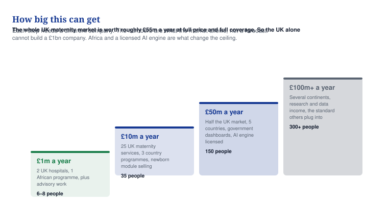

# 15 — How big this can get

**The real size of the market, what each step needs, and the five things that cap it.**

## In one minute

- The whole UK maternity market is worth about £55m a year if you sold everything to everyone at full price. Nobody ever does.
- A realistic strong UK business is £14m to £17m a year. That is a good company, but it is not a billion-pound one.
- Nigeria alone has 7 million births a year, eleven times the UK. The money per woman is far lower, and it depends on donors and state budgets.
- Building the full ecosystem raises what each woman is worth from £22 to about £165. That is the single biggest lever you have.
- Five things cap growth, and the first is that your most valuable module needs a licence you do not have.

## What to do

| Action | Who | By when |
|---|---|---|
| Stop describing the UK as the main market to investors, it is the proving ground | You | Now |
| Work out what one monitored woman actually costs you to serve | Developer | Day 30 |
| Decide whether you are building a UK company or a global one, they need different money | You | Day 60 |
| Put the newborn module and the postpartum year in the investor story, they double the value | You | Day 60 |
| Start the regulatory clock on the AI engine in year two, not year one | You | Year 2 |

## What one woman is worth

This is the number that decides everything. The more of the ecosystem you build, the longer you keep her and the more each birth is worth.

| What you sell | UK value per woman | Programme value |
|---|---|---|
| Tier 1 only, the app and coordination | £22 | £5 |
| Plus monitoring if she is high risk | £140 | £21 |
| Plus the newborn module | £150 | £23 |
| Plus the year after birth | £165 | £26 |

Going from the light product to the full one multiplies what a birth is worth by about seven. That is the argument for building modules 5 to 9. It is also the argument for not stopping at an app.

## The market, honestly

| Market | Births a year | What it could be worth at full coverage | Source |
|---|---|---|---|
| England and Wales | 585,396 in 2025 | £47m | ONS, 2025 |
| Scotland and Northern Ireland | About 65,000 | £5m | ESTIMATE |
| UK regional health bodies, 42 in England | — | £3.4m | ESTIMATE |
| **UK total** | **About 650,000** | **About £55m a year** | |
| Nigeria | About 7 million | £98m nominally, far less in practice | UNICEF |
| Africa | About 45 million | Very large, almost all budget-limited | ESTIMATE |
| World | About 130 million | — | ESTIMATE |

The African number needs a warning. Seven million births does not mean seven million paying customers. Maternal health in Nigeria is paid for by state budgets and by donors, and donor money is tighter than it was. Assume you reach 10% of births in a country where you are established, not 80%.

## The four steps

*Each step is a different company with different people. The numbers are the market's ceiling, not a forecast.*

| Step | What it takes | Where the money comes from | People | When |
|---|---|---|---|---|
| **£1m a year** | 2 UK hospitals, 1 African programme, advisory work alongside | Services 40%, hospitals 35%, programme 25% | 6–8 | Year 2 |
| **£10m a year** | 25 UK maternity services, 3 country programmes, newborn module selling | Hospitals 45%, programmes 35%, dashboards 20% | 35 | Year 4 |
| **£50m a year** | Half the UK market, 5 countries, government dashboards, AI engine licensed | Programmes 40%, hospitals 30%, AI uplift 20%, data 10% | 150 | Year 6–7 |
| **£100m+ a year** | Several continents, research income, the layer other systems plug into | Spread across four continents and four revenue types | 300+ | Year 8–10 |

For context on what those numbers are worth: health technology companies typically sell for six to ten times their yearly revenue. £10m a year is a £60m to £100m company. £50m a year is £300m to £500m. A billion needs £100m or more a year, or a buyer paying a strategic premium.

## The five things that cap growth

**1. The licence you do not have.** The AI engine is the premium tier and the investor story, and you cannot sell it until an approved body certifies it. That is two to three years and £40,000 to £150,000 in regulatory work alone, on top of the evidence. Until then your ceiling is the price of the seven modules you can sell.

**2. Devices do not scale like software.** Every monitored woman needs a monitor delivered, paired, cleaned, chased and returned. That is a warehouse, a courier contract and staff. It caps how fast you can grow tier 2 and it drags your margin down from 85% to about 70%. Plan for it or partner with someone who already does it.

**3. Government buying is slow.** A state ministry or an NHS trust takes 12 to 24 months from first conversation to signed contract. You cannot compress it with effort. You can only run more conversations at once, which needs people you cannot afford yet.

**4. African budgets are real but small and borrowed.** Most maternal health money in the countries you are targeting comes from donors. Contracts are three years, tied to programmes, and they end. Build the sponsorship and insurer routes in document 04 so you are not living on one funder.

**5. Evidence takes years, and you need it before anyone big buys.** A service evaluation is twelve weeks. A proper study is eighteen months. A hospital that wants published evidence before signing will make you wait for it.

## The five things that lift the ceiling

1. **Get the AI engine certified.** It adds 25% to 35% to every monitored woman and it is the difference between a coordination tool and a clinical platform.
2. **Sell the newborn module.** It turns one paying event, a pregnancy, into two.
3. **Keep her for the year after birth.** It extends the paying period from nine months to twenty-one.
4. **Sell data and research access.** Pharmaceutical companies and universities pay for consented, diverse maternal data, and that money does not come out of a health budget.
5. **Licence the platform to an incumbent.** A record-system vendor with 100 hospitals can put you in all of them at once. You earn less per hospital and reach ten times as many.

## What this means for the plan

Pick one. They are different companies and they need different money.

| If you want | Then | Money needed | Realistic outcome |
|---|---|---|---|
| A solid UK business | Focus on UK hospitals, skip the AI engine, stay small and profitable | £500k | £10m–£17m a year, £60m–£120m value |
| A global platform | UK for evidence, Africa for scale, certify the AI engine, raise properly | £15m–£30m over five years | £50m–£100m a year, but only if several things go right |
| A quick sale | Build the UK product, get to £3m–£5m a year, sell to a record vendor | £2m–£3m | £20m–£40m, in about five years |

The plan in document 06 assumes the middle one. If you would rather have the first or the third, tell me and I will change the financial model.

## Words explained

| Word | What it means |
|---|---|
| Market size | What everyone in a market would pay if they all bought from you. Nobody ever gets it all |
| Coverage | How many of the possible customers actually use you |
| Value per woman | Everything you earn from one pregnancy, added up |
| Run rate | What you earn in a year at your current speed |
| Strategic premium | A buyer paying more than the numbers justify because you are worth more to them than to anyone else |
