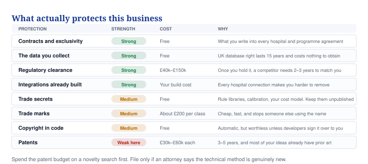

# 16 — What you can patent, and what you cannot

**An honest answer on patents, the prior art already out there, and the cheaper things that protect you better.**

## In one minute

- Most of what is in the ecosystem document cannot be patented. Someone else got there first, in some cases twenty-five years ago.
- Patents are the weakest and most expensive protection available to you. £30,000 to £60,000 each, three to five years, and they rarely stop a funded competitor.
- There are two or three genuinely technical ideas in your system that might be patentable. They are plumbing, not the headline features.
- The things that will actually protect this business are contracts, the data you collect, a regulatory licence and the integrations you build.
- Spend £200 on trade marks this month. Spend nothing on patents until an attorney has done a novelty search on a thing you have actually built.

## What to do

| Action | Who | By when |
|---|---|---|
| File trade marks for VYTALIX and MATERNALINK in classes 9, 42 and 44 | You, with a trade mark attorney | Day 20 |
| Get a signed IP assignment from David Agunede and every developer | Solicitor | Day 30 |
| Sign an NDA before any technical conversation with a partner | You | Always |
| Pay for a novelty search on the two candidates below, only once built | Patent attorney | Month 9 |
| Write data ownership into every hospital and programme contract | Solicitor | Before the first contract |

## What is already taken

I searched the public record. These are real, published, and they block the obvious claims.

| Your feature | What already exists | What it means |
|---|---|---|
| Jaundice photo screening | Picterus, developed and patented at the Norwegian University of Science and Technology. Also BiliScreen and Bilicam from the University of Washington, and published work on sclera chromaticity | Crowded and partly patented. Do not build this to own it. Licence Picterus or leave it out |
| Fetal movement counting | Patent WO1999052020A1 from 1999, US6045500, US20110306893A1, US9078582B2, EP2421442A2 | Twenty-five years of prior art. Not patentable |
| Maternal Instability Score | Maternity early warning scores have been standard UK practice since the 2007 confidential enquiry. NHS England published a national score with the Royal Colleges in 2023–24 | A composite score of vital signs is not new. Not patentable, and it competes with the score hospitals are told to use |
| Maternal and fetal heart monitoring | US20210378532A1 and a large wearables patent estate | Crowded |
| Dashboards, red/amber/green, alerts, timelines | Ordinary software design, used everywhere in health IT | Not patentable anywhere |
| The nine modules as one system | Joining known parts together | Not patentable. "Integrated platform" is a sales phrase, not an invention |

## Why software patents are hard here

In Europe and the UK you cannot patent a computer program "as such", a mathematical method, or a way of doing business. To get past that you need what the European Patent Office calls a **further technical effect**: your invention must solve a technical problem, not just a clinical or commercial one.

The test the examiner applies is called the Comvik approach. Anything in your claim that is not technical is ignored when they judge whether the invention is inventive. A 2021 decision of the EPO's Enlarged Board, G1/19, confirmed that a link to physical reality is a good sign but not strictly required.

Put plainly: **"we work out a risk score from health data" is not patentable. "We get an alert reliably to a midwife over a network that keeps dropping" might be.** The second one solves a technical problem.

The United States is different but no easier. Since the Alice and Mayo decisions, courts have struck down many diagnostic and data-processing patents as abstract ideas. Improvements to how a computer or network actually works survive better.

## The two or three things that might be patentable

These are all plumbing. None of them is the thing you would put on a slide. That is normally a good sign for a patent.

| # | Candidate | The technical problem it solves | My honest view |
|---|---|---|---|
| 1 | **Urgency-aware channel switching.** The system measures the network it can actually reach, combines that with how urgent the clinical flag is, then chooses between app, SMS, USSD and voice call, confirms delivery, and escalates to another channel if delivery fails | Getting a message reliably to a person over an unreliable network, while using the least network resource | The strongest candidate. It is genuinely technical and the combination with clinical urgency may be new |
| 2 | **Offline merging that cannot lose a safety event.** Several midwives record on several devices with no signal. When they reconnect, the system merges the records and guarantees that safety-critical events are never dropped or put in the wrong order | Data consistency across disconnected devices, a real computer-science problem | Second strongest. Depends entirely on whether your method differs from known merge techniques |
| 3 | **Checking a reading is genuine.** Working out, from the device data and the context, that a blood-pressure reading was probably not taken by the enrolled woman, or was taken with the cuff on wrong | Data quality at the sensor, a technical problem | Interesting, possibly novel, harder to draft |
| 4 | Voice features worked out on the phone so raw audio never leaves it | Privacy by design, less data sent | Federated and on-device processing is well trodden. Probably not novel |
| 5 | Routing records by country so data stays where the law requires | Compliance | Almost certainly known. Do not spend money on it |

**None of these should be filed before you have built it and it works.** A patent describes a specific implementation. Filing on an idea gets you a narrow, useless patent or a refusal.

## What a patent actually costs

| Step | Cost | Time |
|---|---|---|
| Novelty search by an attorney before you commit | £1,500–£3,000 | 3–4 weeks |
| UK priority application, drafted properly | £4,000–£8,000 | 1–2 months |
| Taking one family through the UK, Europe and the United States to grant | £30,000–£60,000 | 3–5 years |
| Renewal fees after grant, per country, per year | Hundreds, rising with age | Forever |

All ESTIMATE, meaning our best guess and not a quote. Get two quotes from patent attorneys who do medical software.

Weigh that against what else £40,000 buys you: the whole regulatory work for the AI engine, or five months of a developer, or an entire pilot at a hospital.

## What actually protects this business

*Patents are the most expensive and the weakest thing on this list. Everything above them is cheaper and works better.*

**1. Contracts.** The strongest and cheapest. Write into every hospital and programme agreement who owns the data, what you may do with de-identified data, how long the term runs, and what happens on exit. This is where real protection lives and it costs a solicitor's time.

**2. The data you collect.** UK and European law gives an automatic **database right** to whoever invested in gathering a database. It lasts fifteen years, costs nothing, and you get it just by building the dataset. Your escalation-and-response data, what was flagged, what a human did, and how fast, does not exist anywhere else. Protect it by keeping it, structuring it, and writing your rights into contracts.

**3. Regulatory clearance.** Once you hold a UKCA certificate for the AI engine, any competitor needs two to three years to match you. That is a stronger barrier than a patent and you were going to pay for it anyway.

**4. Integrations you have already built.** Every connection to a hospital record system raises the cost of removing you. Ten integrations is a moat. Nobody can patent around your relationships.

**5. Trade secrets.** Your rule library, your calibration, your cost model. Free, immediate, and lost the moment you publish. Keep them out of papers and out of slide decks.

**6. Trade marks.** About £170 for the first class and £50 for each extra class at the UK IPO, so roughly £270 for three classes, plus attorney time. TO VALIDATE, fees change. File VYTALIX and MATERNALINK in class 9 (software), class 42 (software services) and class 44 (medical services). Do this in the next three weeks, because two American companies already use names close to yours.

**7. Copyright and design rights.** Copyright in the code is automatic, but it belongs to whoever wrote it until they sign it over. That is why the assignment from David Agunede and from every developer matters more than any patent.

## What to say to an investor who asks about patents

Do not pretend. Say this:

> We hold no patents. Most of the obvious features in maternal monitoring have prior art going back to the 1990s, and we are not going to spend £60,000 and five years on claims we would struggle to enforce. Our protection is the clinical data we are building, which no one else has, our regulatory route, our integrations, and the terms in our contracts. We have identified two technical methods in our infrastructure that may be patentable, and we will run a novelty search on them once they are built and proven.

That answer is more convincing than a thin patent. Investors who know health technology have seen plenty of worthless patents.

## Words explained

| Word | What it means |
|---|---|
| Prior art | Anything already published anywhere in the world that shows your idea is not new |
| Novelty search | An attorney checking whether anyone has already published your idea, before you spend money filing |
| Priority application | Your first filing. It fixes your date and gives you twelve months to decide where else to file |
| Technical effect | Something an invention does to the way a machine or a network works, as opposed to what it means for a person |
| Database right | An automatic UK and European right protecting the effort of building a database. Fifteen years, free |
| IP assignment | A signed document transferring ownership of work from the person who made it to the company |
| Class | The category a trade mark is registered in. You need one for each kind of thing you sell |
