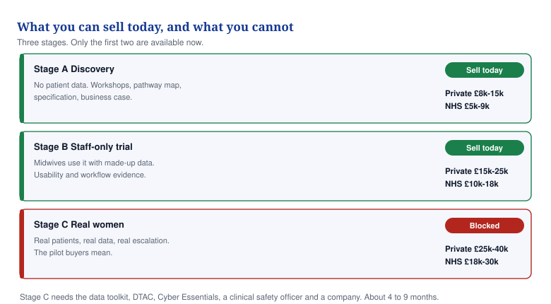

# 17 — What to charge for a pilot right now

**What you can sell this quarter with the prototype you have today, and what you must not sell yet.**

## In one minute

- You cannot sell a real-patient pilot yet. You have no company, no data toolkit and no clinical safety officer.
- You can sell two things today: a discovery project and a staff-only trial. Both avoid patient data entirely.
- Charge a private buyer £8,000 to £25,000. Charge an NHS buyer £5,000 to £18,000.
- Never run a free pilot. A free pilot tells the buyer the thing is worth nothing and gives you no evidence you can sell.
- The £40,000 to £90,000 pilot price in document 04 is for the finished product. That is next year, not now.

*Only the first two stages are available to you. The third needs paperwork you do not have.*

## What to do

| Action | Who | By when |
|---|---|---|
| Register the company, so you can raise an invoice at all | You | Day 10 |
| Stop calling it a pilot in emails; call it a discovery project | You | Now |
| Put a fixed price on Stage A and quote it to three buyers | You | Day 30 |
| Take the operator login off the public prototype and rotate the password | You | Day 2 |
| Start the data security toolkit, so Stage C opens in about 6 months | You | Day 45 |

## Why you cannot sell a real-patient pilot today

A buyer who says "pilot" means real pregnant women using your software. Before any UK hospital lets that happen you need all of the following. You have none of them.

| What is missing | What it is | Time to get it | Cost |
|---|---|---|---|
| A registered company | Nobody can raise a purchase order to a person | 1 week | £50 |
| DSPT (the NHS data security self-assessment) | You must reach "Standards Met" | 6–12 weeks | Your time |
| DTAC (the NHS checklist before a hospital can buy) | Covers safety, data, security, usability | 4–8 weeks after DSPT | Your time |
| Cyber Essentials | A government security certificate | 2–4 weeks | About £300 |
| A clinical safety officer and DCB0129 safety case | A registered clinician who owns the risk log | 8–12 weeks | £500–£900 a day |
| A DPIA (a written check of what could go wrong with the data) | Legally required for health data | 3–4 weeks | Your time |
| Professional indemnity insurance | Covers you when advice or software goes wrong | 1 week | £400–£900 a year |

Realistically that is four to nine months. Selling a real-patient pilot before then is not clever selling. It is trading illegally and personally carrying the liability.

## The three stages, and what each is worth

### Stage A — Discovery project. Sell this today.

Four to six weeks. No patient data touches anything you own. You run two or three workshops with the maternity team, map how their current pathway actually works, count where the time and money go, demonstrate the prototype, and hand over a written specification and a business case they can take to their own finance team.

| Buyer | Price | Why |
|---|---|---|
| Private hospital or clinic group | £8,000–£15,000 | Comes out of an innovation or marketing budget. Decision in weeks |
| NHS trust, ICB or LMNS | £5,000–£9,000 | Usually paid from an innovation fund, not the maternity budget |

This is consulting work, priced at 10 to 12 days. It is legal today, it needs no approvals, and it pays now.

### Stage B — Staff-only trial. Sell this today.

Eight to twelve weeks. Midwives and obstetricians use the real software with made-up patients. You measure whether they can actually use it, how long tasks take, and what breaks. You hand over a written evaluation with numbers in it.

| Buyer | Price | Why |
|---|---|---|
| Private hospital or clinic group | £15,000–£25,000 | They get a usability report and first refusal on the live version |
| NHS trust, ICB or LMNS | £10,000–£18,000 | Lower, because their evaluation becomes your reference site |

Still no patient data, so the governance burden stays light. This is the stage that produces the evidence an investor and the next buyer both want.

### Stage C — Service evaluation with real women. Do not quote a date yet.

Twelve to sixteen weeks, real patients, real escalation. Price it at £25,000–£40,000 private and £18,000–£30,000 NHS. Put it in the proposal as "available once certification completes", with no month attached. Quoting a date you miss is worse than quoting no date.

## Private buyer against public buyer

| | Private | Public (NHS) |
|---|---|---|
| Who signs | A managing director or medical director | A committee, after information governance clears it |
| How long | 3–8 weeks | 3–9 months |
| Pays from | Innovation or marketing budget | Innovation fund, charity fund, or an accelerator |
| Cares most about | Patient experience and competitive edge | Safety paperwork and evidence |
| Will haggle | A little | A lot, and will ask for it free |
| Worth more as a reference | No | Yes, considerably |

Go to private buyers first. They pay faster and they are the only realistic source of money this quarter. Use the money and the evidence from a private buyer to earn the NHS one.

## Rules for every pilot you sell

1. **Fixed price, written scope, paid half up front.** Never bill by the hour for a pilot.
2. **Credit half the fee against year one** if they go on to buy. Say so in the proposal. It makes the price easy to approve.
3. **Never free.** If a buyer will not pay £5,000 they will not pay £250,000 later. The only exception is a named design partner who gives you real clinician time in writing, and you take that decision once, not per deal.
4. **The report is the product.** Every stage ends in a written evaluation with numbers. That document is what you show the next buyer and the next investor.
5. **Never say NHS-approved, clinically proven or UKCA marked.** None is true. Buyers check.
6. **Nothing unlicensed in the scope.** The prediction engine and the jaundice camera stay out of every pilot until they are certified.

## What to say when they ask for it free

"I do not run free pilots, because a free pilot does not get the clinical time it needs and then it proves nothing for either of us. What I do instead is fix the price, take half up front, and credit half of it against your first year if you go ahead. That way your risk is capped and we both take it seriously."

## Words explained

| Word | What it means |
|---|---|
| Discovery project | Paid work where you study how something works today and write down what should be built |
| Service evaluation | A study of whether a service works better with the new thing, run by the hospital, not research |
| DSPT | The yearly NHS self-assessment showing you handle patient data safely |
| DTAC | The NHS checklist a digital product must pass before a hospital can buy it |
| DCB0129 | The safety standard that makes you, the maker, manage clinical risk |
| DPIA | A written check, done in advance, of what could go wrong with the data you plan to hold |
| LMNS | Local Maternity and Neonatal System, the group that plans maternity care across an area |
| Design partner | An early customer who gives you real staff time in exchange for influence over what gets built |
