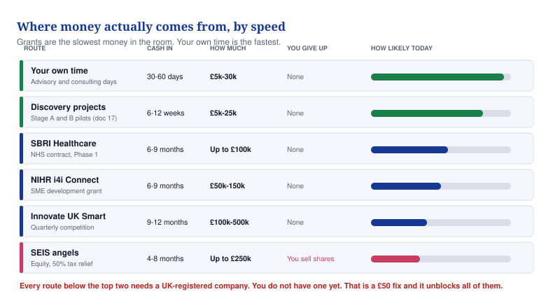

# 20 — Getting money into the business

**Every route that is real, what each one needs, and the order to do them in.**

## In one minute

- Every funding route on this page needs a UK-registered company. You have none. That is what is blocking you.
- Registering costs £50 and takes a week. Until it is done, you are ineligible for all of it.
- Grants are the slowest money there is. Six to twelve months from applying to cash arriving.
- The fastest money is your own time. Your own model says advisory and consulting are 59% of year three.
- Do not chase a £500,000 grant while you have no company, no customer and no clinical partner. You will not win it.

*The top two are available now. Everything below needs the company first.*

## What to do

| Action | Who | By when |
|---|---|---|
| Register the company at Companies House | You | This week |
| Sign the ownership agreement with David Agunede | You | This week |
| Sell one advisory day or one discovery project | You | Day 30 |
| Register on the SBRI and NIHR portals, before you need them | You | Day 30 |
| Apply for SEIS advance assurance once you have a named investor | You, then an accountant | Day 60 |

## The blocker, said once more

You cannot register for the SBRI portal, apply to NIHR i4i, enter an Innovate UK competition,
take SEIS money, open a business bank account or raise an invoice without a registered
company. It is £50 and about a week. Nothing else on this page matters until it is done.

The second blocker is the ownership agreement. No grant panel and no investor will put money
into software that another person publicly claims to have founded. Fix both this week.

## The routes, in the order the money actually arrives

### 1. Your own time. Weeks, not months.

Advisory and consulting days. Your financial model has these at £867,000 of year-three
revenue, which is 59% of everything. One retainer held for two years is worth about £91,000,
which is more than any MaternaLink assumption inside three years.

This is not a fallback. It is the main business while the product is being built. It also
needs no company registration to *sell* — only to invoice, which is another reason to register.

### 2. Discovery projects and staff-only trials. Six to twelve weeks.

£5,000 to £25,000 each, from private clinics and NHS innovation funds. Document 17 has the
prices and the proposal template. Legal today, no certification needed, and each one produces
a written evaluation you can show a grant panel.

### 3. SBRI Healthcare. Six to nine months.

NHS-funded development contracts, run by NHS England's Accelerated Access Collaborative.
Phase 1 is up to £100,000 over six months for feasibility. Phase 2 is up to £800,000 over
twelve months, and only Phase 1 winners may apply.

**This is the best fit on the page.** SBRI has already run competitions on Health Inequalities
in Maternity Care and on Women's Health, so your subject is one they fund. It is 100% funded
and you give up no shares.

What it needs: a registered company, a credible team, and an NHS partner. Register on their
portal at least a week before any deadline. Check what is currently open rather than assuming.

### 4. NIHR i4i Connect. Six to nine months.

£50,000 to £150,000 over six to twelve months, for small companies that need a push to reach
the next stage. Digital health for the NHS is explicitly in scope.

What it needs: a UK-registered SME, on Companies House **before** you apply. Fewer than 250
staff. A clinical collaborator.

### 5. Innovate UK Smart Grants. Nine to twelve months.

£100,000 to £500,000 for a single company, and start-ups can get up to 70% of costs covered.
Roughly quarterly rounds, each open six to eight weeks. Any sector, so competition is heavy.

What it needs: a UK-registered company, and for a pre-revenue applicant, evidence that
customers actually want this. That evidence is what your discovery projects produce.

### 6. SEIS angel money. Four to eight months.

The Seed Enterprise Investment Scheme is how almost every first UK round gets done.

| Rule | What it means |
|---|---|
| £250,000 | The most the company can ever raise under SEIS, in total |
| 50% income tax relief | An investor putting in £20,000 gets £10,000 back from HMRC |
| Under three years trading | The clock starts when you register. Another reason not to delay |
| Under £350,000 gross assets | Easy for you |
| Fewer than 25 employees | Easy for you |

Get **advance assurance** from HMRC before you raise. It is HMRC confirming in advance that
your company qualifies, and no experienced angel will write a cheque without it. HMRC takes
15 to 45 working days, and you need at least one named investor to apply. So start it two
months before you need the money.

## What you cannot get yet, and why

| Route | Why not yet |
|---|---|
| Any grant at all | No registered company |
| SBRI Phase 2 | You must win Phase 1 first |
| Venture capital | No revenue, no team, no traction. It would be a waste of both parties' time |
| NHS charity or trust innovation funds | Need a named clinical partner inside the trust |
| Research grants (NIHR programme awards) | Need a university partner and an ethics-approved protocol |

None of this is permanent. Most of it is four to six months away, and all of it starts with
the same £50.

## Free help you are not using

| Who | What they give | Cost |
|---|---|---|
| Health Innovation Network (your regional one) | Free support to get NHS-ready, and the usual route into SBRI | Free |
| NHS Clinical Entrepreneur Programme | Training and networks. Ask Dr Yusuf Shittu whether a non-clinician can get in | Free |
| Innovate UK Business Growth | An assigned adviser for innovative small companies | Free |
| Your council's growth or business team | Small local grants, often a few thousand pounds, rarely competitive | Free |

Use these before you pay any grant-writing consultant. Most charge 5% to 10% of what you win,
and none of them can make an ineligible company eligible.

## The order, on one line

Register the company, sign the ownership agreement, sell advisory days, run a paid discovery
project, use that evidence to apply to SBRI and i4i, and raise SEIS money only once you can
show a customer who paid.

## Words explained

| Word | What it means |
|---|---|
| Non-dilutive | Money that does not cost you shares. Grants and contracts are non-dilutive |
| SEIS | A tax scheme giving investors 50% of their money back from HMRC when they back a new British company |
| Advance assurance | HMRC confirming in advance that your company qualifies for SEIS, before anyone invests |
| Phase 1 / Phase 2 | SBRI's two stages. Phase 1 proves it could work, Phase 2 builds and tests it |
| Gross assets | Everything the company owns, before subtracting what it owes |
| Retainer | A client paying a set monthly fee for ongoing advice, rather than per project |
