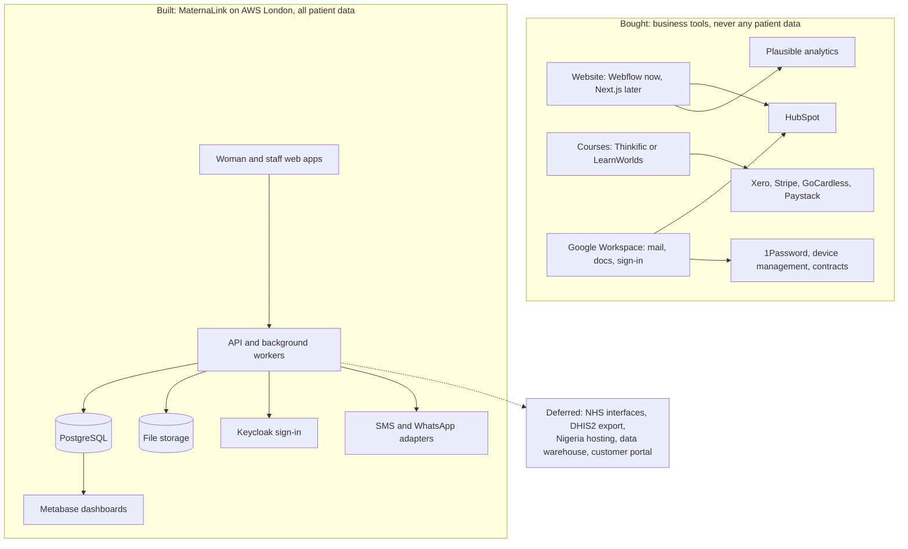

# 04 — Every piece of technology the company needs

**This document is for your developer.**

**One table for the whole company: what each thing is for, what to use, roughly what it costs a month, and what else would do.**

## In one minute

- Vytalix has two separate estates: cheap bought tools for the business, and one built platform for MaternaLink.
- Buy everything that is not the product. Build only the product.
- The business tools cost £90–£250 a month at the start, rising to £460–£1,560 once the build is running.
- MaternaLink runs on AWS in London for £350–£700 a month at first release.
- The "do not build yet" list at the end matters as much as the buy list. Keep it on the agenda.

## What to do

| Action | Who | By when |
|---|---|---|
| On incorporation: domain, Google Workspace, email security, password manager, HubSpot free, Xero, Webflow, Plausible, ICO registration | Founder | One week of setup, under £300 a month |
| Set up the AWS organisation, infrastructure-as-code baseline and GitHub before the build starts | Developer | Before build week 1 |
| Write down the AI policy and have the founder sign it | Founder | Before any tool is used on client work |
| Choose the e-learning platform when the first course is scheduled, not before | Founder | Month 6 |
| Book Cyber Essentials for the quarter in which the MaternaLink test environment exists | Developer | 2027 |

## How it fits together

*Caption: business tools on the left are bought and hold no patient data; the product platform on the right is built, and patient data never leaves it.*

## The whole company's technology in one table

All prices are ESTIMATE (our best guess, not a fact) in pounds at September 2026, from public list prices. Check every one before buying; vendors rename plans often.

| What it is for | What to use | Roughly per month | The alternative |
|---|---|---|---|
| Company website | Webflow with its CMS plan in year 1. Next.js with a headless CMS once engineers exist in 2027 | £18–£25, plus £10–£15 a year for the domain | Framer, similar and design-led. WordPress, cheap but a security burden. Squarespace, too limited |
| Marketing content | Webflow's own CMS now, then Sanity or Payload later. MaternaLink's clinical content is not here: it lives in the product with its own two-person approval | Included, then £0–£80 | Contentful, pricier. Strapi, self-hosted |
| Sales and contacts | HubSpot, free tier then Starter. The investor list imports as its own pipeline | £0, then £15–£20 per seat | Pipedrive £12–£14 per seat, sales only. Attio £25+. Salesforce, no |
| Customer portal | Do not build in year 1. Serve consulting clients with shared drives and PandaDoc, learners inside the course platform, MaternaLink customers inside the product's admin screens | £0 now, £30k–£60k to build later | HubSpot's own portal for tickets |
| Selling courses | Thinkific if the first courses are for individuals, LearnWorlds if a corporate or NHS group licence is signed first | £30–£120 Thinkific, £25–£250 LearnWorlds | Teachable, weaker on corporate. Moodle, only when a university or NHS buyer demands it: £80–£150 hosted, or £30–£100 self-hosted plus admin time. Custom build £40k–£80k, not before year 3 |
| The MaternaLink product | TypeScript throughout; Next.js web apps; a NestJS API; PostgreSQL with row-level security; Redis for jobs; S3; Keycloak; AWS eu-west-2 (London); Terraform; GitHub Actions; SMS adapters for Africa's Talking, Termii and Twilio | £350–£700 at first release; £1,000–£2,500 at 5 organisations and 20,000 women | Azure UK South, equivalent and worth choosing if the first NHS customer is Microsoft-centred. Do not run both. GCP London has fewer NHS references |
| Product admin and dashboards | Admin lives inside the MaternaLink staff app. Business dashboards on Metabase, self-hosted, reading a copy of the database. Company numbers start as a spreadsheet fed by HubSpot, Xero and course exports | £30–£50 for Metabase, £0 for the spreadsheet | Retool, fast but data leaves the region unless self-hosted. Power BI if the buyers are Microsoft-heavy |
| Analytics | Plausible for the website, hosted in the EU with no cookies. For the product, an events table inside our own database holding no personal data, read by Metabase | £9–£15, product side included in cloud cost | Fathom. Google Analytics is free but brings a consent banner and data-transfer questions. Amplitude and Mixpanel are excluded: data leaves the region |
| Staff sign-in | Google Workspace as the identity provider for every business tool, with security keys for admins. A company domain replaces the personal Gmail on day one | £5–£11 per user | Microsoft 365 is a legitimate choice because NHS buyers are Microsoft-heavy. Decide once |
| MaternaLink sign-in | Keycloak, self-hosted in London, for staff. Phone code plus device PIN for women | £40–£70 | Auth0 and Clerk are easier but their UK data residency is unconfirmed. Cognito is cheap but clumsy to federate |
| Taking payments | Stripe for cards and subscriptions, usually through the course platform. Xero invoicing with GoCardless direct debit for retainers. Paystack or Flutterwave for Nigeria, which needs a Nigerian entity or a partner | Xero £15–£40. Fees: about 1.5% plus 20p on UK cards; GoCardless about 1% capped; Paystack about 1.5% plus ₦100 over ₦2,500 | Paddle handles global VAT itself at a higher percentage. Interswitch or Monnify in Nigeria. Government and donor contracts are invoice and bank transfer only |
| Joining other systems | Our own documented API first. FHIR UK Core read-only view in version 2. DHIS2 export for Nigeria. Hospital record interfaces where the vendor supports them | Mostly effort: £20k–£40k per NHS integration, £30k–£50k for the FHIR view | Zapier or Make for business tools only, never for patient data |
| Cloud and databases | AWS eu-west-2 with separate accounts for production, non-production, backups and security. PostgreSQL everywhere. Redis for queues only. S3 with write-once storage for audit copies | See the product row. A Nigeria cell adds £350–£1,500 | Azure UK South. Hetzner or OVH are cheap but weak for NHS assurance. Vercel and Supabase are fine for the corporate site, not for patient data |
| AI tools | Business tiers with no-training terms, for drafting marketing and course content, code help, internal meeting notes and translation first drafts | £20–£60 per user, plus £10–£40 for coding assistants | None needed. What matters is the policy, not the vendor |
| Security | Google Workspace sign-in with passkeys. Device management. 1Password. Email authentication set to reject forgeries. Cyber Essentials, then Plus, then the NHS toolkit | 1Password £6–£8 per user; devices £0–£8 each; certification £2k–£4k a year | Bitwarden instead of 1Password. ISO 27001 deferred to year 2 or 3 at £15k–£40k |
| Data governance and backups | ICO registration on incorporation, a fractional data protection officer, records of processing, retention schedule, DPIA templates and a sub-processor register. Product backups: point-in-time recovery, 35-day snapshots, a copy in a separate UK account, restore drills every quarter. Business tools export monthly to encrypted storage; code sits in GitHub with branch protection and a nightly mirror | DPO £500–£1,500; ICO fee £52–£78 a year; SaaS backup £3–£6 per user; product backup included in cloud | None. Neither is optional once real data exists |

Annual items on top (ESTIMATE): Cyber Essentials £300–£600; Cyber Essentials Plus £1,500–£3,000; penetration test £6,000–£12,000; accessibility audit £3,000–£6,000; ICO fee £52–£78; insurance £1,000–£3,000.

## The lean first-year setup

Phase A is months 1 to 3, services only, two paid seats. Phase B is months 4 to 12, with the MaternaLink build running, four or five seats.

| Component | Phase A per month | Phase B per month |
|---|---|---|
| Domain, DNS, email security | £2 | £2 |
| Google Workspace | £10–£22 | £25–£55 |
| Website (Webflow) | £18–£25 | £18–£25 |
| Website analytics (Plausible) | £9 | £9 |
| CRM (HubSpot) | £0–£20 | £20–£40 |
| Finance (Xero, with Stripe and GoCardless) | £15–£30 | £15–£30 |
| Work management (Notion, GitHub Projects) | £0–£16 | £16–£40 |
| Contracts (PandaDoc or Docusign) | £0–£25 | £25–£40 |
| Password manager (1Password) | £12–£16 | £30–£40 |
| Scheduling (Calendly) | £0–£10 | £0–£10 |
| AI assistants | £20–£60 | £80–£200 |
| Course platform | £0 | £30–£120, from about month 6 |
| GitHub Team | £0 | £12–£20 |
| AWS, as environments come online | £0 | £150–£700 |
| Monitoring (Sentry, Grafana, uptime checks) | £0 | £20–£80 |
| SMS gateways, sandbox then pilot | £0 | £10–£150, billed on in pilots |
| **Tools total** | **£90–£250** | **£460–£1,560** |
| Fractional data protection officer | £0–£500 | £500–£1,500 |
| **Total including that officer** | **£90–£750** | **£960–£3,060** |

## Do not build this yet

| Item | Why not now | Build it when |
|---|---|---|
| A custom website or CMS | No engineers. Webflow is enough | The engineering team exists and the brand has settled |
| A custom course platform | Bought platforms cover years 1 and 2 | Learning revenue passes £150k a year, or a buyer demands self-hosting |
| A customer portal | There are no customers to serve | Five or more paying organisations |
| A data warehouse | The volumes are tiny. Metabase and a spreadsheet are enough | More than five organisations, or research data needs it |
| Native mobile apps | The web app meets the need. App stores add clinical safety re-testing on every release | Evaluation shows the web app cannot do it |
| NHS interfaces and FHIR | There is no NHS customer, and onboarding is heavy | A trust asks for it, in version 2 |
| Hosting inside Nigeria | No contract requires it | A signed contract has a data residency clause |
| Two live regions at once | Cost and complexity | A contract demands better than 99.9% availability |
| AI on patient data | No DPIA, no in-region endpoint, no clinical review process | Version 1.1 at the earliest, under the written policy |
| ISO 27001 | NHS buyers ask for Cyber Essentials Plus and the toolkit first | A buyer requires it, or year 3 |
| Kubernetes, or splitting into microservices | Managed containers and one well-organised application are faster and safer | Many services with someone to run them, or a team past ten engineers |
| A separate sign-in service for women | Phone code plus PIN is enough | Merging it with staff sign-in is clearly worth it |
| Blockchain, tokens, own-brand wearables | No user needs them and they damage credibility | Never, unless evidence appears |

## Rules that do not bend

1. Patient data lives only in the MaternaLink platform, in London, behind row-level security, audit and encryption. Business tools never receive it.
2. Every outside service is a sub-processor: it needs an agreement, a register entry and a DPIA update.
3. Every integration sits behind an interface, so a customer's choice of SMS provider or hospital system is configuration, not code.
4. Customer exports use documented formats, so nobody is locked in.
5. Monitoring, backups and infrastructure-as-code start with the first environment. They are the cheapest assurance evidence you will ever buy.

## Words explained

| Word | What it means |
|---|---|
| CMS | The tool that lets a non-developer edit website pages. A headless CMS stores the content separately from the site that displays it |
| CRM | The tool that tracks who you have spoken to and what you sold |
| Row-level security | The database itself refuses to show one customer's rows to another |
| Sub-processor | Any outside company that touches your data on your behalf |
| Data residency | The country the data physically sits in |
| Infrastructure-as-code | The servers are described in files, so they can be rebuilt exactly |
| FHIR and DHIS2 | The standard NHS systems use to exchange health records, and the reporting system most African health ministries run |
| ICO | The UK data protection regulator. You register with it on incorporation |
| ESTIMATE / TO VALIDATE | Our best guess, not a fact / nobody has checked this yet |
