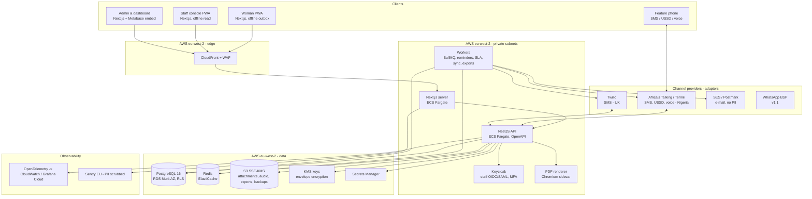
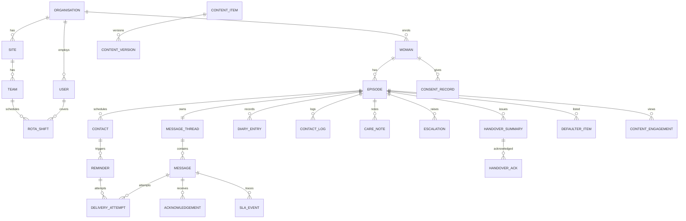
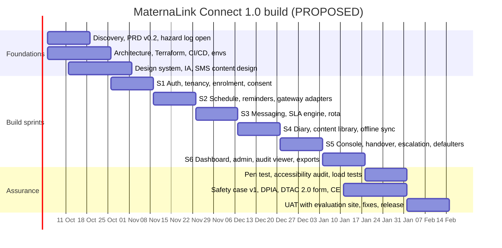

# MaternaLink (in development) — MVP Technical Specification

**Product:** MaternaLink Connect 1.0 · **Owner:** CTO, Vytalix · **Status:** PROPOSED v0.1 · **Date:** 7 September 2026 · **Governing files:** `/FACTS_BASE.md`; `/docs/04_MATERNALINK_PRODUCT_STRATEGY.md`; `/product/MATERNALINK_PRD.md` (requirement IDs FR-nnn / NFR-nnn / SYNC-nn referenced here). Group-level stack decisions live in `/docs/07_TECHNOLOGY_ARCHITECTURE.md`.

> **Labels.** All prices and effort figures are ESTIMATE in GBP at September 2026 and must be re-quoted before budgeting. Vendor capabilities (regions, residency, pricing tiers) are TO VALIDATE unless a source URL is given. No component described here exists yet; the Vercel prototype is not assumed to be reused (FACTS_BASE §1.3; strategy §25).

## Executive view (5 lines)

1. **Stack (PROPOSED):** TypeScript monorepo — Next.js PWA front-ends, NestJS API, PostgreSQL 16 with row-level tenant isolation, Redis/BullMQ jobs, S3 object storage, Keycloak for staff identity, all in **AWS eu-west-2 (London)** via Terraform and GitHub Actions; a Nigeria "cell" is a configuration of the same Terraform, not a second codebase.
2. **Why:** one language across the team (hiring in both the UK and Nigeria), boring and auditable components, in-region data paths with no third-party sub-processors on the patient-data path, and a channel abstraction so SMS/WhatsApp/USSD providers are adapters.
3. **Safety and assurance are architecture, not paperwork:** append-only messaging and diary tables, versioned optimistic writes for notes, an SLA engine that escalates to humans, immutable audit of every personal-data access, envelope encryption of identifiers, and a break-glass path that is time-boxed and tenant-visible.
4. **Run cost at MVP (ESTIMATE):** £350–£700/month cloud for dev+staging+prod plus £50–£150/month tooling and pass-through messaging; **build cost (ESTIMATE):** £220k–£320k UK-led or £140k–£210k UK-led with a Nigeria-based engineering pair, over 16 weeks.
5. Controls are mapped to Cyber Essentials (five controls) and the CAF-aligned NHS DSPT v8 (Category 3 supplier: 35 assertions / 42 mandatory evidence items — source: https://www.dsptoolkit.nhs.uk/News/161 and https://dionach.com/data-security-and-protection-toolkit-dspt-2025-2026-caf/ ); both are design targets — no certification exists today.

---

## 1. Architecture overview



Design rules: (1) all personal data stays inside the VPC and the chosen region; (2) gateways receive only what a message needs (phone number and text); (3) no synchronous dependency on a gateway in a user request — everything outbound is a job; (4) every table that holds personal data has an `organisation_id` and a row-level-security policy; (5) the woman-facing app must render its cached schedule, content and emergency banner with the API unreachable (NFR-007).

---

## 2. Stack — choices, rationale, cost, alternatives

| Layer | Recommendation (PROPOSED) | Why | Cost (ESTIMATE, monthly unless stated) | Alternatives considered |
|---|---|---|---|---|
| Language / repo | TypeScript everywhere; pnpm + Turborepo monorepo (`apps/web-woman`, `apps/web-staff`, `apps/api`, `packages/schema` (zod), `packages/ui`, `packages/i18n`, `infra/`) | Shared validation schemas front-to-back; one hiring profile in UK and Nigeria; fewer integration bugs | £0 | Python/Django API (see below); separate repos (more CI overhead) |
| Woman & staff front-ends | Next.js 15 (App Router), React, PWA via Serwist (Workbox), Dexie (IndexedDB) for local store and outbox, TanStack Query, react-hook-form + zod | Mature PWA tooling; SSR for fast first paint on 3G; component reuse across both apps; NHS-design-system-style components in `packages/ui` | £0 (hosting counted below) | Remix; SvelteKit (smaller bundles, smaller hiring pool); React Native/Expo (native — out of MVP, NG10) |
| Front-end hosting | Containerised Next.js on ECS Fargate behind CloudFront in eu-west-2 | Keeps SSR and API calls in-region without adding Vercel as a sub-processor on the patient-data path | Included in ECS cost | Vercel Pro (£16–£20/user; fast DX; functions in London region are configurable TO VALIDATE — acceptable for the corporate site, adds a processor for MaternaLink) |
| API | **NestJS** (Node 22, Fastify adapter), OpenAPI 3.1 generated, class-validator/zod, Prisma or Drizzle ORM with raw SQL for RLS-sensitive paths | Modular, opinionated, testable; same language as the front-ends; strong OpenAPI story for DTAC interoperability questions | £0 | **Django + DRF** (excellent admin, Python for later data science; two-language team); FastAPI (lighter, less structure) — Python remains the v3 research language regardless |
| Database | PostgreSQL 16 on Amazon RDS (Multi-AZ in prod; single-AZ dev/staging), row-level security keyed by `organisation_id`, logical replication slot for the analytics copy | Relational integrity for consent/schedule/audit; RLS as a hard tenant boundary; well-understood backup tooling | Prod db.t4g.medium Multi-AZ £90–£130; staging/dev £30–£50 | Aurora PostgreSQL (better scaling, higher floor cost); Azure Database for PostgreSQL Flexible Server (UK South) if Azure is chosen |
| Jobs / cache | Redis 7 (ElastiCache) + BullMQ (reminder dispatch, SLA timers, sync post-processing, exports, gateway retries with dead-letter) | One queue system with delayed jobs and retries; visible in a small admin UI | £25–£45 | SQS + EventBridge Scheduler (more managed, more moving parts); pg-boss (queue in Postgres; viable for MVP if we want to drop Redis) |
| Object storage | S3 with SSE-KMS, bucket-per-environment, versioning, Object Lock for audit exports, presigned URLs (short TTL) | Attachments (FR-045), audio content, handover PDFs, exports, backups | £10–£30 | Azure Blob; Cloudflare R2 (no egress fees; residency TO VALIDATE) |
| Identity — staff | **Keycloak** (self-hosted on ECS, its own small RDS instance), OIDC for our apps, SAML/OIDC federation for trust SSO, TOTP/WebAuthn MFA | Enterprise federation without per-user fees; data stays in-region; open source | £40–£70 compute | Auth0 (UK residency on higher tiers TO VALIDATE; per-MAU pricing); Clerk (fast DX; data residency TO VALIDATE — likely US); Amazon Cognito (cheap, in-region, weaker federation UX); Azure Entra External ID |
| Identity — women | Phone-number OTP (SMS) + device PIN/biometric unlock implemented in the API, issuing short-lived tokens; PWA holds refresh token in IndexedDB encrypted with the PIN-derived key | Women may have no e-mail; feature-phone parity; discreet mode; avoids putting 20k women into Keycloak | Included | Keycloak custom flow (possible later to unify); magic links (needs e-mail) |
| Messaging gateways | Adapter interface `ChannelProvider` (send, inbound webhook, delivery status, opt-out sync); adapters: Africa's Talking, Termii, Twilio; WhatsApp BSP adapter in v1.1 | Provider is configuration per organisation; failover; cost per message recorded for pass-through billing | Pass-through: Nigeria SMS ESTIMATE ₦4–₦6/msg; UK SMS ESTIMATE £0.03–£0.05/msg — TO VALIDATE | Infobip (enterprise); direct operator contracts (later, volume) |
| E-mail | Amazon SES in eu-west-2 (or Postmark) — notifications only, no personal content | Cheap, in-region | £1–£10 | Postmark (£12+; better deliverability tooling); Resend |
| PDF / print | Headless Chromium sidecar (Playwright) rendering the handover template | Same React template for screen and PDF | Included | Server-side PDF libs (worse fidelity) |
| Observability | OpenTelemetry SDK → CloudWatch (logs/metrics) + Grafana Cloud free/pro for dashboards; Sentry (EU region) for errors with PII scrubbing; uptime checks (Better Stack or Grafana synthetic) | Enough to meet NFR targets and DSPT logging expectations | £20–£80 | Datadog (excellent, costly); self-hosted Grafana/Loki/Tempo (ops burden) |
| CI/CD | GitHub Actions; OIDC federation to AWS (no long-lived keys); trunk-based development; preview builds; automated migrations; blue/green ECS deploys with health checks and one-click rollback | Standard, cheap, auditable | GitHub Team £4/user; Actions minutes £0–£30 | GitLab; AWS CodePipeline |
| IaC | Terraform (or OpenTofu) modules: network, data, app, identity, observability; state in S3 with locking; one root per environment; the Nigeria cell is a root with different provider/region variables | Repeatable environments; evidence for DSPT/CE ("secure configuration") | £0 | AWS CDK (TypeScript; ties to AWS); Pulumi |
| Security tooling | Dependabot/Renovate, CodeQL, Trivy image scans, gitleaks, OWASP ZAP baseline in CI; AWS Config rules; GuardDuty; WAF managed rules | Supply-chain and config hygiene with evidence trails | £15–£40 | Snyk (paid); Wiz (enterprise) |
| Analytics | Events table in Postgres (`analytics_event`, no PII) → nightly Parquet to S3 → Metabase (self-hosted on ECS) for programme dashboards and internal product analytics | In-region, no third-party SaaS on event data; dashboards embedded for `programme_manager` | £30–£50 compute | PostHog EU (self-host or cloud; TO VALIDATE residency); Amplitude/Mixpanel (out — data leaves region) |
| Feature flags | Database-backed flags per organisation (FR-109) with an admin UI | Avoids another SaaS with data | £0 | LaunchDarkly/Unleash (later) |
| Cloud — alternative | **Azure UK South** as a full alternative (AKS/Container Apps, Flexible Server PostgreSQL, Blob, Key Vault, Entra) | Some NHS organisations prefer Azure; Microsoft NHS relationships | Comparable ±15% | GCP europe-west2 (London) — fewer NHS references (ASSUMPTION) |

**Cloud total at MVP (ESTIMATE):** prod £250–£450/month; staging £70–£150; dev £40–£100 → **£350–£700/month**, before Nigeria cell and before volume SMS. NAT gateway, WAF and Multi-AZ are the main fixed costs; Fargate Spot in non-prod cuts 30–50%.

### 2.1 Nigeria data-residency options (all TO VALIDATE; decision per contract)

| Option | Description | Pros | Cons | Cost ESTIMATE |
|---|---|---|---|---|
| A. UK region + NDPA transfer safeguards | Keep the cell in eu-west-2; rely on NDPA cross-border transfer conditions (adequacy decision by the NDPC, contractual clauses, consent) | Simplest; one estate | Some states/donors demand in-country data; NDPC adequacy status of the UK TO VALIDATE | £0 extra |
| B. AWS af-south-1 (Cape Town) | Same Terraform, different region | Nearest full AWS region; lower latency | Still cross-border (South Africa); NDPA analysis still required | £350–£700/month for a full cell |
| C. In-country hosting | Galaxy Backbone (government cloud), Rack Centre, MainOne/Equinix Lagos, MDXi; or an AWS Local Zone in Lagos if available (TO VALIDATE) | Satisfies "data stays in Nigeria" requirements; government-friendly | Different tooling; managed PostgreSQL/KMS equivalents vary; ops burden; supply and power risks | £500–£1,500/month plus setup £5k–£15k |
| D. Hybrid | Data (PostgreSQL, S3-equivalent) in-country; stateless services wherever cheapest; gateway in-country | Meets residency with less ops | Latency; complexity | Between B and C |

Recommendation: design for **A now, C when a contract requires it**; keep every residency-sensitive component behind Terraform variables and an ORM without region-specific features.

---

## 3. Data model

### 3.1 Entity list (key fields; every table has `id` UUIDv7, `organisation_id`, `created_at`, `updated_at`, `created_by`; PII columns marked †are envelope-encrypted; append-only tables have no `updated_at`)

| Entity | Purpose | Key fields |
|---|---|---|
| `organisation` | Tenant | name, market (UK/NG), timezone, default_locale, config JSON (emergency text/numbers, service hours, SLA minutes, channels enabled, languages), data_region |
| `site` | Facility / clinic | organisation_id, name, type (community team, PHC, hospital), address, phone†, dhis2_org_unit (nullable) |
| `team` | Care team within a site | site_id, name, lead_user_id |
| `user` | Staff account | keycloak_subject, email†, name†, phone†, status, mfa_enforced, role assignments (many-to-many `user_role` with scope: organisation/site/team) |
| `woman` | Person receiving care | name†, dob†, phone†, preferred_locale, preferred_channel, interpreter_needed, interpreter_note†, discreet_mode, under_18_flag, safeguarding_flag_present (boolean only), pin_hash, status |
| `episode` | One pregnancy/postnatal episode | woman_id, edd, edd_source, lmp, gravida, para, planned_birth_place, birth_preferences†, things_to_know†, primary_user_id (named midwife/CHEW), team_id, site_id, status (antenatal/postnatal/closed), outcome (nullable), outcome_date, outcome_type |
| `clinical_note_field` | Staff-entered clinical fields shown "as recorded by" | episode_id, field (allergies/known_conditions), value†, recorded_by, recorded_at, version |
| `consent_text` | Versioned consent wording | organisation_id, type, locale, version, body, approved_by, approved_at |
| `consent_record` (append-only) | Consent events | woman_id, type, consent_text_id, given (bool), channel, actor (woman/staff), timestamp |
| `schedule_template` | Contact schedule per organisation | name, market, rules JSON (offsets from EDD/LMP by parity), version, approved_by |
| `contact` | Planned/attended contacts | episode_id, template_ref, type, due_at, window_start/end, status, site_id, version |
| `reminder` | Scheduled reminders | contact_id, channel, send_at, status, provider_message_id, cancelled_reason |
| `message_thread` | One thread per episode | episode_id, owner_user_id, sla_state, last_activity_at |
| `message` (append-only) | Messages both directions | thread_id, direction, author_type, author_id, type (question/appointment/tell/important/not_safe/reschedule), body†, attachment_key, channel, client_uuid, client_ts, received_at, sent_in_error (nullable reason) |
| `acknowledgement` (append-only) | Acknowledge events | message_id, user_id, at |
| `sla_event` (append-only) | SLA engine trace | message_id, event (started/breached/reassigned/escalated), from_user_id, to_user_id, at |
| `delivery_attempt` (append-only) | Gateway attempts | reminder_id or message_id, provider, provider_id, status, error_code, cost_minor_units, at |
| `diary_entry` (append-only) | Self-recorded values | episode_id, type (feeling/symptom/movement/bp/weight/question), value JSON†, note†, client_uuid, client_ts, received_at |
| `contact_log` (append-only) | Staff record of a contact | contact_id, episode_id, mode, attended, summary†, actions†, routine_enquiry_attested (bool) |
| `care_note` (versioned) | Communication notes | episode_id, body†, version, author_id |
| `escalation` | Escalation record | episode_id, to_role, to_name†, means, reason†, opened_at, outcome†, closed_at, follow_up_user_id |
| `handover_summary` | Issued summaries (immutable per version) | episode_id, version, content JSON†, issued_by, issued_at, pdf_key |
| `handover_ack` (append-only) | Receipt | handover_summary_id, user_id or external_ack_text, at |
| `defaulter_item` | Tracing list | episode_id, reason, listed_on, assigned_user_id, status, status_changed_at |
| `content_item` / `content_version` | Education library | slug, market, gestation_window, literacy_level, locale, title, body, audio_key, video_key, sources JSON, author_id, reviewer_id, status, review_by, version |
| `content_engagement` (append-only) | Reach | episode_id, content_version_id, event, at |
| `rota` / `rota_shift` | On-call | team_id, user_id, start_at, end_at, role (on_call/lead) |
| `safeguarding_record` | Concern content (restricted) | episode_id, recorded_by, body†, routed_to_user_id, status |
| `channel_config` | Provider selection | organisation_id, channel, provider, sender_id, credentials_secret_ref, opt_out_sync |
| `audit_event` (append-only, separate schema, insert-only role) | Every access/change | actor_id, actor_role, action, entity, entity_id, woman_id (nullable), before_hash, after_hash, reason (break-glass), ip_hash, user_agent, at |
| `analytics_event` (append-only) | Product analytics, no PII | event, pseudonymous_subject_hash, organisation_id, site_id, role, properties JSON (whitelisted keys), at |
| `job` | BullMQ mirror for admin visibility | type, status, attempts, last_error |
| `feature_flag` | Per-organisation flags | key, organisation_id, enabled |
| `data_subject_request` | Rights requests | woman_id, type, status, due_at, handled_by |

### 3.2 Entity relationships (core)



### 3.3 Data rules

- **Tenant isolation:** PostgreSQL RLS on every table with `organisation_id`; the API sets `SET LOCAL app.organisation_id` per request from the verified token; a nightly test asserts every table has a policy (AC-14).
- **Append-only enforcement:** database roles for the API have INSERT but not UPDATE/DELETE on append-only tables; corrections are new rows (e.g., `sent_in_error`).
- **Versioned writes:** `version` column with `WHERE version = :expected` on update; mismatch returns HTTP 409 with both versions (SYNC-05).
- **Idempotency:** unique index on (`organisation_id`, `client_uuid`) for client-generated records (SYNC-03).
- **Small-cell suppression** is implemented in the SQL views used by dashboards, not in the UI (FR-079).
- **Retention:** per-organisation retention policy table drives a nightly job that anonymises or deletes closed episodes after the configured period (defaults PROPOSED in strategy §15; TO VALIDATE with each controller).

---

## 4. API surface (REST, OpenAPI 3.1; `/v1`; JSON; all authenticated except health, OTP start and gateway webhooks with signature verification)

| Area | Endpoints (representative) | Roles |
|---|---|---|
| Auth | `POST /auth/otp/start`, `POST /auth/otp/verify`, `POST /auth/pin/unlock`, `POST /auth/refresh`, `POST /auth/logout`, `GET /auth/oidc/callback` (staff via Keycloak) | public/mother/staff |
| Organisation & admin | `GET/PUT /org`, `GET/POST/PUT /org/sites`, `/org/teams`, `/org/users`, `/org/roles`, `/org/consent-texts`, `/org/schedule-templates`, `/org/channel-config`, `/org/feature-flags`, `GET /org/audit?filters` | operator_admin (audit read also IG roles) |
| Women & episodes | `POST /women` (enrol; duplicate check), `GET /women/{id}`, `PUT /women/{id}` (versioned), `POST /women/import` (CSV), `POST /women/{id}/episodes`, `PUT /episodes/{id}` (EDD change → schedule regen), `POST /episodes/{id}/outcome`, `GET /episodes/{id}/timeline` | midwife/clinician/care_worker (scoped) |
| Consent | `GET /women/{id}/consents`, `POST /women/{id}/consents` (give/withdraw), `POST /me/consents` (woman) | staff / mother |
| Schedule | `GET /episodes/{id}/contacts`, `POST /episodes/{id}/contacts`, `PATCH /contacts/{id}` (status/move, versioned), `GET /me/contacts`, `POST /me/contacts/{id}/reschedule-request` | staff / mother |
| Content | `GET /me/content?window=current`, `GET /content/{slug}`, `GET /me/content/bundle` (offline pack), `POST /me/content/{id}/engagement`; admin: `/content-items` CRUD with workflow transitions `submit`, `approve`, `retire` | mother / clinician reviewers / operator_admin |
| Messaging | `GET /me/thread`, `POST /me/messages` (idempotent by client_uuid), `GET /threads?filter=unacknowledged|breached|mine`, `POST /messages/{id}/acknowledge`, `POST /threads/{id}/messages` (staff reply, optional template), `POST /messages/{id}/sent-in-error`, `POST /threads/{id}/reassign` | mother / staff |
| Diary | `GET /me/diary`, `POST /me/diary` (idempotent), `GET /episodes/{id}/diary` | mother / staff |
| Contact logs & notes | `POST /episodes/{id}/contact-logs`, `GET/POST /episodes/{id}/notes`, `PUT /notes/{id}` (versioned), `GET /episodes/{id}/pre-visit` | staff |
| Escalation | `POST /episodes/{id}/escalations`, `PATCH /escalations/{id}` (close), `GET /escalations?open=true`, `GET /reports/escalations/aggregate` | staff / programme_manager (aggregate) |
| Handover | `POST /episodes/{id}/handover` (draft from data), `PUT /handover/{id}` (edit draft), `POST /handover/{id}/issue`, `GET /handover/{id}.pdf`, `POST /handover/{id}/acknowledge`, `GET /handover/on-call?period=` | staff |
| Defaulters | `GET /defaulters?team=&status=`, `PATCH /defaulters/{id}`, `GET /defaulters/export.csv` | staff / programme_manager |
| Rota | `GET/POST /teams/{id}/rota`, `GET /teams/{id}/on-call/now` | operator_admin / team lead |
| Dashboard | `GET /reports/summary?from=&to=&site=` (suppressed cells), `GET /reports/export.csv`, `GET /reports/dhis2` (C) | programme_manager |
| Sync | `POST /sync/push` (batch of outbox items; per-item result), `GET /sync/pull?cursor=` (delta by entity), `GET /sync/status` | mother / staff |
| Safeguarding | `POST /episodes/{id}/safeguarding`, `GET /safeguarding/queue` (safeguarding lead) | restricted |
| Rights | `POST /women/{id}/dsr` (export/rectify/delete), `GET /dsr/{id}` | operator_admin |
| Support | `POST /support/break-glass` (reason, tenant, duration ≤ 4 h), `GET /support/tenants/{id}/health` | vytalix_support |
| Webhooks (inbound) | `POST /webhooks/{provider}/inbound-sms`, `POST /webhooks/{provider}/delivery-status`, `POST /webhooks/{provider}/ussd` (C) — HMAC/IP-allowlist verified, idempotent by provider message ID | provider |
| Platform | `GET /health`, `GET /ready`, `GET /version`, `GET /openapi.json` | public (no data) |

Conventions: cursor pagination; `If-Match`/version fields on updates; `Idempotency-Key` header accepted on all POSTs; errors as RFC 9457 problem details; rate limits per token and per IP; every response carries a request ID that appears in the audit log.

---

## 5. Messaging and SLA subsystem

```mermaid
sequenceDiagram
  participant Wm as Woman (PWA/SMS)
  participant GW as Gateway adapter
  participant API as API
  participant Q as BullMQ
  participant St as Staff console
  Wm->>API: POST /me/messages (client_uuid) or inbound SMS via GW
  API->>API: store message (append-only), set owner from episode.primary_user_id or team inbox
  API->>Q: enqueue sla.check(message_id, due = now + SLA within service hours)
  API-->>St: inbox shows message (unacknowledged)
  alt acknowledged before due
    St->>API: POST /messages/{id}/acknowledge
    API->>Q: cancel sla.check
    API-->>Wm: "Seen by Sarah 10:12" (in-app / neutral SMS)
  else not acknowledged
    Q->>API: sla.check fires
    API->>API: sla_event(breached); reassign to on-call from rota; notify programme_manager
    API->>Q: enqueue sla.check level 2
  end
  Note over API: 'not_safe' and 'important' types skip the queue: immediate notification to on-call + emergency banner to woman
```

Rota gap detection: an hourly job verifies that every live team has an on-call user for the next 24 h; gaps raise an alert to `operator_admin` and Vytalix support (PRD risk "silent SLA failure").

Outbound SMS pipeline: `reminder.dispatch` job → template render in locale (neutral by default) → provider adapter → `delivery_attempt` → status webhook updates → retry with backoff → failover provider after N failures → dead-letter with alert. Opt-out (STOP) processed synchronously on inbound and mirrored to the provider's opt-out list.

---

## 6. Role model and permissions

| Capability | mother | care_worker | midwife | clinician | programme_manager | operator_admin | vytalix_support |
|---|---|---|---|---|---|---|---|
| View own schedule/content/diary/messages | ✔ | — | — | — | — | — | — |
| Enrol women; edit profile | — | ✔ (limited fields) | ✔ | ✔ | — | ✔ | break-glass |
| Enter clinical fields (allergies, conditions) | — | — | ✔ | ✔ | — | — | — |
| Read caseload (scope) | — | team | team/site | site/org | — | — | break-glass |
| Acknowledge/reply messages | — | ✔ | ✔ | ✔ | — | — | — |
| Record contact log, notes | — | ✔ | ✔ | ✔ | — | — | — |
| Record escalation | — | ✔ (open only) | ✔ | ✔ | — | — | — |
| Generate/issue handover | — | — | ✔ | ✔ | — | — | — |
| Acknowledge handover | — | — | ✔ | ✔ | — | — | — |
| Defaulter list (view/status) | — | ✔ | ✔ | ✔ | view | — | — |
| Safeguarding record (content) | — | — | ✔ | ✔ | — | safeguarding lead only | — |
| Dashboard (aggregate, suppressed) | — | — | — | — | ✔ | ✔ | ✔ (tenant health only) |
| Row-level export | — | — | — | — | — | ✔ (audited, purpose) | — |
| Users, roles, rota, config, content publishing | — | — | — | — | rota (own teams) | ✔ | — |
| Audit log read | — | — | — | — | — | ✔ | ✔ |
| Break-glass | — | — | — | — | — | — | ✔ (time-boxed, reason, tenant notified) |

Enforcement: authorisation policies in the API (attribute-based: role × scope × entity), RLS as the second line, and permission tests generated from this matrix in CI.

---

## 7. Audit logging

- **What:** every read of a woman's record (list rows excluded, detail views included), every create/update, every consent event, every auth event (login, MFA, failure, token revoke), every admin/config change, every export, every break-glass session, every content publish/retire.
- **How:** `audit_event` in a separate schema; the application DB role has INSERT only; nightly export to S3 with Object Lock (WORM) and hash chain (each event stores hash of previous) so tampering is detectable; retained ≥ 6 years (TO VALIDATE against controller schedule).
- **Who sees:** `operator_admin` per tenant via the viewer (FR-087); women can see who viewed their record (FR-106, S); Vytalix support sees cross-tenant audit only for incident response.
- **Alerts:** anomalous access patterns (volume per user per hour, out-of-hours bulk reads) raise alerts to the tenant admin; break-glass always alerts.

## 8. Encryption and key management

| Control | Specification |
|---|---|
| In transit | TLS 1.2+ (1.3 preferred) at CloudFront and between services; HSTS; internal traffic within the VPC over TLS where the service supports it |
| At rest — storage | RDS, S3, ElastiCache, EBS encrypted with KMS customer-managed keys; separate keys per environment and per data class |
| At rest — field level | Envelope encryption for † fields: per-organisation data key wrapped by KMS; deterministic HMAC index columns (phone_hash, dob_hash) for duplicate checks and search; keys rotated annually with lazy re-encryption |
| On device | IndexedDB payloads encrypted with an AES-GCM key derived from PIN/biometric (PBKDF2/Argon2 in WebCrypto where available); cache expiry 7 days (SYNC-11) |
| Secrets | AWS Secrets Manager; no secrets in repo (gitleaks in CI); gateway credentials per organisation |
| Backups | Encrypted with a backup-specific KMS key; cross-account copy (see §9) |
| Key custody | Two named key administrators; KMS key policies deny deletion without dual approval; quarterly access review |

## 9. Backup and disaster recovery (design targets, ESTIMATE)

| Item | Target |
|---|---|
| RDS automated backups | Daily snapshots + PITR (5-minute granularity), 35-day retention |
| Cross-account copy | Snapshots and S3 replicated to a separate AWS "backup vault" account in eu-west-2 (keeps data in the UK; isolates from account compromise). Cross-cloud copy to Azure UK South optional in v2 |
| RPO | 15 minutes (prod) |
| RTO | 4 hours for full region-local restore into the same region; 24 hours for a cold rebuild from Terraform + backups in a different account |
| Restore testing | Quarterly restore drill with a written record (DSPT evidence) |
| Degraded mode | Static emergency page on CloudFront with organisation phone numbers when the API is unhealthy (NFR-007) |
| Gateway outage | Outbound queue persists in Redis (AOF) and the `reminder`/`message` tables; replay after recovery; failover provider |

## 10. Environments

| Env | Purpose | Data | Access |
|---|---|---|---|
| `local` | Developer machines with Docker Compose (Postgres, Redis, Keycloak, MinIO, gateway mocks) | Synthetic only | Developers |
| `dev` | Integration; ephemeral preview stacks per PR (optional) | Synthetic | Team |
| `staging` | UAT, safety-case testing, pen test, accessibility audit, gateway sandbox accounts | Synthetic; **never** real personal data | Team + evaluators |
| `prod-uk` | Live UK tenants | Real (after DPIA, DPA, safety case) | Restricted; break-glass |
| `prod-ng` (cell) | Nigeria tenants when a contract requires; region per §2.1 | Real | Restricted |

Synthetic data generator (`packages/fixtures`) produces realistic but fictitious cohorts in English and Yoruba for every environment below prod.

## 11. Testing strategy

| Level | Tooling | Coverage expectations |
|---|---|---|
| Unit | Vitest (front-end and API), zod schema tests | Business rules: schedule generation, SLA timers, consent state machine, suppression, encryption helpers |
| Contract | OpenAPI-driven tests; provider adapter contract tests against recorded fixtures | All endpoints; all gateway adapters |
| Integration | Testcontainers (Postgres, Redis, Keycloak) | RLS policies (every table), idempotency, versioned writes, retention jobs |
| End-to-end | Playwright on both PWAs, including offline (service-worker + network throttling) and sync conflict scenarios | Every acceptance criterion AC-01–AC-20 scripted |
| Safety testing | Hazard-driven test cases mapped to the DCB0129 hazard log (H-01…H-10), executed before each release and recorded in the safety case | 100% of hazard controls |
| Accessibility | axe-core in CI; manual screen-reader passes; external WCAG 2.2 AA audit before go-live | No AA failures |
| Performance | k6 load tests to NFR-003/005; Lighthouse budgets in CI for LB-02 | p95 targets |
| Security | SAST (CodeQL), dependency and image scans, ZAP baseline, secrets scanning in CI; external penetration test (web, API, mobile-web, cloud config) before go-live and after major change (ESTIMATE £6k–£12k) | No open high/critical |
| Chaos/resilience | Gateway failure injection, Redis loss, DB failover drill in staging | Queue replay and failover verified |
| Localisation QA | Pseudo-localisation in CI; native-speaker review of every published string and content item | Per language |

## 12. Security controls mapped to Cyber Essentials and NHS DSPT

Cyber Essentials (five control themes; cost ESTIMATE: basic £300–£600 + VAT depending on size band, Plus typically £1,500–£3,000 + VAT — sources: https://www.isms.online/cyber-essentials/cost/ and https://www.figgroup.co.uk/blog/cyber-essentials-vs-cyber-essentials-plus-cost ; the NCSC scheme page is https://www.ncsc.gov.uk/cyberessentials/overview ). DSPT 2025-26 is version 8, aligned to the NCSC Cyber Assessment Framework v3.4; Category 3 suppliers complete 35 assertions and 42 mandatory evidence items (sources above). The 2026-27 cycle requirements are TO VALIDATE when published.

| Control area | Implementation in MaternaLink | Cyber Essentials theme | DSPT / CAF objective (v8) |
|---|---|---|---|
| Boundary protection | CloudFront + WAF managed rules; private subnets; security groups deny-by-default; no public DB/Redis; egress via NAT with allow-listed gateway domains | Firewalls | B4 System security |
| Secure configuration | Terraform baseline; CIS-aligned AMIs/containers; AWS Config rules; no default credentials; hardened Keycloak realm | Secure configuration | B4 |
| User access control | Keycloak MFA for all staff; RBAC/ABAC + RLS; least privilege; joiners/movers/leavers process; quarterly access review; break-glass audited | User access control | B2 Identity and access control |
| Malware protection | Container image scanning; endpoint protection and MDM on staff laptops; no unsigned software; attachments scanned before storage | Malware protection | B4 |
| Security update management | Renovate/Dependabot with SLA (critical ≤ 14 days; TO VALIDATE against CE requirement), managed services patched by AWS, monthly patch report | Security update management | B4 |
| Asset and data inventory | Terraform state as asset register; data-flow diagram and RoPA maintained by the DPO | — | A3 Asset management; A2 Risk management |
| Risk management | Quarterly risk review; DCB0129 hazard log; ISO 27001-style risk register (certification not pursued in year 1) | — | A2 |
| Supply chain | Sub-processor register (AWS, gateways, Sentry, e-mail); DPAs; security questionnaires; pinning and SBOM | — | A4 Supply chain |
| Data security | Encryption (§8); data minimisation; pseudonymous analytics; retention jobs | — | B3 Data security |
| Logging & monitoring | Centralised logs (CloudWatch), audit events, GuardDuty, alerts to on-call engineer; log retention 12 months (TO VALIDATE) | — | C1 Security monitoring |
| Incident management | Incident response plan; 72-hour ICO / NDPC notification readiness; post-incident review; clinical-safety incident route to CSO within 24 h | — | D1 Response and recovery planning; D2 Lessons learned |
| Resilience | Multi-AZ, backups, DR drills (§9) | — | B5 Resilient networks and systems |
| Staff training | Annual data-security and safeguarding training; phishing simulations | — | B6 Staff awareness and training |
| Governance | Named SIRO, Caldicott-style guardian (advisor), DPO, CSO; board-level review | — | A1 Governance |

## 13. Build plan

### 13.1 Timeline (16 weeks; the 12-week case removes S items and the staff offline write)



### 13.2 Team and cost (ESTIMATE; day rates are UK/Nigeria contractor market assumptions, September 2026, TO VALIDATE)

| Role | Involvement (16 weeks = 80 working days) | UK-led (day rate × days) | UK + Nigeria blended (day rate × days) |
|---|---|---|---|
| Product owner / CPO-CTO | Founder-side or fractional; not costed here (FACTS_BASE A6 assumes founder time) | £0 (opportunity cost) | £0 |
| Tech lead / architect (UK) | Full-time | £750 × 80 = £60,000 | £750 × 80 = £60,000 |
| Full-stack engineer ×2 | Full-time | £550 × 80 × 2 = £88,000 | Nigeria-based senior engineers £200–£300 × 80 × 2 = £32,000–£48,000 |
| Product designer | 50% | £500 × 40 = £20,000 | Blended £300 × 40 = £12,000 |
| QA / test automation | 50% | £400 × 40 = £16,000 | Nigeria-based £150–£200 × 40 = £6,000–£8,000 |
| DevOps / security engineer | 15 days | £700 × 15 = £10,500 | £10,500 |
| Clinical Safety Officer (DCB0129) | 0.2 FTE ≈ 16 days | £800 × 16 = £12,800 | £12,800 |
| Clinical content authors/reviewers | ~20 days | £500 × 20 = £10,000 | £10,000 (UK) + Nigeria clinical reviewer £2,000 |
| Translation (Yoruba) and audio | Package | £4,000–£8,000 | £3,000–£6,000 |
| Penetration test | Package | £6,000–£12,000 | £6,000–£12,000 |
| Accessibility audit | Package | £3,000–£6,000 | £3,000–£6,000 |
| Regulatory/data-protection counsel (intended use, DPIA review, NDPA) | Package | £8,000–£15,000 | £8,000–£15,000 |
| Cyber Essentials (+ Plus) | Certification | £2,000–£3,600 | £2,000–£3,600 |
| Cloud and tooling during build (4 months) | — | £2,000–£4,000 | £2,000–£4,000 |
| Contingency (15%) | — | ~£36,000 | ~£23,000 |
| **Total (ESTIMATE)** | | **£220k–£320k** | **£140k–£210k** |

Notes: (a) the blended model assumes the UK tech lead owns architecture, security and safety-critical modules (SLA engine, sync, encryption) and reviews every merge; (b) Nigeria-based engineers also bring channel and context knowledge for the SMS cohort; (c) an employed team instead of contractors lowers day-rate cost but adds recruitment time beyond the 16 weeks; (d) none of this is funded today (FACTS_BASE A3) — the roadmap sequences it behind services revenue and grants.

### 13.3 Ongoing run cost after MVP (ESTIMATE, monthly)

Cloud £350–£700; tooling £50–£150; messaging pass-through variable; support engineer 0.3 FTE and CSO 0.1 FTE ≈ £3,000–£4,500; annual items (pen test, CE Plus, accessibility re-audit, DSPT effort) ≈ £15k–£25k/year.

---

## Priorities / Risks / Next actions

**Priorities**
1. Decide the cloud (AWS eu-west-2 vs Azure UK South) and identity approach with the first evaluation site's IT team in view; default AWS + Keycloak.
2. Stand up Terraform, CI/CD and the three environments in weeks 1–3 so that every sprint deploys to staging with synthetic data.
3. Build the safety-critical modules first with the tech lead (tenancy/RLS, SLA engine, sync/idempotency, audit, encryption) and test them against the hazard log.
4. Contract the Nigeria gateway sandbox early (sender ID lead time) and the UK SMS/e-mail providers.
5. Book the penetration test and accessibility audit for weeks 13–14 now; they have lead times.

**Risks**
| Risk | Mitigation |
|---|---|
| Two identity systems (Keycloak for staff, OTP/PIN for women) add complexity | Keep the woman flow minimal; unify under Keycloak in v2 if warranted |
| RLS mistakes leak across tenants | Policy-presence test on every table; AC-14 in CI; pen test scope includes tenancy |
| Offline sync bugs lose or duplicate data | Append-only + idempotency + versioned writes; fault-injection tests |
| Gateway DND/route classification blocks reminders | Transactional route, registered sender ID, delivery monitoring, failover |
| Cost overrun from scope creep | MoSCoW freeze; change control; 12-week fallback scope defined |
| No real users for UAT | Evaluation-site LOI by week 4; NGO cohort as fallback |

**Next actions**
- CTO: finalise ADRs (architecture decision records) for cloud, identity, ORM, queue; create the monorepo skeleton and Terraform modules; write the hazard-to-test mapping template.
- Founder: budget decision (UK-led vs blended) and funding source; sign the IP resolution so the repository can be created under the Vytalix entity.
- CSO (to appoint): review §5–§8 against DCB0129; open hazard log.
- DPO/counsel: DPIA v0.1 using §3 and §8; sub-processor register.
