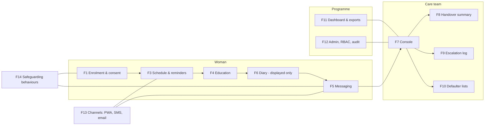

# MaternaLink (in development) — MVP Product Requirements Document (PRD)

**Product:** MaternaLink Connect 1.0 (internal MVP name) · **Owner:** CPO/CTO, Vytalix · **Status:** PROPOSED v0.1 (draft for discovery sign-off) · **Date:** 7 September 2026 · **Governing files:** `/FACTS_BASE.md` (language rules, labels) and `/docs/04_MATERNALINK_PRODUCT_STRATEGY.md` (strategy; this PRD implements its §5–§6 scope). Companion files: `/product/MATERNALINK_MVP_SPEC.md` (technical spec), `/product/MATERNALINK_ROADMAP.md` (8-quarter plan), `/docs/07_TECHNOLOGY_ARCHITECTURE.md` (group stack).

> **Verification note.** Six web searches were used for this batch of documents, all on regulatory facts; their URLs are cited inline. Every other external figure (SMS tariffs, vendor prices, market data) is marked ESTIMATE or TO VALIDATE. Nothing here is a claim about a working product: MaternaLink is in development, the existing Vercel prototype is of unknown provenance (FACTS_BASE §1.3), and no clinical, regulatory or government status exists.

## Executive view (5 lines)

1. This PRD defines the 12–16-week MVP of MaternaLink (in development) as a **non-diagnostic care-coordination, communication, education and monitoring-support platform**: enrolment, schedules and reminders, signed-off education, owned two-way messaging with human escalation, a displayed-not-interpreted diary, a care-team console, a structured handover summary, an escalation log, defaulter lists, a programme dashboard, admin/audit, and a Nigeria SMS channel.
2. **Non-goals are the product**: no risk score, no threshold alerts, no urgency classification, no symptom checker, no chatbot advice, no EPR write-back, no partner access. These keep the intended use outside medical-device classification (TO VALIDATE with regulatory counsel) and keep the safety case tractable.
3. 118 numbered requirements are prioritised MoSCoW; the Must set is deliberately small enough for a 3–4-person build team, with offline-first sync rules, a low-bandwidth mode and an SMS channel specified as first-class requirements, not afterthoughts.
4. Nigeria channel strategy is **SMS first (transactional route, registered sender ID, DND-aware), WhatsApp in v1.1, USSD and voice IVR in v1.1–v2**, with Africa's Talking or Termii as the primary gateway candidates and Twilio/Infobip as alternatives — all TO VALIDATE on price, coverage and compliance.
5. The MVP is accepted only when the end-to-end antenatal journey passes the acceptance criteria in §11 under a signed DCB0129 clinical safety case, a completed DPIA, a passed penetration test and an accessibility audit — none of which exist today.

---

## 1. Purpose, context and constraints

| Item | Position (labelled) |
|---|---|
| What exists today | A concept deck (2025), an Ekiti proposal (March 2026, outcome unknown), a Vercel prototype dashboard of unknown code ownership, security and data handling, and a "Lang Switcher" demo video (VERIFIED as artefacts only; FACTS_BASE §1) |
| What this PRD assumes | The prototype is a demo asset, not a product asset; the MVP is specified as a **rebuild** with optional reuse of audited UI components (ASSUMPTION pending the prototype audit in strategy §25) |
| Intended use (PROPOSED, TO VALIDATE with counsel) | Support communication, education, scheduling and information handover between women receiving maternity care and their care teams, and support programme administration. Not intended to diagnose, prevent, monitor, predict, prognose, treat or provide clinical decision support (strategy §21.1) |
| Regulatory posture | Designed to sit outside UK MDR 2002 device classification; qualification decision to be documented per feature; DTAC 2.0 form (in force from 6 April 2026, required before pilots as well as procurement — source: https://www.burges-salmon.com/articles/102mnjh/new-nhs-digital-technology-assessment-criteria-what-health-tech-suppliers-need-t/ and https://innovation.nhs.uk/news/updated-nhs-england-digital-technology-assessment-criteria-dtac-form-and-guidance/) completed as part of MVP exit |
| Markets in scope for MVP | One UK service-evaluation site (community midwifery team); one Nigeria SMS cohort with an NGO or state partner (neither secured — TO VALIDATE) |
| Budget and timeline | 12–16 weeks build; cost range in `/product/MATERNALINK_MVP_SPEC.md` §12 (ESTIMATE £140k–£320k depending on team model) |

---

## 2. Goals and non-goals

### 2.1 Goals (MVP)

| # | Goal | Measure at MVP exit (design target, ESTIMATE) |
|---|---|---|
| G1 | A woman and her care team can complete an antenatal episode end-to-end in the product | 100% of the acceptance scenarios in §11 pass in staging with test data |
| G2 | Every message from a woman has a human owner and is acknowledged within an SLA, with escalation to humans when it is not | ≥95% acknowledged within SLA in evaluation; zero unowned messages in audit |
| G3 | Handover between professionals uses a structured, audited summary | ≥60% of evaluation-site births have a summary generated |
| G4 | A Nigeria programme can enrol a cohort and run scheduled two-way SMS with a defaulter list, without a smartphone on the woman's side | ≥80% SMS delivery to enrolled numbers; defaulter list generated daily |
| G5 | The product ships with its assurance artefacts | DCB0129 safety case v1 signed by CSO; DPIA complete; pen test passed (no unresolved high/critical); WCAG 2.2 AA audit; DTAC 2.0 form completed; Cyber Essentials certificate |
| G6 | The product works on poor connections and intermittently offline | Core woman-side flows usable offline; sync conflict rate <1% of synced records |

### 2.2 Non-goals (explicit, MVP and v1)

| # | Non-goal | Why |
|---|---|---|
| NG1 | Any risk score, prediction, or "Maternal Instability Score" | v3 research track only; requires validation and SaMD pathway (strategy §8) |
| NG2 | Threshold alerts on self-recorded observations (BP, weight, movements) | Monitoring intended purpose → likely device; v2 qualification decision (strategy §7) |
| NG3 | Automated urgency/priority classification of message content | Would make the system decide clinical urgency; hazard H-01 |
| NG4 | Symptom checker, chatbot, generated clinical advice, LLM output shown to women | Content is pre-approved only (strategy §16) |
| NG5 | Scored mental-health questionnaires (EPDS, Whooley, GAD-2) | v2 under clinical governance review |
| NG6 | EPR/FHIR write-back, NHS login, PDS lookup | v2; MVP provides pasteable/printable outputs |
| NG7 | Partner/companion accounts | Safeguarding design first; v2 |
| NG8 | Video consultations, wearables, device pairing, payments | Out of MVP |
| NG9 | Being the legal record of care | The EPR/facility register remains the record; MaternaLink holds communication and coordination data |
| NG10 | Native iOS/Android apps | PWA only in MVP; store apps considered after evaluation |

---

## 3. Users and roles

Roles are defined in strategy §3 and the permission matrix is in the MVP spec §6. Summary:

| Role key | Who | Primary MVP surface |
|---|---|---|
| `mother` | Enrolled woman (UK: smartphone PWA; Nigeria: SMS, optionally PWA) | Home, schedule, learn, diary, messages, my team, settings |
| `midwife` (variant `care_worker` with reduced permissions) | Community midwife; CHEW/CHIPS agent | Caseload, inbox, contact log, handover, escalation, defaulter list |
| `clinician` | Obstetrician, facility doctor/nurse-midwife | Caseload (facility scope), handover receipt, escalation, care notes |
| `programme_manager` | Head of midwifery, digital midwife, MoH desk officer, NGO M&E lead | Dashboard, exports, rotas, content library view |
| `operator_admin` | Trust IT/IG; state IT; implementing partner admin | Organisation, sites, users, roles, consent texts, content publishing, audit viewer |
| `vytalix_support` | Vytalix support/clinical safety/data protection | Break-glass, tenant configuration, incident tooling — all audited and time-boxed |

Persona references: P1 Amara (UK mother), P2 Bolanle (Nigeria mother, feature phone), P3 Sarah (community midwife), P4 Mr Okafor (clinical lead), P5 Dr Adeyemi (state director), P6 Grace (NGO programme officer) — strategy §3.2 (ASSUMPTION until discovery interviews).

---

## 4. Scope map (features → requirement groups)

---

## 5. Functional requirements (numbered, MoSCoW)

Legend: **M** Must (MVP cannot ship without), **S** Should (in MVP if capacity allows; otherwise v1.1), **C** Could (v1.1/v1.2), **W** Won't (this release; recorded to prevent scope creep). "Woman" is used for the `mother` role. Every requirement that touches personal data is subject to the DPIA and every safety-relevant one is cross-referenced to a hazard ID (H-nn) in the DCB0129 hazard log (to be opened; IDs here are provisional).

### 5.1 F1 — Enrolment, consent, preferences

| ID | Requirement | MoSCoW | Notes / hazard |
|---|---|---|---|
| FR-001 | A staff user (`midwife`, `clinician`, `operator_admin`) can enrol a woman with minimum fields: name, date of birth, phone number, preferred language, preferred channel, organisation/site, expected date of delivery (EDD) or last menstrual period (LMP) with EDD computed and editable, and consent record | M | H-05 (wrong woman): duplicate check on phone + DOB |
| FR-002 | A woman can self-enrol via an organisation-specific invitation link or SMS keyword, subject to staff confirmation before she is added to a caseload | S | Nigeria cohorts may self-register by keyword |
| FR-003 | Consent is layered and granular: (a) platform use, (b) SMS/voice contact, (c) content of SMS (neutral vs. pregnancy-specific), (d) research contact, (e) programme reporting (aggregate). Each is timestamped, versioned to the consent text version, and withdrawable | M | Consent texts per organisation and language; UK GDPR / NDPA |
| FR-004 | Withdrawal of consent is possible in-app and by SMS keyword (e.g., "STOP") and takes effect within one sync cycle; staff are notified; data handling follows the retention rule in the DPIA | M | NCC DND-style opt-out behaviour mirrored in product |
| FR-005 | Age at enrolment is captured; under-18 enrolment triggers the organisation's configured safeguarding workflow (notify safeguarding lead; require staff attestation of local consent policy) | M | Strategy §19 |
| FR-006 | Interpreter/advocate need is recorded as a flag with free text (e.g., "Yoruba, husband must not be interpreter") visible to all care-team roles | M | Handover field |
| FR-007 | A woman can choose reminder time windows (e.g., 08:00–20:00) and quiet days | S | Feature-phone battery pattern (P2) |
| FR-008 | Enrolment works offline for staff (queued, synced later) with a provisional ID and duplicate resolution on sync | S | Sync rules §6.3 |
| FR-009 | Bulk enrolment by CSV upload (programme cohort) with validation report | S | Nigeria NGO cohorts |
| FR-010 | Companion/partner enrolment | W | v2 |

### 5.2 F2 — Pregnancy profile

| ID | Requirement | MoSCoW | Notes / hazard |
|---|---|---|---|
| FR-011 | Profile holds: EDD (with source: LMP/scan/manual), parity (gravida/para), care team assignment (named midwife/CHEW, facility), planned place of birth, birth preferences (free text and structured options), language/interpreter, allergies and known conditions **as entered by clinical staff only**, and "things I want my team to know" (woman-entered free text) | M | Clinical fields are staff-only; labelled "as recorded by [name] on [date]" |
| FR-012 | EDD change re-generates the schedule and shows a confirmation with what will change; superseded reminders are cancelled | M | H-03 (stale schedule) |
| FR-013 | Birth outcome recording (date, place, mode as free-text/coded, live birth/loss) switches the episode to postnatal and changes content and schedule; loss triggers a bereavement content pathway and suppresses all pregnancy-progress content within one sync cycle | M | H-07 (content after loss) — highest-severity content hazard |
| FR-014 | Every profile change is audited (who, when, old→new) | M | Audit §MVP spec §7 |
| FR-015 | Multiple concurrent pregnancies per woman are not supported; a new episode can be opened after closure | M | Simplifies data model |

### 5.3 F3 — Contact schedule and reminders

| ID | Requirement | MoSCoW | Notes / hazard |
|---|---|---|---|
| FR-016 | Schedule templates are configurable per organisation: UK default aligned to the NICE NG201 antenatal contact schedule; Nigeria default aligned to the WHO 8-contact model (both TO VALIDATE against current guideline text by the CSO before use) | M | Templates are clinically signed off (content governance §9) |
| FR-017 | Schedule generation from EDD/LMP and parity produces dated contacts with type (booking, scan, ANC contact, postnatal visit, custom) and status (planned, attended, missed, cancelled, rescheduled) | M | |
| FR-018 | Reminders are sent per contact at configurable offsets (e.g., 7 days, 1 day, morning of) via the woman's chosen channel, within her time window | M | Channel rules §6.5 |
| FR-019 | Reminder content is neutral by default on SMS ("You have an appointment on Tue 14 Oct at Ikere PHC") unless the woman opted into pregnancy-specific wording | M | H-09 (shared phone disclosure) |
| FR-020 | Staff can add, move, cancel and mark contacts attended/missed from the console; woman can request a reschedule (message type) | M | |
| FR-021 | Missed contact (no attendance recorded by end of day + grace period) is flagged to the defaulter list (F10) | M | |
| FR-022 | Two-way SMS confirmation ("Reply 1 to confirm, 2 to reschedule") | S | Gateway must support two-way (§6.5) |
| FR-023 | Calendar (.ics) export for the woman | C | |
| FR-024 | Automatic slot booking against facility diaries | W | Requires integration |

### 5.4 F4 — Education library

| ID | Requirement | MoSCoW | Notes / hazard |
|---|---|---|---|
| FR-025 | Content items have: title, body (text), optional audio, optional short video (low-data variant mandatory), language, literacy level tag, gestation window, market, sources cited, author, clinical reviewer, version, review-by date, status (draft/in review/approved/retired) | M | Content governance §9 |
| FR-026 | Content is served to the woman by gestation window, language and market; a "what to expect this week" surface is the home screen default | M | |
| FR-027 | Initial approved library at MVP exit: ~40 items UK English; ~20 items Nigeria English; Yoruba subset (≥10 items) if a Yoruba-speaking pilot is confirmed | M | ESTIMATE volumes; sources NICE/RCOG/WHO/FMOH patient materials (licensing TO VALIDATE) |
| FR-028 | A permanent, non-dismissable emergency banner on every woman-facing screen with the organisation-configured emergency instruction and number (UK: "call 999 or go to your maternity unit"; Nigeria: configured facility/ambulance number) | M | H-01 |
| FR-029 | Danger-sign education is delivered as **generic education** ("if you have a severe headache…contact your team now") — never personalised interpretation of a woman's own recorded values | M | Intended use |
| FR-030 | Content can be pushed as an SMS digest (≤160 chars, or concatenated up to 3 segments) for feature-phone users, with a keyword to request more | M | Nigeria |
| FR-031 | Content engagement (opened, completed, audio played) is recorded per item per woman for the dashboard and for the woman's own progress | S | Analytics §10 |
| FR-032 | Retiring an item removes it from all surfaces within one sync cycle and records a content-incident if retirement was due to error | M | H-06 (content error) |
| FR-033 | Offline availability: approved text content for the woman's current and next gestation window is cached on the device; audio/video cached only on Wi-Fi or explicit download | M | Low-bandwidth §6.4 |

### 5.5 F5 — Secure asynchronous messaging

| ID | Requirement | MoSCoW | Notes / hazard |
|---|---|---|---|
| FR-034 | A woman can send a message (text; photo attachment S) to her care team; each message is a thread item with a type chosen by the woman: question, appointment, "I want to tell my team something", "important" | M | Types are operational, not clinical |
| FR-035 | Every incoming message has an **owner** (the named midwife/CHEW; else the team inbox) and an **acknowledgement SLA** configured per organisation (default 4 working hours; TO VALIDATE with the evaluation site) | M | H-01 (unread message) |
| FR-036 | If not acknowledged within SLA, the message is auto-reassigned to the on-call/lead per the rota and the programme manager is notified; a second breach escalates again; all steps audited | M | H-01 |
| FR-037 | Acknowledgement is a distinct action from reply ("Seen by Sarah at 10:12"), shown to the woman | M | Ockenden "listening" evidence |
| FR-038 | Staff replies can use organisation-approved templates (e.g., "Thank you, I have read this; we will discuss at your visit on…") | S | |
| FR-039 | Sending a message marked "important" or containing the woman-chosen "I am not safe" type shows the emergency banner and the care-team phone number immediately, and routes to the on-call human regardless of hours | M | H-01, H-10 |
| FR-040 | The system **never** classifies message urgency automatically | M | NG3 |
| FR-041 | Messages are stored end-to-end within the tenant boundary, encrypted at rest; there is no e-mail relay of message content; notifications say "You have a new message" only | M | H-09 |
| FR-042 | SMS two-way: a woman's SMS reply is ingested into her thread; staff replies out of the console are delivered by SMS when SMS is her channel; SMS previews are neutral | M | Gateway inbound webhook |
| FR-043 | Out-of-hours behaviour: an auto-reply states the service hours and the emergency instruction; the message still enters the inbox and the SLA clock follows configured service hours | M | Explicit rota rules |
| FR-044 | Read receipts, edit history, deletion policy: messages cannot be deleted by users; staff can mark as "sent in error" with reason (audited) | M | Record integrity |
| FR-045 | Message attachments (images) with size limit and client-side compression | S | Low-bandwidth |
| FR-046 | Voice-note messages | C | Nigeria literacy; needs storage and transcription policy |
| FR-047 | Real-time chat / typing indicators | W | Asynchronous by design |

### 5.6 F6 — Self-recorded diary and observations (display only)

| ID | Requirement | MoSCoW | Notes / hazard |
|---|---|---|---|
| FR-048 | A woman can record: how I feel today (5-point scale + free text), symptoms (checklist, free text), fetal movements (free text/"as usual, less than usual"), blood pressure (if she has a cuff; two integers), weight, and "questions for my next visit" | M | |
| FR-049 | Recorded values are **displayed** to the woman and her care team as entered, with the timestamp and the words "recorded by you/by the woman" — no colour coding by value, no thresholds, no trend interpretation, no alerts | M | H-08 (misinterpretation): explicit UI copy "Your care team will review this at your next contact; if you are worried now, [emergency instruction]" |
| FR-050 | Chronological list and simple non-interpretive charts (plain line over time without reference bands) | S | Reference bands would imply interpretation |
| FR-051 | Diary entries are visible on the care-team timeline and in the pre-visit view | M | |
| FR-052 | Diary entries can be recorded offline and queue for sync; ordering by client timestamp with server receipt time shown | M | Sync §6.3 |
| FR-053 | Entries via SMS keyword ("BP 120 80") for Nigeria | C | Parsing risk; needs confirmation echo |
| FR-054 | Validated questionnaires with scoring | W | v2 governance |

### 5.7 F7 — Care-team console

| ID | Requirement | MoSCoW | Notes / hazard |
|---|---|---|---|
| FR-055 | Caseload view scoped to the user's team/site: name, gestation/postnatal day, next contact, last contact, unread messages, missed contacts, flags (interpreter, safeguarding-present-only, under-18) | M | Safeguarding flag shows presence, not content |
| FR-056 | Woman timeline: contacts, messages, diary, notes, escalations, handover events in one chronological view | M | |
| FR-057 | Team inbox with filters (mine, team, unacknowledged, breached SLA) and bulk acknowledge disabled (each acknowledgement is individual) | M | H-01 |
| FR-058 | Contact log: record a contact (date, type, mode, attended, summary free text, actions) | M | Communication note, not the legal record |
| FR-059 | Care notes (free text, versioned; "as recorded by") with copy-to-clipboard formatted for pasting into the EPR | M | Strategy §11 point 3 |
| FR-060 | Rota: define team members, on-call periods and a lead; used by SLA escalation | M | |
| FR-061 | Offline read of the last-synced caseload and timelines for the staff PWA; offline write of contact logs and notes with conflict handling | S | Sync §6.3 |
| FR-062 | Pre-visit summary card: what she recorded since last contact, unanswered questions, upcoming contacts | S | P3 need |
| FR-063 | Assign/reassign a woman between team members with audit | M | |
| FR-064 | EPR integration | W | v2 |

### 5.8 F8 — Structured handover summary

| ID | Requirement | MoSCoW | Notes / hazard |
|---|---|---|---|
| FR-065 | Generate a handover summary from recorded data: identifiers, EDD/gestation, parity, care team, planned place of birth, birth preferences, allergies/known conditions as recorded by staff (with attribution), interpreter need, safeguarding flag presence, companion, woman's "important" messages (last 30 days), open escalations, upcoming contacts | M | H-05 (wrong woman): summary carries three identifiers and a visible warning to confirm identity |
| FR-066 | Summary is editable by the sending clinician before issue; issued versions are immutable and numbered | M | |
| FR-067 | Output: on-screen, print/PDF, copy-as-text; "acknowledge receipt" action by a receiving user, or a printable acknowledgement line when the receiving facility is not on the platform | M | Audit of view/acknowledge |
| FR-068 | Summary contains **no computed assessment or score**; a footer states it is a communication summary and the receiving clinician performs their own assessment | M | Intended use |
| FR-069 | Shift/on-call handover list: all women with open items for the on-call period | S | |
| FR-070 | FHIR export | W | v2 |

### 5.9 F9 — Escalation log

| ID | Requirement | MoSCoW | Notes / hazard |
|---|---|---|---|
| FR-071 | Staff can record an escalation once: to whom (role/name), by what means (phone, in person, referral), when, reason (free text), outcome, follow-up owner | M | Ockenden escalation actions |
| FR-072 | Open escalations appear on the caseload, timeline and handover summary until closed | M | |
| FR-073 | Programme managers see aggregate counts and time-to-close; individual content is visible only to care roles | M | Privacy |
| FR-074 | Referral to another facility (Nigeria) with a receiving-facility notification by SMS to a configured facility number | S | P2 success condition |

### 5.10 F10 — Defaulter / missed-contact tracing

| ID | Requirement | MoSCoW | Notes / hazard |
|---|---|---|---|
| FR-075 | Daily list per team/site of women with missed contacts or no contact in N days (configurable), each assignable to a human with status (to contact, contacted, unreachable, rebooked) | M | Operational; assigned to a human |
| FR-076 | CHEW/field mode: list sorted by locality, phone-call button, offline-capable with status sync | S | Nigeria |
| FR-077 | Export defaulter list (CSV) with organisation-configured field set | M | |

### 5.11 F11 — Programme dashboard and exports

| ID | Requirement | MoSCoW | Notes / hazard |
|---|---|---|---|
| FR-078 | Metrics: enrolments (by site, week), active women, contact completion vs schedule, missed and traced, messages and SLA performance, escalations opened/closed, content reach, SMS sent/delivered/failed, consent withdrawals | M | Operational only; no clinical outcomes |
| FR-079 | Small-cell suppression: no cell below 5 displayed or exported in aggregate views | M | Strategy §15 |
| FR-080 | CSV export of aggregate indicators with date range; row-level export restricted to `operator_admin` under DPIA-defined purpose and audited | M | |
| FR-081 | DHIS2-compatible aggregate export (data element mapping configurable) | C | v1.1/1.2 |
| FR-082 | Clinical outcome reporting (mortality, morbidity) | W | Never as product metrics without a formal evaluation |

### 5.12 F12 — Administration, RBAC, audit

| ID | Requirement | MoSCoW | Notes / hazard |
|---|---|---|---|
| FR-083 | Multi-tenant: organisation → sites → teams; all data scoped to organisation; no cross-tenant queries | M | Isolation control |
| FR-084 | User management: invite, role assignment, deactivation, MFA enforcement for staff roles, session policies | M | |
| FR-085 | Consent-text and schedule-template management with versioning and clinical sign-off state | M | |
| FR-086 | Content publishing workflow (draft → review → approved → retired) with two-person rule | M | §9 |
| FR-087 | Audit log viewer: filter by user, woman, action, date; export for IG; immutable | M | |
| FR-088 | Break-glass access for `vytalix_support`: reason required, time-boxed, tenant notified, audited | M | |
| FR-089 | Data subject request tooling: export a woman's data; rectify; delete/anonymise subject to retention rules | S | UK GDPR rights |
| FR-090 | Organisation-level configuration: emergency instruction and numbers, service hours, SLA, channel availability, languages, market defaults | M | |

### 5.13 F13 — Channels

| ID | Requirement | MoSCoW | Notes / hazard |
|---|---|---|---|
| FR-091 | Woman-facing PWA (installable, offline-capable) for UK and smartphone users in Nigeria | M | |
| FR-092 | Staff PWA (console) with offline read | M | |
| FR-093 | SMS outbound (reminders, digests, notifications) and inbound (replies, keywords) via one gateway abstraction with provider adapters (Africa's Talking first; Termii second; Twilio for UK) | M | §6.5 |
| FR-094 | UK notifications: e-mail and SMS "you have a new message/appointment" with no sensitive content | M | |
| FR-095 | Web push notifications for PWA | S | iOS support constraints TO VALIDATE |
| FR-096 | WhatsApp Business Platform channel (template messages, two-way) | C | v1.1; BSP selection §6.5 |
| FR-097 | USSD menus (schedule, confirm, request call-back) | C | v1.1/v2 |
| FR-098 | Voice IVR reminders in local languages | C | v1.1; TTS quality for Yoruba/Hausa TO VALIDATE |
| FR-099 | Native app-store apps | W | Post-evaluation |

### 5.14 F14 — Safeguarding behaviours

| ID | Requirement | MoSCoW | Notes / hazard |
|---|---|---|---|
| FR-100 | Discreet mode: neutral app name/icon option, no sensitive content in notification previews, quick-exit button to a neutral page, PIN/biometric lock | M | H-09; Domestic Abuse Act 2021 context (strategy §19) |
| FR-101 | "I am not safe" message type routes to a named human with immediate notification and emergency banner (FR-039) | M | |
| FR-102 | Staff prompt at each recorded contact to confirm routine enquiry per local policy (attestation only; no content stored unless the staff member records a concern) | S | |
| FR-103 | Safeguarding concern record visible only to care roles and the configured safeguarding lead; presence-only flag elsewhere | M | |
| FR-104 | No partner access; consent for any third party to receive SMS is explicit | M | |

### 5.15 Cross-cutting

| ID | Requirement | MoSCoW | Notes |
|---|---|---|---|
| FR-105 | Every woman-facing screen states, in plain language, what the product is and is not ("This app helps you and your care team stay in touch. It does not check your health or tell you if something is wrong.") | M | Intended use in the UI |
| FR-106 | Woman can see who has viewed her record (transparency log) | S | Trust |
| FR-107 | Identity confirmation pattern (name + DOB shown) before any staff action on a woman's record after search | M | H-05 |
| FR-108 | All dates show timezone-safe values (Europe/London; Africa/Lagos) | M | |
| FR-109 | Feature flags per organisation for every S/C item | M | Controlled rollout |
| FR-110 | Data export on tenant exit (full organisation data in documented format) | S | No lock-in (strategy §12) |

---

## 6. Non-functional requirements

### 6.1 Availability, performance, capacity

| ID | Requirement | Target (design target, ESTIMATE — not a contractual or marketing claim) |
|---|---|---|
| NFR-001 | Availability of the API and web app (monthly, excluding announced maintenance) | 99.5% design target for MVP; 99.9% as the v2 architecture target once multi-AZ database and blue/green deploys are proven. The Ekiti email's "99.5–99.9%" is treated as an aspiration, not a commitment (FACTS_BASE §1.2) |
| NFR-002 | Reminder dispatch punctuality | ≥99% of reminders handed to the gateway within 5 minutes of scheduled time |
| NFR-003 | API latency | p95 < 500 ms for reads, < 1 s for writes at MVP load |
| NFR-004 | Woman PWA first meaningful paint on 3G-class connection | < 5 s on first visit; < 2 s on repeat (cached shell) |
| NFR-005 | MVP capacity | 5 organisations, 20 sites, 200 staff, 20,000 enrolled women, 2 million SMS/year without architectural change (ESTIMATE) |
| NFR-006 | Maintenance windows | Announced 72 h ahead; outside UK and Nigeria service hours; emergency banner and phone numbers remain reachable via static fallback page |
| NFR-007 | Degraded mode | If the API is down, the woman PWA still shows cached schedule, content and the emergency banner; the SMS gateway queue drains when service returns |

### 6.2 Data, privacy, security (summary — detail in MVP spec §7–§9)

| ID | Requirement |
|---|---|
| NFR-010 | UK data at rest in AWS eu-west-2 (London) (or Azure UK South as alternative); Nigeria deployment cell configurable per contract (strategy §15) |
| NFR-011 | Encryption in transit TLS 1.2+; at rest AES-256 with KMS; field-level encryption for direct identifiers (name, phone, DOB) |
| NFR-012 | Audit log of every read and write of personal data, immutable, retained ≥ 6 years (TO VALIDATE against controller retention schedules) |
| NFR-013 | RBAC with least privilege; MFA for all staff roles; SSO (OIDC/SAML) for organisations that require it |
| NFR-014 | No patient data leaves the tenant boundary to any third-party model endpoint in MVP (strategy §16); analytics events contain no free text or direct identifiers (§10) |
| NFR-015 | DPIA completed and approved before any real data; DPA signed with each controller |

### 6.3 Offline-first and synchronisation rules

Principles: the server is the system of record; clients are caches with an outbox; every write is idempotent; conflicts are resolved by explicit, documented rules, never silently.

| Rule | Specification |
|---|---|
| SYNC-01 Scope of offline | Woman PWA: read schedule, content (current+next window), own diary, own messages; write diary entries, messages, reschedule requests, consent withdrawal. Staff PWA: read last-synced caseload and timelines (S); write contact logs, notes, defaulter statuses, enrolments (S) |
| SYNC-02 Storage | IndexedDB via a local database layer; encrypted at rest on device using a key derived from the user's PIN/biometric unlock (web-crypto); auto-purge of cached records for women no longer on the caseload; maximum 50 MB text cache per staff device (ESTIMATE) |
| SYNC-03 Outbox | Every offline write gets a client-generated UUID v7 and client timestamp; queued in an outbox; sent in order; server accepts idempotently (duplicate UUID = no-op with original result) |
| SYNC-04 Append-only entities | Messages, diary entries, escalation entries, contact-log entries, audit events are **append-only**; no conflicts possible — the server orders by receipt time and displays client time alongside |
| SYNC-05 Versioned entities | Profile, care notes, birth preferences, schedule contacts carry a version number. A write with a stale version is rejected; the client shows both versions and the user chooses (three-way merge for free text is offered; no automatic overwrite). Hazard H-04 (sync overwrite) |
| SYNC-06 Server-authoritative entities | Schedule generation, rota, SLA timers, consent state, content publication state — clients never compute these; they display the last-synced value with a "last updated" stamp |
| SYNC-07 Consent withdrawal | Has priority in the outbox and is processed before any other queued write from that user |
| SYNC-08 Sync triggers | On reconnect, on app foreground, every 15 minutes when online, and on explicit user pull |
| SYNC-09 Clock skew | Client timestamps are displayed but server receipt time is the ordering key; skew > 10 minutes is flagged in the record |
| SYNC-10 Failure visibility | The user always sees the count of unsent items and can retry; unsent items older than 24 h show a persistent warning and, for messages, instruct the woman to phone her team (H-01) |
| SYNC-11 Staff device loss | Remote revocation of the device's refresh token; local cache is unreadable without the PIN-derived key; cache expires after 7 days without sync |

### 6.4 Low-bandwidth mode

| Rule | Specification |
|---|---|
| LB-01 | "Lite" mode toggled automatically on 2G/3G/Save-Data header or manually: text-only content, no images above 20 KB, no autoplay, audio/video as explicit downloads with size shown |
| LB-02 | Page payload budgets: app shell ≤ 300 KB compressed on first load; per-route JSON ≤ 50 KB; images served via responsive variants (WebP/AVIF) |
| LB-03 | Delta sync: only records changed since the last sync cursor |
| LB-04 | Content bundles for offline: per gestation window, text-only, ≤ 200 KB |
| LB-05 | SMS fallback: any woman on PWA can also enable SMS reminders so that she is reachable when data is off |
| LB-06 | Compression (Brotli/gzip) and HTTP/2 or HTTP/3 through the CDN |

### 6.5 Channel strategy — Nigeria (SMS, USSD, WhatsApp, voice)

**Principle:** meet the woman where she is. Feature phones dominate outside cities (ASSUMPTION; NDHS/GSMA figures TO VALIDATE); therefore SMS is the Must channel, with WhatsApp as the smartphone upgrade path and USSD/voice for interactive and low-literacy use.

| Channel | MVP status | Use | Constraints (regulatory facts cited; commercial figures TO VALIDATE) |
|---|---|---|---|
| SMS (two-way) | **M** | Reminders, digests, replies, keywords (CONFIRM, STOP, HELP, MORE) | Sender ID must be registered with the NCC process via the operators (MTN, Glo, Airtel, 9mobile); alphanumeric IDs up to 11 characters; the Do-Not-Disturb service on short code 2442 blocks promotional traffic to opted-out subscribers, while transactional/informational messages can still be delivered via corporate transactional routes. Sources: https://www.sent.dm/en/resources/sms-compliance/nigeria-sms-guide ; https://arkesel.com/bulk-sms-in-nigeria-legal-and-regulatory-aspects/ ; https://www.bulksmsnigeria.com/resources/sms-compliance-nigeria . MaternaLink reminders are informational/transactional by design (opt-in, service messages) — classification with the gateway and counsel TO VALIDATE. Per-SMS cost ESTIMATE ₦4–₦6 (strategy §9) TO VALIDATE |
| WhatsApp Business Platform | C (v1.1) | Rich reminders, content cards, two-way chat for smartphone users | Requires a Business Solution Provider or direct Cloud API access; template pre-approval; conversation-based pricing (TO VALIDATE current rates); data flows via Meta — DPIA and NDPA cross-border analysis required before enabling |
| USSD | C (v1.1/v2) | Menu: next appointment, confirm, request call-back, danger-sign guide | Short-code lease via an aggregator; session timeouts (~180 s); costs per session TO VALIDATE; works on any phone with no data |
| Voice IVR / voice reminders | C (v1.1) | Yoruba/Hausa/Igbo/Pidgin recorded reminders; call-back requests | Pre-recorded human audio preferred over TTS for local languages (quality TO VALIDATE); per-minute cost TO VALIDATE |
| PWA push | S | Smartphone users | Requires installation and permission; iOS constraints TO VALIDATE |

**Provider options (all TO VALIDATE on pricing, delivery rates, DND handling, data residency and contract terms):**

| Provider | Channels | Strengths | Concerns | Role |
|---|---|---|---|---|
| Africa's Talking | SMS, USSD, voice, airtime | Africa-native, USSD and voice in one API, sandbox, Nigeria presence | Enterprise support, SLA terms TO VALIDATE | **Primary candidate (Nigeria)** |
| Termii | SMS, WhatsApp, voice, OTP | Nigeria-native, DND-aware routes, WhatsApp | Multi-country reach, enterprise SLA TO VALIDATE | Secondary / failover (Nigeria) |
| Twilio | SMS, WhatsApp (BSP), voice | Global, mature tooling, UK SMS | Cost per SMS in Nigeria often higher; DND/sender-ID handling via local partners TO VALIDATE | **UK SMS**; global fallback |
| Infobip | SMS, WhatsApp, USSD, voice | Enterprise, local Nigerian connectivity, WhatsApp BSP | Contract minimums TO VALIDATE | Enterprise alternative |
| Meta WhatsApp Business Platform (direct Cloud API) | WhatsApp | No BSP margin; template control | Business verification; conversation pricing; support | v1.1 option via BSP first |

**Architecture requirement:** a channel abstraction (`ChannelProvider` interface: send, receive-webhook, delivery-status, opt-out sync) so that providers are configuration, not code changes; per-organisation provider selection; delivery status stored per message; cost recorded per message for pass-through billing.

**Compliance requirements:** opt-in recorded before first SMS; STOP handled in all languages; DND list respected for anything not clearly transactional; sender ID registered before pilot; message logs retained per DPIA; no clinical content in SMS beyond generic education; Nigeria Data Protection Act 2023 applies — registration with the NDPC as a data controller/processor of major importance is likely required because health is a designated sector and the threshold is reportedly >200 data subjects in 6 months (TO VALIDATE against the current NDPC General Application and Implementation Directive: https://ndpc.gov.ng/wp-content/uploads/2025/07/NDP-ACT-GAID-2025-MARCH-20TH.pdf ; secondary source: https://globaladvisoryexperts.com/ndpc-data-controller-registration/ ).

### 6.6 UK notification channel

E-mail (transactional provider) and SMS (Twilio or UK-native alternative such as a GOV.UK Notify-style service if eligible — TO VALIDATE eligibility) carry **no personal or clinical content**; only "You have a new message in MaternaLink" with a deep link.

---

## 7. Accessibility

| ID | Requirement |
|---|---|
| ACC-01 | WCAG 2.2 AA conformance for both PWAs; audited by an external assessor before go-live (ESTIMATE £3k–£6k) |
| ACC-02 | Alignment with the NHS service standard and NHS design system patterns for UK deployments (component reuse where licence allows; TO VALIDATE) |
| ACC-03 | Reading age: woman-facing English content at reading age 9–11 (plain English); tested with a readability tool and user testing |
| ACC-04 | Audio versions of all Must content items in each supported language |
| ACC-05 | Large-touch targets (≥ 44 px), high-contrast theme, dynamic text scaling, screen-reader labels on all controls, no colour-only meaning |
| ACC-06 | Feature-phone parity: every Must woman-side function has an SMS equivalent (reminder, confirm, message, STOP) |
| ACC-07 | Works on low-end Android (2 GB RAM, Android 9+) and iOS 15+ Safari (TO VALIDATE PWA constraints); Chrome, Edge, Firefox, Safari last two versions on desktop for staff |
| ACC-08 | Discreet mode and quick exit are keyboard and screen-reader accessible |

---

## 8. Localisation

| Item | Position |
|---|---|
| Now (MVP) | English UI for all roles; i18n framework in place (ICU message format, locale files, RTL-capable although not required); Yoruba **content** subset (≥10 items) if a Yoruba-speaking pilot is confirmed; SMS templates in English and Yoruba |
| Roadmap | Yoruba UI (v1.1), Hausa (v1.2/v2, required for northern states), Igbo (v2), Nigerian Pidgin (v1.1 for SMS/voice — high reach, low translation cost, ASSUMPTION), further UK community languages by content only (Urdu, Bengali, Polish, Somali, Arabic — priorities TO VALIDATE with the evaluation site) |
| Existing "Lang Switcher" demo | A language-switcher demo video exists among the Ekiti proposal materials (VERIFIED as a video only; FACTS_BASE §1.2). It demonstrates UI toggling, not translated clinical content or a translation QA process. It may be referenced as a UX intention; nothing from it is reused until the prototype audit (strategy §25) clears code ownership |
| Translation process | Professional translation by native speakers with maternal-health experience → back-translation → clinical reviewer sign-off in the target language → user testing with ≥5 women per language; glossary maintained; machine translation may draft **internal** first passes only, never published unreviewed (strategy §16) |
| Locale rules | Dates, times, numbers per locale; timezones Europe/London and Africa/Lagos; names in free text (no forced first/last split); phone numbers in E.164 |
| Cultural adaptation | Content reviewed for local practice (e.g., traditional birth attendants, family decision-making, faith contexts) with the implementing partner; pictures and audio recorded locally |
| Cost (ESTIMATE) | £0.10–£0.20 per word professional translation plus clinical review; ~15,000 words per language for the initial library → £2k–£4k per language plus review and audio recording £1k–£3k |

---

## 9. Content governance

| Element | Rule |
|---|---|
| Sources | NICE, RCOG/RCM patient information, NHS.uk, Tommy's, WHO ANC recommendations, Nigerian FMOH/NPHCDA materials — licensing and reuse rights TO VALIDATE per source |
| Authorship | Clinical author (midwife/obstetrician) drafts; **two-person rule**: second clinical reviewer or CSO approves; both recorded on the item |
| Versioning | Every item has version, sources, author, reviewer, approval date, review-by date (≤ 12 months); superseded versions retained |
| Review triggers | Guideline change, incident, user feedback, translation change, 12-month expiry |
| Content incident | Any error reaches the CSO within 24 h; item retired within one sync cycle (FR-032); women who received it are identified and re-messaged where clinically indicated by the deploying organisation |
| Claims | No content may state that MaternaLink detects, predicts or prevents any condition; all danger-sign content ends with the organisation's emergency instruction |
| Local overlays | Organisations can add local items (facility directions, local numbers) under the same workflow |
| Bereavement pathway | Dedicated content set, reviewed with a bereavement specialist; automatic suppression of pregnancy-progress content after loss (FR-013) |
| Language parity | An item is "approved" in a language only when that language version has passed the translation process (§8) |

---

## 10. Analytics events

Rules: events carry pseudonymous IDs (hashed woman ID per tenant), organisation and site, role, locale, channel and app version; **never** free text, phone numbers, names, DOB, message content or diary values. Event storage is in-region; product analytics run on the events table in the warehouse, not in a third-party SaaS, until a DPIA permits otherwise. Sampling is not used for safety-relevant events.

| Event | Fired when | Key properties | Used for |
|---|---|---|---|
| `enrolment_started` / `enrolment_completed` / `enrolment_abandoned` | Enrolment flow | channel, self_vs_staff, step | G1, funnel |
| `consent_given` / `consent_withdrawn` | Consent change | consent_type, consent_version | Compliance reporting |
| `schedule_generated` / `contact_status_changed` | Schedule events | contact_type, status, days_from_due | Contact completion |
| `reminder_sent` / `reminder_delivered` / `reminder_failed` | Gateway callbacks | channel, provider, offset, failure_code | Delivery rate |
| `content_viewed` / `content_completed` / `audio_played` | Education | content_id, language, gestation_window, lite_mode | Reach |
| `diary_entry_created` | Diary | entry_type (not value), offline_flag | Engagement |
| `message_sent` (woman) / `message_received` (staff) | Messaging | message_type, channel, offline_flag | Engagement |
| `message_acknowledged` / `sla_breached` / `message_reassigned` | SLA engine | minutes_to_ack, breach_level | G2 (safety metric) |
| `escalation_opened` / `escalation_closed` | F9 | hours_open | Programme |
| `handover_generated` / `handover_acknowledged` | F8 | version, output_type | G3 |
| `defaulter_listed` / `defaulter_status_changed` | F10 | status, days_to_trace | Programme |
| `sync_completed` / `sync_conflict` | Sync engine | records, duration, entity_type | G6 |
| `lite_mode_enabled` | Auto/manual | trigger | Low-bandwidth |
| `discreet_mode_enabled` / `quick_exit_used` | Safeguarding | — (no further properties) | Design review only; low-cardinality |
| `break_glass_access` | Support | reason_code | Governance |
| `error_client` / `error_api` | Runtime | code, route (no payload) | Quality |

---

## 11. Acceptance criteria (MVP exit)

Format: Given / When / Then. All must pass in the staging environment with synthetic data, and the safety-relevant ones must be re-run in production smoke tests with test tenants.

| AC | Scenario |
|---|---|
| AC-01 Antenatal end-to-end | Given a midwife enrols a woman with EDD, When the woman opens the PWA, Then she sees her dated contacts, this week's content, the emergency banner and her named team; and the midwife sees her on the caseload within one sync |
| AC-02 Reminder | Given a contact in 7 days and channel SMS, When the reminder time arrives, Then an SMS with neutral wording is handed to the gateway within 5 minutes and `reminder_sent` and the delivery status are recorded |
| AC-03 Message SLA | Given a message is sent at 09:00 on a working day with SLA 4 h and no acknowledgement, When 13:00 passes, Then the message is reassigned to the on-call user, the programme manager is notified, `sla_breached` is recorded and the audit log shows the chain |
| AC-04 Not-safe message | Given a woman selects "I am not safe", When she sends it, Then the emergency banner and team phone are shown immediately, the on-call user receives a notification within 1 minute, and the event is audited |
| AC-05 Diary display only | Given a woman records BP 160/110, When staff view it, Then it is shown exactly as entered with the timestamp and attribution and **no** colour, alert, flag or interpretation appears anywhere |
| AC-06 Handover | Given a woman with recorded preferences, an open escalation and an "important" message, When a midwife generates a handover summary, Then it contains those items with attribution, three identifiers, the identity-check warning, the "no assessment" footer, and a receiving user can acknowledge it (audited) |
| AC-07 Escalation once | Given a clinician records an escalation, When saved, Then it appears in the timeline, caseload and handover summary and in the programme aggregate without content |
| AC-08 Defaulter | Given a contact passes its date without attendance, When the daily job runs, Then the woman appears on the defaulter list and can be assigned and statused; CSV export matches the on-screen list |
| AC-09 Offline diary | Given the woman is offline, When she records two diary entries and sends one message, Then they are visible locally with "not yet sent", and after reconnection they sync exactly once (duplicate-safe) with client and server times shown |
| AC-10 Conflict | Given a note is edited on two devices offline, When both sync, Then the second is rejected with both versions shown to the user, and no version is lost |
| AC-11 EDD change | Given EDD changes by 10 days, When confirmed, Then the future schedule is regenerated, superseded reminders are cancelled (no orphan SMS is sent) and the audit shows old→new |
| AC-12 Loss pathway | Given a birth outcome of loss is recorded, When the woman next syncs (or within 15 minutes for SMS), Then no pregnancy-progress content or reminder is delivered and the bereavement pathway is shown |
| AC-13 Consent STOP | Given a woman texts STOP, When received, Then no further SMS is sent, her consent record updates, staff are notified and the audit log records it |
| AC-14 Tenant isolation | Given two organisations, When any user of one searches, lists or requests any record by ID from the other, Then the API returns not-found and the attempt is logged |
| AC-15 Discreet mode | Given discreet mode is on, When a notification arrives, Then the preview contains no sensitive words and the quick-exit control leaves no MaternaLink page in the visible history |
| AC-16 Accessibility | Given the external audit, When completed, Then no WCAG 2.2 AA failures remain unresolved |
| AC-17 Security | Given the penetration test report, When reviewed, Then no critical or high findings remain open, and the retest confirms fixes |
| AC-18 Assurance pack | The DCB0129 clinical safety case report v1 is signed by the CSO, the DPIA is approved by the DPO, the DTAC 2.0 form is completed, and Cyber Essentials is certified (Plus scheduled) |
| AC-19 Lite mode | Given a simulated 3G connection with Save-Data, When the woman opens the app, Then the shell loads under 5 s and the content route payload is under 50 KB |
| AC-20 Nigeria cohort | Given a programme officer uploads a CSV of 200 women with phone numbers and EDDs, When processed, Then a validation report is produced, schedules are generated, opt-in SMS are sent and replies are ingested into threads |

---

## 12. Risks (PRD-level)

| Risk | Likelihood | Impact | Mitigation |
|---|---|---|---|
| A Must feature is judged a medical device (e.g., diary display, handover) | Medium | High | Intended-use statement in UI; no interpretation anywhere; documented qualification decision per feature; regulatory counsel review before go-live |
| SLA escalation fails silently (no on-call configured) | Medium | Critical | Rota is mandatory before an organisation goes live; daily job checks rota coverage; alert to Vytalix support on gaps |
| SMS delivery failures or DND blocking in Nigeria | Medium | High | Transactional route, registered sender ID, delivery status tracking, failover provider, voice/USSD roadmap |
| Content error reaches women | Medium | High | Two-person rule, review dates, content-incident process, rapid retirement |
| Offline sync data loss | Low | High | Append-only entities, versioned writes, idempotency, conflict UI, tested with fault injection |
| Shared-phone disclosure | Medium | High | Neutral SMS default, discreet mode, per-channel consent |
| Scope creep from the Ekiti proposal's feature list or the prototype | High | Medium | This PRD's Won't list; change control via CPO |
| Discovery invalidates personas/flows | Medium | Medium | Discovery before build weeks 1–2; PRD v0.2 sign-off gate |
| No evaluation site by build end | Medium | High | Commercial workstream in parallel; NGO cohort as fallback |

## 13. Open questions

| # | Question | Owner | Needed by |
|---|---|---|---|
| OQ-01 | Who owns the prototype code and the "Maternal Link" name; can any of it be reused? | Founder | Before build week 1 |
| OQ-02 | Which UK site (and which community team) will host the service evaluation, and what SLA and service hours do they want? | Commercial | Build week 4 |
| OQ-03 | Which Nigeria partner and state; is the pilot Yoruba-speaking (drives translation scope)? | Commercial | Build week 4 |
| OQ-04 | Does the CSO agree the diary display, handover summary and defaulter list are outside device classification as specified? | CSO + counsel | Build week 2 |
| OQ-05 | Controller/processor allocation per deployment and the resulting retention periods | DPO/counsel | DPIA v1 (week 6) |
| OQ-06 | Can NHS design system components be used under licence, and does the site require NHS login (v2)? | CTO | Week 3 |
| OQ-07 | Gateway choice and sender ID registration lead time in Nigeria | CTO + partner | Week 6 |
| OQ-08 | Is a NAFDAC view needed on non-diagnostic software in Nigeria? | Regulatory | Before pilot |
| OQ-09 | Which content sources can be licensed (RCOG/RCM/Tommy's) versus authored in-house? | Clinical lead | Week 4 |
| OQ-10 | Does DTAC 2.0 need to be assessed by the evaluating trust before a no-fee service evaluation (the guidance says DTAC applies before pilots)? | Commercial + CTO | Week 8 |

---

## Priorities / Risks / Next actions

**Priorities**
1. Close OQ-01 (IP/prototype) and OQ-04 (device qualification of Must features) — they determine whether the build starts as a rebuild and whether the scope is safe.
2. Run discovery (20 women + 10 professionals per market) and re-issue this PRD as v0.2 with personas validated and SLA/service-hour defaults set by the evaluation site.
3. Freeze the Must set (FR-001–FR-110 marked M) and open the DCB0129 hazard log against it before the first sprint.
4. Select and contract the Nigeria SMS gateway and start sender-ID registration; select the UK notification provider.
5. Commission the accessibility audit, penetration test and DPIA in parallel with the build so that they land in week 14–16.

**Risks** — see §12; the top three are device qualification of Must features, silent SLA failure, and SMS delivery/DND in Nigeria.

**Next actions**
- CPO/CTO: circulate this PRD to the CSO (to be appointed) and regulatory counsel; schedule discovery; draft hazard log entries H-01–H-10.
- Founder: IP agreement and prototype audit authorisation; evaluation-site and Nigeria-partner conversations.
- Clinical lead (to recruit): source and licence the initial content library; nominate the second reviewer.
- Design: information architecture and low-fidelity flows for the six personas; content-first design for SMS.
