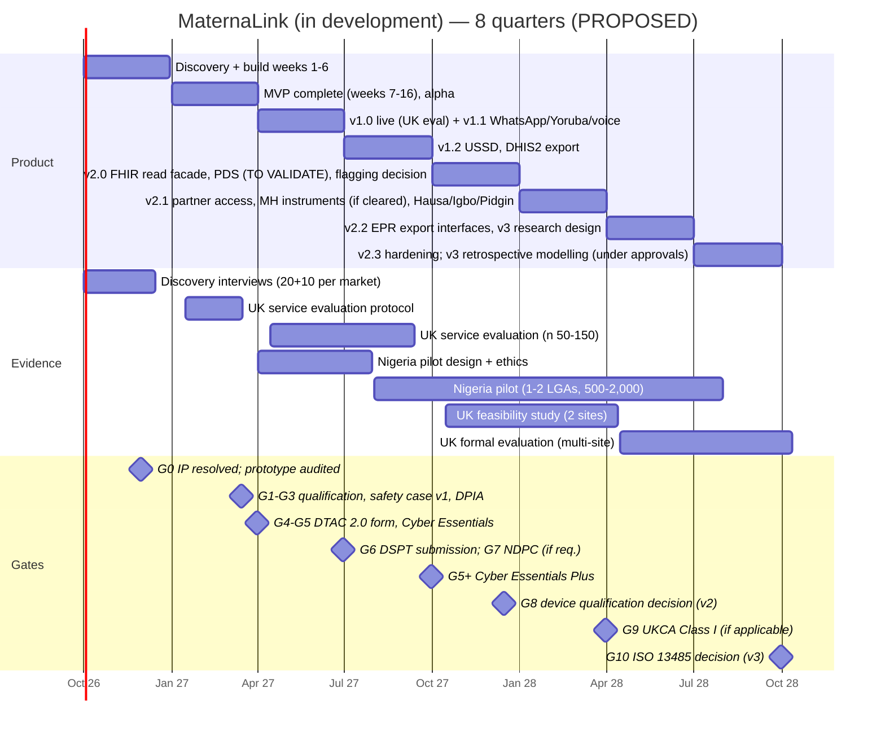
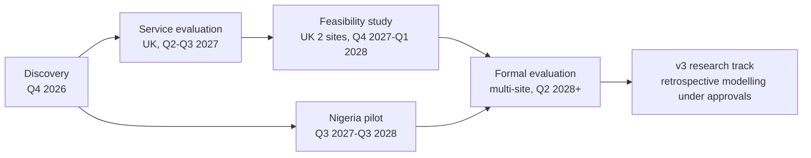
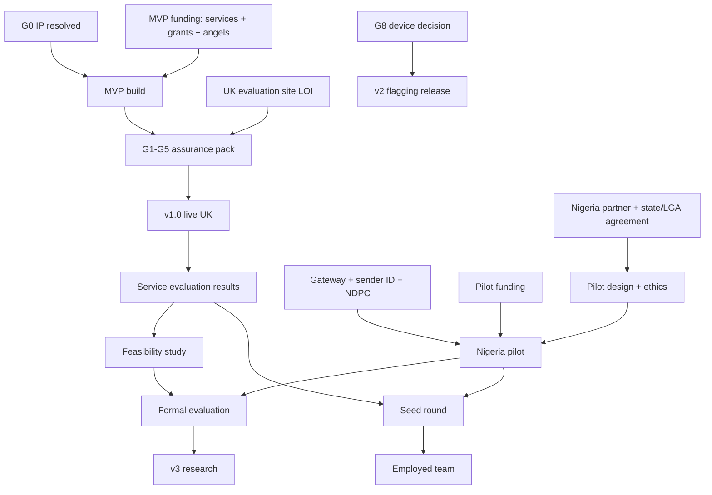

# MaternaLink (in development) — 8-Quarter Roadmap (Q4 2026 – Q3 2028)

**Owner:** CPO/CTO, Vytalix · **Status:** PROPOSED v0.1 · **Date:** 7 September 2026 · **Governing files:** `/FACTS_BASE.md`; `/docs/04_MATERNALINK_PRODUCT_STRATEGY.md` (§22–§23 summarise this roadmap); `/product/MATERNALINK_PRD.md`; `/product/MATERNALINK_MVP_SPEC.md`.

> Every milestone here is a plan, not a commitment or a record. Dates assume incorporation, IP resolution and funding in Q4 2026 (FACTS_BASE A3/A7); slippage in any gate moves everything after it. Sources cited are the six regulatory searches used for this batch; everything else is ESTIMATE or TO VALIDATE.

## Executive view (5 lines)

1. Eight quarters take MaternaLink (in development) from a concept and an unaudited prototype to a **v2.x product with evidence from one UK service evaluation, one UK feasibility study, one Nigeria pilot and a multi-site formal evaluation under way** — and a documented decision on whether any v2 monitoring feature is a medical device.
2. The roadmap is **gate-driven**: G0 IP/ownership → G1 qualification decision → G2 safety case → G3 DPIA → G4 DTAC 2.0 → G5 Cyber Essentials/Plus → G6 DSPT → G7 NDPC registration → G8 device decision (v2) → G9 UKCA Class I if applicable → G10 ISO 13485 decision for v3; no external claim is made ahead of the gate that supports it.
3. **Evidence stages define permitted language:** service evaluation ("in use at", usability, operational metrics) → feasibility ("feasible and acceptable") → pilot ("engagement/adherence in context") → formal evaluation ("associated with" process outcomes) — mortality and morbidity claims are never permitted without a powered, independent study, which is beyond this horizon.
4. **Hiring is triggered by evidence and cash, not by the calendar**: first engineers on funding of the MVP; a clinical lead on the first evaluation site; a Nigeria country lead on a funded pilot; a regulatory/QA lead only if G8 concludes "device".
5. Dependencies outside Vytalix's control dominate: an NHS evaluation site, a Nigeria partner, gateway/sender-ID approvals, HRA/REC and NHREC timelines, and grant cycles — each quarter therefore names a fallback.

---

## 1. Timeline at a glance

---

## 2. Quarter-by-quarter plan

Legend: **Product** (what ships), **Evidence** (what is learned and what may then be said), **Regulatory/assurance gates**, **Commercial** (from strategy §23), **Dependencies**, **Hiring trigger**, **Fallback**.

### Q4 2026 (Oct–Dec) — Foundations

| Track | Milestones |
|---|---|
| Product | Discovery (20 women + 10 professionals per market); PRD v0.2 signed off; design system and IA; architecture ADRs; Terraform/CI/CD/environments; build weeks 1–6 (auth, tenancy, enrolment, consent, schedule, reminders, gateway adapters) |
| Evidence | Discovery synthesis: validated personas, SLA/service-hour defaults, channel preferences; **permitted claims:** none about the product; "we are building, informed by interviews with N women and N professionals" |
| Gates | **G0** IP/ownership documented; prototype audit complete (reuse vs rebuild decided); CSO contracted; DCB0129 hazard log opened; DPIA v0.1; ICO registration on incorporation; clinical advisory group formed |
| Commercial | Advisory/consulting revenue funds runway (FACTS_BASE A6); Ekiti status call and mDoc complementarity call; two alternative states scored; one UK service-evaluation LOI targeted |
| Dependencies | Incorporation; David Agunede agreement; funding decision for the build (UK-led £220k–£320k vs blended £140k–£210k, ESTIMATE); access to interviewees via community organisations (no relationships exist — TO VALIDATE) |
| Hiring trigger | MVP funding confirmed → contract tech lead + 2 engineers + 0.5 designer; CSO 0.2 FTE; fractional DPO |
| Fallback | If funding is only partial: build the Nigeria SMS-cohort slice first (enrolment, schedule, SMS, defaulter list) because it needs the least UI and can earn an NGO programme licence sooner |

### Q1 2027 (Jan–Mar) — MVP complete

| Track | Milestones |
|---|---|
| Product | Build weeks 7–16: messaging + SLA engine + rota; diary; content library (≈40 UK + ≈20 NG items; Yoruba subset if pilot confirmed); offline sync; console; handover; escalation; defaulters; dashboard; admin/audit. Internal alpha with synthetic data; UAT with the evaluation site's digital midwife |
| Evidence | Service-evaluation protocol agreed with the UK site (service evaluation ≠ research: confirm with the HRA decision tool — TO VALIDATE — so no REC approval is required, but trust governance and Caldicott approval are); baseline operational metrics defined (contact completion, acknowledgement times). **Permitted claims:** "MVP complete; entering a service evaluation" |
| Gates | **G1** qualification decisions documented per Must feature (not a device — TO VALIDATE with counsel); **G2** clinical safety case report v1 signed by CSO; **G3** DPIA v1 approved; DPA with the site; **G4** DTAC 2.0 form completed (the form in force from 6 April 2026 — sources: https://www.burges-salmon.com/articles/102mnjh/new-nhs-digital-technology-assessment-criteria-what-health-tech-suppliers-need-t/ and https://digitalregulations.innovation.nhs.uk/regulations-and-guidance-for-developers/all-developers-guidance/using-the-digital-technology-assessment-criteria-dtac/ ); **G5** Cyber Essentials (basic) certified; penetration test passed; WCAG 2.2 AA audit passed |
| Commercial | Grant applications (Innovate UK, SBRI Healthcare where a call fits — TO VALIDATE); one Nigeria NGO programme LOI; gateway contract and sender-ID registration |
| Dependencies | Evaluation-site sign-off on DTAC and DCB0160 (the trust's side); gateway sandbox; content licensing answers |
| Hiring trigger | Evaluation site confirmed → contract a clinical lead/digital midwife advisor (0.2–0.4 FTE); support engineer 0.3 FTE from go-live |
| Fallback | If no UK site by end of quarter: go live first with a private maternity/independent midwife group (strategy §9) or the NGO cohort |

### Q2 2027 (Apr–Jun) — v1.0 live; v1.1

| Track | Milestones |
|---|---|
| Product | **v1.0 live in the UK service evaluation** (one community team); v1.1: WhatsApp Business Platform channel (via BSP), Yoruba content library and UI strings, voice reminders (pre-recorded), pre-visit summary, bulk CSV import hardening |
| Evidence | UK service evaluation runs (n ≈ 50–150 women; ESTIMATE); measures: usability (SUS), acknowledgement times, contact completion, handover usage, safety events, staff time; Nigeria pilot designed with the partner (theory of change, indicators aligned to DHIS2, ethics application to NHREC/state committee). **Permitted claims after this quarter:** "in use in a service evaluation at [site, with permission]"; descriptive usage numbers; no effectiveness language |
| Gates | **G6** DSPT submitted (category and cycle TO VALIDATE — 2025-26 v8 deadline was 30 June 2026, so this is the 2026-27 cycle; source: https://www.dsptoolkit.nhs.uk/News/161 ); **G7** NDPC registration as a data controller/processor of major importance if thresholds apply (health sector; >200 data subjects in 6 months reported — TO VALIDATE: https://ndpc.gov.ng/wp-content/uploads/2025/07/NDP-ACT-GAID-2025-MARCH-20TH.pdf ); WhatsApp DPIA addendum; sender ID live |
| Commercial | First paid pilot (private maternity or NGO programme licence, £10k–£40k ESTIMATE); employer-benefits conversations |
| Dependencies | Site go-live readiness (DCB0160); NDPC process time; BSP onboarding |
| Hiring trigger | Paid pilot + Nigeria partner signed → Nigeria country lead (contract), community engagement/content coordinator (Yoruba) |
| Fallback | If NHREC/state ethics is slow: start the Nigeria cohort as a **service delivery pilot with routine monitoring** (no research claims) while the evaluation protocol is approved |

### Q3 2027 (Jul–Sep) — v1.2; Nigeria pilot starts

| Track | Milestones |
|---|---|
| Product | v1.2: USSD menus; DHIS2 aggregate export; referral notification to receiving facility; CHEW field mode for defaulter tracing; partner-access design (not release); performance and cost tuning for SMS volume |
| Evidence | **Nigeria pilot starts** (1–2 LGAs; 500–2,000 women; ESTIMATE) with the implementing partner; UK service evaluation interim report; UK feasibility-study protocol (2 sites) drafted for HRA/REC. **Permitted claims:** service-evaluation results as descriptive findings (e.g., "median acknowledgement time X hours"); "pilot under way in [state] with [partner]" only with their written permission and never "government partner" (FACTS_BASE §4) |
| Gates | **G5+** Cyber Essentials Plus (ESTIMATE £1,500–£3,000 + VAT: https://www.figgroup.co.uk/blog/cyber-essentials-vs-cyber-essentials-plus-cost ); Nigeria ethics approval for the pilot evaluation; safety case v1.1 (new channels); annual pen-test scheduling |
| Commercial | Nigeria pilot funded (donor or state; £0.1m–£0.3m ESTIMATE); G-Cloud listing preparation (TO VALIDATE route); second UK site conversations |
| Dependencies | Pilot funding; USSD short-code lease; state data-sharing agreement |
| Hiring trigger | Pilot funded → 2 Nigeria-based field/support staff via the partner (not Vytalix payroll); +1 engineer if two markets are live |
| Fallback | If pilot funding slips: run a smaller NGO cohort (≤500) on the programme licence |

### Q4 2027 (Oct–Dec) — v2.0; device decision

| Track | Milestones |
|---|---|
| Product | v2.0: FHIR UK Core read facade (Patient, Encounter, Appointment resources) for future EPR integration; PDS demographics lookup (NHS API onboarding TO VALIDATE); **rule-based flagging of self-recorded observations designed but not released** pending G8; audit/report improvements from evaluation feedback |
| Evidence | UK feasibility study begins (2 sites; mixed methods; pre-registered; HRA/REC approval); Nigeria pilot monthly monitoring. **Permitted claims:** unchanged; feasibility results not yet available |
| Gates | **G8** documented qualification decision on rule-based flagging and scored questionnaires with regulatory counsel: if "device", Class I route (UKCA self-declaration, MHRA registration, technical file, PMS plan under the post-market surveillance regime in force since June 2025 with 15-day serious-incident reporting — sources: https://www.qualio.com/blog/mhra-s-2026-devices-reform-what-changes-and-when and https://patientguard.com/the-mhra-2026-regulatory-roadmap-explained/ ); if "not device", release under the safety case with explicit intended-use wording |
| Commercial | First NHS trust paid-contract discussion post-evaluation; G-Cloud listing (TO VALIDATE); seed-round preparation on evidence |
| Dependencies | HRA/REC timeline (ESTIMATE 3–6 months); NHS API onboarding; counsel availability |
| Hiring trigger | G8 = device → contract a regulatory/QA lead (0.3 FTE) and adopt IEC 62304/ISO 14971 processes for that module; evidence lead (0.5 FTE) for the feasibility study |
| Fallback | If G8 is unresolved: v2.0 ships without flagging; the roadmap item moves one quarter, not the release |

### Q1 2028 (Jan–Mar) — v2.1

| Track | Milestones |
|---|---|
| Product | v2.1: partner/companion access with consent and safeguarding controls; mental-health instruments (EPDS/Whooley/GAD-2) **only if G8 cleared them**; Hausa, Igbo and Pidgin libraries (SMS/voice-first); transport/emergency-fund tracking (Nigeria) |
| Evidence | Nigeria pilot interim results (engagement, contact completion vs baseline, SMS reach); UK formal-evaluation protocol (multi-site; stepped-wedge or cluster design TO VALIDATE with a methodologist). **Permitted claims:** pilot interim descriptive results with the partner's permission; "feasibility study under way" |
| Gates | **G9** UKCA Class I registration if applicable; MHRA annual PMS fees apply from April 2026 for registered devices (£300 per applicable GMDN category for 2026–27 — source: https://patientguard.com/the-mhra-2026-regulatory-roadmap-explained/ — TO VALIDATE); safety case v2; DPIA v2 (partner access); DSPT re-submission cycle |
| Commercial | 2–3 UK sites; one state-scale agreement in Nigeria targeted (10k+ women); seed round on evidence |
| Dependencies | Translation partners for Hausa/Igbo; northern-state partner for Hausa content; investor appetite |
| Hiring trigger | Seed round closed → first employed engineers (2–3), product manager, customer success lead (UK), Nigeria country manager (employed) |
| Fallback | If the seed round slips: hold v2.1 to partner access + one language; extend services revenue |

### Q2 2028 (Apr–Jun) — v2.2; formal evaluation starts

| Track | Milestones |
|---|---|
| Product | v2.2: EPR export interfaces (vendor-supported; availability TO VALIDATE per vendor); handover FHIR export; v3 research design (data specification, protocol, fairness analysis plan); analytics warehouse hardening |
| Evidence | **UK formal evaluation starts** (multi-site; process outcomes: contact completion, acknowledgement times, handover completeness, women's reported experience; not powered for mortality); Nigeria scale-up 5k–10k women with the partner. **Permitted claims:** "formal evaluation under way"; feasibility results as published |
| Gates | Data-sharing agreements for v3 research; HRA/REC application for v3 data access; NHREC application (Nigeria teaching hospital) |
| Commercial | State-scale contract signed (ESTIMATE); NHS contracts 2–3; ARR scenario building toward £0.4m–£0.9m by Q3 2028 (scenario, not forecast; strategy §23) |
| Dependencies | Academic partner for the evaluation (no relationship exists — TO VALIDATE); EPR vendor cooperation |
| Hiring trigger | Formal evaluation funded → research/data scientist (v3, 1 FTE) reporting to the evidence lead; clinical safety team to 0.4 FTE |
| Fallback | If no academic partner: run a rigorous internal evaluation with an independent evaluator (e.g., a university consultancy) and label it accordingly |

### Q3 2028 (Jul–Sep) — v2.3; v3 research begins

| Track | Milestones |
|---|---|
| Product | v2.3: hardening, cost optimisation, multi-region readiness (Nigeria cell live if contracted), accessibility re-audit; v3 retrospective modelling **under approvals** in a separated research environment (no production patient data without the approved data flow) |
| Evidence | Interim evaluation reports (UK and Nigeria); v3 pre-registered protocol; TRIPOD+AI reporting plan. **Permitted claims:** still no prediction or outcome claims; research described as research |
| Gates | **G10** ISO 13485 QMS decision for v3 (if the research suggests a viable device, begin QMS; ESTIMATE 24–36 months and £1.5m–£4m to a clinical claim, strategy §8); annual pen test; CE Plus renewal; DSPT |
| Commercial | Series-A preparation on formal-evaluation interim data; expansion market scored (second African market) |
| Dependencies | Research approvals; investor appetite for deep-tech optionality |
| Hiring trigger | G10 = proceed → regulatory affairs lead (1 FTE), quality manager (0.5–1 FTE) |
| Fallback | If v3 evidence is weak: keep v3 as an academic collaboration and concentrate on v2 scale — this is an acceptable outcome, not a failure |

---

## 3. Evidence-generation plan and permitted claims

| Stage | Design | Governance | Questions answered | Claims permitted afterwards (with data, dates, and site permission) | Claims never permitted at this stage |
|---|---|---|---|---|---|
| Discovery | Interviews, observation, co-design | Consent for interviews; no patient data | Needs, channels, language, SLA norms | "Designed with input from N women and N professionals" | Any product performance |
| Service evaluation | Single site, before/after operational metrics, usability | Trust service-evaluation governance (HRA decision tool → not research, TO VALIDATE); DCB0160 at the trust; DPIA | Is it usable, safe in operation, adopted by staff? What are acknowledgement times and contact completion? | "In use in a service evaluation at [site]"; usability scores; descriptive operational metrics | Effectiveness; "improves outcomes"; "validated" |
| Feasibility study | Two sites, mixed methods, pre-registered | HRA/REC approval; sponsor; PPI involvement | Is a formal evaluation feasible (recruitment, retention, data completeness, acceptability)? | "Feasible and acceptable in a study of N women across two sites" | Efficacy; "proven" |
| Nigeria pilot | 1–2 LGAs, cohort with comparison LGAs where possible; DHIS2-aligned indicators | NHREC/state ethics; state data-sharing agreement; NDPA compliance | Reach, engagement, contact completion vs baseline, defaulter tracing time, cost per woman | "Pilot in [LGAs] with [partner]: reach X%, contact completion +Y points vs baseline" (as observed, with caveats) | "Reduces maternal mortality"; "government partner" |
| Formal evaluation | Multi-site, stepped-wedge or cluster-randomised (design TO VALIDATE), pre-registered, independent analysis | HRA/REC; sponsor; trial registration; data monitoring | Effect on process outcomes and experience measures; safety events; cost | "Associated with [effect] on [process outcome] in a multi-site evaluation" | Mortality/morbidity reduction unless the study is powered for it (out of horizon) |
| v3 research | Retrospective model development under data-sharing agreements; fairness analysis | HRA/REC; NHREC; DPIA; no production data without approval | Is a multimodal signal detectable and fair? | Research findings in publications only | Any clinical claim; any product feature |

NICE Evidence Standards Framework mapping (TO VALIDATE): v1 → Tier B (communication and simple monitoring-support); v2 flagging and v3 → Tier C with higher evidence requirements.

---

## 4. Regulatory and assurance gates

| Gate | What must be true | Evidence artefact | Owner | Quarter |
|---|---|---|---|---|
| G0 IP and prototype | Written IP assignment/licence covering code, brand and proposals; prototype audit complete; naming clearance (VITALIX/VYTALYX conflicts in FACTS_BASE) | Signed agreement; audit report | Founder | Q4 2026 |
| G1 Qualification | Intended-use statement adopted; per-feature qualification decisions recorded (MHRA guidance on software apps and on crafting an intended purpose — strategy §21.1) | Qualification decision log; counsel letter | CTO + counsel | Q1 2027 |
| G2 Clinical safety | DCB0129 hazard log complete; Clinical Safety Case Report v1 signed by CSO; deploying site's DCB0160 done | CSCR v1 | CSO | Q1 2027 |
| G3 Data protection | DPIA approved; DPAs; RoPA; ICO registration; privacy notices in the woman's languages | DPIA v1 | DPO | Q1 2027 |
| G4 DTAC 2.0 | Form completed across the five areas; evaluating trust assesses before the pilot (DTAC applies before pilots as well as procurement) | DTAC form + evidence | CTO | Q1 2027 |
| G5 / G5+ Cyber Essentials / Plus | Five controls evidenced; Plus tested by an assessor | Certificates | CTO | Q1 2027 / Q3 2027 |
| G6 DSPT | Supplier submission for the current cycle (v8 CAF-aligned; Category 3 evidence set) | DSPT status | CTO + DPO | Q2 2027 (then annual) |
| G7 NDPC | Registration as a data controller/processor of major importance if thresholds apply; DPO named; NDPA DPIA | NDPC certificate | Nigeria lead + counsel | Q2 2027 |
| G8 Device decision (v2) | Documented decision on flagging/scoring with counsel; if device, Class I route resourced | Decision memo | CTO + CSO + counsel | Q4 2027 |
| G9 UKCA Class I | Technical file; UKCA self-declaration; MHRA registration; PMS plan (Part 4A regime; 15-day serious-incident reporting; annual PMS fees TO VALIDATE) | Registration | Regulatory lead | Q1 2028 (if applicable) |
| G10 ISO 13485 (v3) | Decision to build a QMS for a Class IIa+ prediction device; budget approved | Board decision | CEO + CTO | Q3 2028 |

Note on CE/UKCA: EU-MDR CE-marked devices are accepted in Great Britain until 30 June 2030 under current transitional rules (source: https://trustedtracemed.com/resources/ukca-medical-software-2026.html — TO VALIDATE); this matters only if MaternaLink ever pursues EU marking first.

---

## 5. Dependencies map

---

## 6. Hiring triggers (summary)

| Trigger | Role(s) | Model | Cost ESTIMATE |
|---|---|---|---|
| MVP funding confirmed (Q4 2026) | Tech lead; 2 engineers; 0.5 designer; 0.5 QA; CSO 0.2 FTE; fractional DPO | Contract | See MVP spec §13.2 |
| Evaluation site confirmed (Q1 2027) | Clinical lead / digital midwife advisor 0.2–0.4 FTE; support engineer 0.3 FTE | Contract | £3k–£6k/month |
| Nigeria pilot funded (Q3 2027) | Country lead (contract); field staff via partner; +1 engineer | Contract/partner | £4k–£8k/month |
| G8 = device (Q4 2027) | Regulatory/QA lead 0.3 FTE | Contract | £3k–£5k/month |
| Feasibility study funded (Q4 2027) | Evidence lead 0.5 FTE | Contract/academic secondment | £3k–£5k/month |
| Seed round closed (Q1 2028) | 2–3 employed engineers; product manager; customer success (UK); Nigeria country manager | Employed | £35k–£45k/month payroll (ESTIMATE) |
| Formal evaluation funded (Q2 2028) | Research/data scientist (v3) | Employed | £6k–£8k/month |
| G10 = proceed (Q3 2028) | Regulatory affairs lead; quality manager | Employed | £10k–£15k/month |

---

## 7. What would change this roadmap

| Signal | Change |
|---|---|
| Discovery shows women in the UK site overwhelmingly want WhatsApp over an app | Pull WhatsApp into MVP scope in place of web push; DPIA earlier |
| Ekiti ministry confirms a defined gap alongside mDoc | Nigeria pilot in Ekiti LGAs in Q2–Q3 2027 with Yoruba content prioritised |
| A northern state partner emerges first | Hausa content moves to v1.1; Yoruba to v1.2 |
| Counsel judges the handover summary or diary display a device | Redesign those features (e.g., remove diary values from staff view) before go-live; add a Class I route to Q2 2027 |
| A grant is won that requires an academic partner | Feasibility study moves earlier and becomes the evaluation vehicle |
| Prototype audit is clean and IP is assigned | Reuse of UI components; build shortened by ~2 weeks (ESTIMATE) |

---

## Priorities / Risks / Next actions

**Priorities**
1. Close G0 in Q4 2026; nothing on this roadmap is real without it.
2. Secure the UK evaluation site and the Nigeria partner in parallel with the build, not after it.
3. Treat the assurance pack (G1–G5) as MVP deliverables with the same status as code.
4. Design v2 monitoring features early enough that the G8 decision is made on documents, not on shipped code.
5. Keep v3 explicitly a research option in every external document.

**Risks**
| Risk | Effect on roadmap | Mitigation |
|---|---|---|
| Funding shortfall for the MVP | Q1–Q2 2027 slip by 1–3 quarters | Blended team; Nigeria-slice-first fallback; grants |
| No evaluation site | v1.0 live slips; evidence chain delayed | Private maternity/NGO alternative; artefact-led selling |
| Ethics timelines (HRA/REC, NHREC) | Feasibility/pilot evaluation slip | Service-delivery pilot with routine monitoring first; early applications |
| G8 concludes "device" for core v2 items | +1–2 quarters and regulatory cost | Class I route budgeted; features designed as separable modules |
| Partner or state political change in Nigeria | Pilot interruption | Two-state pipeline; NGO route independent of state |
| Over-claiming under investor pressure | Credibility and regulatory exposure | This document's permitted-claims table enforced in all materials |

**Next actions**
- Founder: G0 actions; site and partner LOIs; funding decision.
- CPO/CTO: convert Q4 2026 into a sprint plan; appoint CSO; draft qualification-decision log template; start DTAC 2.0 form from the PRD.
- Clinical lead (to recruit): draft the service-evaluation protocol with the site; content licensing.
- Commercial: pilot funding pipeline (donors, state, NGO); grant calendar with deadlines; investor update template that uses only permitted claims.
